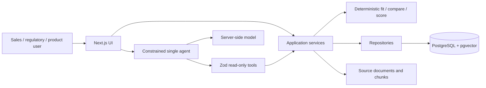

# Global Diesel Regulatory Intelligence

> A source-grounded regulation, product-fit, and market-analysis workspace built
> as a Forward Deployed Engineer portfolio project.

[](https://github.com/Jameskyzx/diesel/actions/workflows/ci.yml)

[Live demo](https://jamesky.site) ·
[World map](https://jamesky.site/map) ·
[AI workspace](https://jamesky.site/chat) ·
[FDE case study](docs/FDE_CASE_STUDY.md) ·
[Current status](docs/STATUS.md) ·
[中文 README](README.zh-CN.md)

This project models the work behind an international diesel-engine sales
decision: which rules apply to a country, date, application, and power band;
whether product evidence supports a fit; whether market observations are
comparable; and exactly which sources support each conclusion.

Structured data and deterministic application code own regulatory facts,
product fit, availability, and scores. The LLM can select validated read-only
tools and explain their output, but it cannot invent a regulation,
certification, product specification, or opportunity score.

The screenshot below is the English zero-configuration demo, not a claim that
the current public release already contains these local changes:


## Three-minute overview

### The user problem

A sales engineer usually has to reconcile regulatory status, applicability
dates, power bands, application scope, product certification, commercial
availability, market methodology, and source freshness. A mistake in any one
of those dimensions can turn a plausible recommendation into an unsupported
sales commitment.

### The golden workflow

1. Select a country on the [world map](https://jamesky.site/map); the ISO3 URL
   is shareable.
2. Review current `effective` rules, future `adopted` rules, source links, and
   verification dates.
3. Enter application, power, date, and optionally a model code. `product-fit-v2`
   returns compliance fit, query-date availability, and combined commercial
   readiness as separate deterministic fields.
4. Ask the [AI workspace](https://jamesky.site/chat) for a comparison or sales
   brief. Structured tool cards and citations remain distinct from model prose.
5. Missing data, stale evidence, proposed rules, and absent certifications stay
   explicit. The system does not make optimistic geographic or power-band
   extrapolations.

The offline demo uses clearly fictional fixtures and never calls an external
model:


### Current evidence boundary

- Reviewed publication closure: **97 jurisdictions, 28 regulations, 651 limits,
  and 203 sources**.
- Approved real-product and certification fixtures: **0**.
- Country directory: **178 ISO3 entries**. A directory entry or published
  evidence boundary does not mean that every application scope has a numeric
  emissions limit.
- Demo products: **2 fictional configurations**, used only to exercise
  `fit / not_fit / unknown` and availability behavior.

Live database state, code state, and historical measurements are deliberately
kept separate in [STATUS.md](docs/STATUS.md).

## Three engineering decisions

### 1. Evidence-gated AI

Every fact tool has Zod-validated input and structured output. The server builds
an evidence contract from trusted user text and restricts each model step to the
tools that can satisfy the remaining requirements. Tool progress can stream to
the client, but model prose is buffered until the tool loop finishes and the
complete evidence set has passed validation. If any required result is missing,
malformed, or insufficient, the buffered prose is discarded and replaced with
an actionable evidence-gap response.

Provider reasoning is never sent to the browser. Enabling a thinking model only
changes provider-side inference; it does not expose chain-of-thought through
`/api/chat`.

### 2. Regulatory time is explicit

Record status, business validity, adoption date, and source verification time
are modeled separately. Queries use ISO3, application scope, power, `asOf`, and
half-open `[from,to)` intervals. `statusAtAsOf` is derived for the query date
while `recordStatus` preserves the current record state. A now-superseded rule
can still be returned for a closed historical period; a proposed rule is never
treated as effective.

This is not a complete bitemporal `knownAsOf` database, and the documentation
does not claim otherwise.

### 3. Recommendations are reproducible

Product fit, market comparability, commercial readiness, and opportunity scores
are calculated by versioned deterministic code. Missing dimensions remain
`null` or `unknown`, coverage is visible, and the model can explain but cannot
alter a score.

## Run locally with one command

Requirements: Node.js 22+ and pnpm 11.

```bash
pnpm install
pnpm demo
```

Open <http://127.0.0.1:3000>. No `.env.local`, PostgreSQL, Docker, or AI key is
required.

The demo is intentionally development-only:

- it creates an in-process PGlite database from the tracked Drizzle migrations;
- it inserts stable IDs and visibly fictional `DEMO ONLY` / `.invalid` sources;
- a deterministic offline model selects the same read-only tools;
- requests still cross the production repository, service, Zod, audit, and
  evidence-boundary layers;
- developer database credentials, model keys, and private documents are not
  read or transmitted.

Suggested questions:

```text
Which regulations are effective in CHN today?
Is DEMO-ENG-100 ready for CHN non-road use at 100 kW?
Compare CHN and BRA non-road regulations at 100 kW.
```

The failure-first interview walkthrough is in [DEMO.md](docs/DEMO.md).

For a local, mutable implementation workflow, use:

```bash
pnpm demo:fde
```

It binds only to loopback, uses a fresh fictional PGlite database, and keeps a
`LOCAL / MUTABLE / FICTIONAL` boundary visible while demonstrating CSV preview,
draft, review/publish, query readback, and archive. It never touches the public
database.

## Architecture



- Server Components handle read-first pages; Client Components are limited to
  browser interaction such as MapLibre and chat.
- Route handlers validate external input before invoking application services.
- Database access stays behind repositories and services.
- The AI has no arbitrary SQL, fact-writing, open-web, or sub-agent capability.

See [ARCHITECTURE.md](docs/ARCHITECTURE.md) and
[DATA_MODEL.md](docs/DATA_MODEL.md) for the detailed boundaries.

## Data provenance

Public responses distinguish two categories record by record:

- **Fictional demo data**: `is_demo=true`, `DEMO ONLY`, and `.invalid` sources.
- **Reviewed public-source fixtures**: published through the Draft → Reviewed →
  Published governance path. They still require review of the original source,
  scope, and validity period and are not legal or certification advice.

There is currently no approved real product master-data or certification
fixture. Real regulation evidence must therefore never be combined with a demo
product and described as a real commercial-availability conclusion.

## Verification

```bash
pnpm lint
pnpm typecheck
pnpm test
pnpm test:coverage
pnpm ai:eval
pnpm ai:eval:live
pnpm portfolio:verify
pnpm db:check
pnpm build
pnpm playwright test
pnpm test:e2e:demo
pnpm test:e2e:fde
pnpm audit:security
```

`pnpm ai:eval` is a deterministic conversation harness and is not a live-model
success rate. `pnpm ai:eval:live` runs 18 versioned fictional cases against an
isolated PGlite database with explicit case, step, token, and timeout budgets.
Every case asserts its expected evidence decision; a failed or incomplete run
is retained as a failed report rather than repackaged as a success metric.

GitHub CI runs lint, strict TypeScript, coverage gates, migration checks, build,
desktop/mobile Playwright, the zero-config demo contract, real PostgreSQL +
pgvector migration smoke tests, full-history secret scanning, and the dependency
advisory policy. A single `Required CI gate` aggregates every merge-blocking job
that branch protection is intended to require, so the strongest database check
cannot fail unnoticed. The workflow defines the gate; repository branch
protection must still be configured and verified separately on GitHub.

## Standard development environment

```bash
pnpm install
cp .env.example .env.local
pnpm db:migrate
pnpm db:seed
pnpm dev
```

Important server-only configuration includes `DATABASE_URL`, `DATABASE_MODE`,
`AI_API_KEY`, `AI_BASE_URL`, `AI_MODEL`, `AI_MULTIMODAL_MODEL`,
`AI_CHAT_RATE_LIMIT_BACKEND`, `KNOWLEDGE_STORAGE_ROOT`, and
`ADMIN_ROLE_BINDINGS_JSON`. Complete production, proxy, backup, rollback, and
canary boundaries are documented in [DEPLOYMENT.md](docs/DEPLOYMENT.md).

## Review paths

- Why a modular monolith instead of microservices? See
  [ARCHITECTURE.md](docs/ARCHITECTURE.md).
- How does the evidence gate fail closed? See the sales-chat service and its
  adversarial tests.
- How are source validity and product availability queried? See
  [DATA_MODEL.md](docs/DATA_MODEL.md).
- Which data is real, reviewed, demo-only, or still absent? See
  [STATUS.md](docs/STATUS.md), [ACCEPTANCE.md](docs/ACCEPTANCE.md), and
  [PRODUCT_EVIDENCE.md](docs/PRODUCT_EVIDENCE.md).
- What incremental development history survived the consolidated public
  snapshot? See [DEVELOPMENT_HISTORY.md](docs/DEVELOPMENT_HISTORY.md).

## AI-assisted development disclosure

Coding agents assisted with implementation, mechanical organization, and
adversarial review. The author owns problem framing, data boundaries, schema and
ADR decisions, acceptance criteria, publication red lines, and final review.
Agent output cannot bypass source readback, automated tests, migrations, or
human approval.

## Disclaimer

This is a public portfolio project, not an official system of any engine
manufacturer, regulator, or employer. Verify original sources, applicability,
effective dates, and formal certifications before use. Nothing here constitutes
legal, certification, sales, investment, or regulatory advice.
