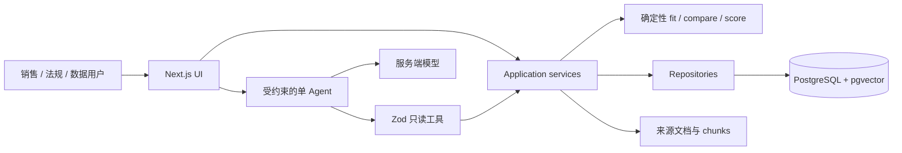

# 全球柴油机法规与市场分析平台

> A source-grounded diesel regulation and product-fit workspace built as a
> Forward Deployed Engineer portfolio project.

[](https://github.com/Jameskyzx/diesel/actions/workflows/ci.yml)
[在线 Demo](https://jamesky.site) ·
[全球地图](https://jamesky.site/map) ·
[AI 分析工作区](https://jamesky.site/chat) ·
[当前项目状态](docs/STATUS.md) ·
[三角色模拟评估](docs/SIMULATED_USER_EVALUATION.md)

面向柴油机海外销售与法规协作场景，把国家法规、适用时间、功率范围、市场指标、
产品认证和来源证据放进同一条可复核工作流。权威事实由结构化数据库和确定性代码
提供；LLM 只能选择只读工具并解释结果，不能创造法规、认证或机会评分。

[](https://jamesky.site)

## 三分钟看懂项目

### 用户问题

销售人员需要同时回答：目标国家当前执行什么法规、指定功率和用途是否适用、产品
认证是否覆盖、市场数据是否同口径，以及每个结论来自哪里。任何一个日期、scope、
状态或来源判断错误，都可能让后续产品推荐失真。

### 黄金工作流

1. 在[全球地图](https://jamesky.site/map)选择国家，得到可分享的 ISO3 URL。
2. 在国家详情核对当前 `effective`、未来 `adopted`、来源和最近核验时间。
3. 输入应用场景、功率和日期，运行 `product-fit-v1` 确定性适配判断。
4. 在[AI 工作区](https://jamesky.site/chat)请求比较或销售简报；事实、来源卡片与
   AI 解释分层显示。
5. 对无数据、过期来源、proposed 法规或缺失认证明确返回缺口，不做乐观推断。

离线 Demo 的真实证据卡片如下。它只使用显式标记的虚构 fixture，不会调用外部模型：


### 三个关键工程问题

- **怎样阻止 LLM“有礼貌地胡说”**：所有事实工具都使用 Zod 输入/输出；服务端在
  流级缓冲模型文本，任一工具 `no_data`、失败或证据不足时丢弃肯定文本，改为
  可执行的证据缺口说明。证据合同还会逐步缩小模型可见工具：缺什么只开放什么，
  证据齐全或失败后停止工具循环。
- **怎样正确处理法规时态**：状态、业务有效期、核验时间分别建模；查询统一使用
  `[from,to)`、ISO3、scope、功率和 `asOf`。服务端从 `asOf` 派生
  `statusAtAsOf` 并保留记录状态 `recordStatus`：现在已 superseded 的法规仍可在
  闭合的历史有效期返回；`adoptedOn` 必须已知且不得晚于查询日，缺失采纳日或
  superseded 终止日的异常记录不会生成确定的查询日状态；proposed 永远不会被当作
  effective。
  这不是完整的 `knownAsOf` 双时态数据库。
- **怎样让推荐可复现**：产品适配、市场可比性和机会评分都由版本化确定性代码
  计算；缺失维度保持 `null` 并公开覆盖率，LLM 只能解释，不能改分。

## 一条命令本地体验

要求 Node.js 22+、pnpm 11：

```bash
pnpm install
pnpm demo
```

打开 <http://127.0.0.1:3000>。不需要 `.env.local`、PostgreSQL、Docker 或 AI Key。

`pnpm demo` 有意限制为开发环境：

- 从真实 Drizzle Migration 创建进程内 PGlite；
- 写入稳定 ID、`DEMO ONLY`、`.invalid` 来源的虚构 fixture；
- 使用确定性离线 Demo 模型选择现有只读工具；
- 仍经过原有审计、结构化卡片和证据失败关闭逻辑；
- 不读取或发送开发者的数据库凭据、模型 Key 或私有文档。

推荐提问：

```text
CHN 目前有哪些有效法规？
CHN 的 non-road 100 kW 产品是否适配？
比较 CHN 和 BRA 的 non-road 100 kW 法规。
```

面试讲解顺序、预期画面和失败场景见 [三分钟演示脚本](docs/DEMO.md)。

## 架构



- Client Components 只负责地图、筛选和流式交互。
- Route Handler 校验外部输入后调用 service，不从 UI 直接查询 Supabase。
- Repository 封装 Drizzle 查询；纯领域函数负责区间、适用性、fit 和 score。
- AI 没有任意 SQL、事实写入、开放网络或子 Agent 能力。

更完整的边界与数据流见 [ARCHITECTURE.md](docs/ARCHITECTURE.md) 和
[DATA_MODEL.md](docs/DATA_MODEL.md)。

## 数据可信度边界

本仓库同时存在两类记录，并在 API、UI 和引用中逐条标识：

- **虚构 Demo**：`is_demo=true`、`DEMO ONLY`、`example.invalid`，只验证产品流程；
- **已核验公开来源 fixture**：经 Draft → Reviewed → Published 治理链发布，仍需
  回看原文、适用范围和有效期，不构成法律、认证或销售建议。

当前已包含经签核的法规验收行和公开市场观测，但尚无获准公开发布的真实产品配置/
认证 fixture；因此真实法规与 Demo 产品不能被描述成真实可售性结论。实时覆盖数量
以[在线工作台](https://jamesky.site)为准，代码、运行库与历史测量的区别见
[STATUS.md](docs/STATUS.md)。

2026-08-12 的[三角色模拟评估](docs/SIMULATED_USER_EVALUATION.md)由 subagent 分别
扮演海外销售、法规合规和产品应用工程师，用于发现交互与时态缺陷。它不是现实用户
试点、外部法规专家签核或 KPI 结果，不得用来宣称客户验证或商业成效。

## 工程质量

```bash
pnpm lint
pnpm typecheck
pnpm test
pnpm ai:eval
pnpm db:check
pnpm build
pnpm playwright test
```

`pnpm ai:eval` 是不调用外部模型的对话 harness：固定 golden prompts，检查确定性
分流、缺参、证据需求、每轮可用工具和停止阶段。真实 provider 的工具选择质量仍需
另行运行带模型版本、成本和日期的 live eval，不能由离线 harness 代替。

GitHub CI 对每次 PR/`master` 推送执行：

- ESLint、TypeScript strict、Vitest、Drizzle migration check、生产构建；
- Chromium 桌面/移动关键流程；
- gitleaks 全历史密钥扫描；
- `pnpm audit --audit-level=critical`。

测试覆盖有效期与功率边界、proposed/effective 隔离、完整来源链、产品适配三态、
AI 伪造事实对抗、请求体限制、错误脱敏、迟到响应竞态、治理权限与发布事务。

## 标准开发环境

需要真实 PostgreSQL 或 Supabase PostgreSQL 时：

```bash
pnpm install
cp .env.example .env.local
pnpm db:migrate
pnpm db:seed
pnpm dev
```

Windows PowerShell 使用：

```powershell
Copy-Item .env.example .env.local
```

关键配置：

- `DATABASE_URL`：服务端 PostgreSQL 连接；
- `DATABASE_MODE`：默认 `postgres`，`pglite-demo` 只允许测试/作品 Demo；
- `AI_API_KEY`、`AI_BASE_URL`、`AI_MODEL`：可选的服务端 OpenAI-compatible 文本模型；
- `AI_MULTIMODAL_MODEL`：可选的同端点视觉模型；只有图片上传需要，且必须同时支持
  图片输入与 Function Calling；
- `KNOWLEDGE_STORAGE_ROOT`：开发期 `.data` 下的文档目录；
- `ADMIN_ROLE_BINDINGS_JSON`：受可信身份代理保护的管理角色映射。

已签核公开事实通过治理脚本发布，Demo Seed 不会把它们伪装成真实数据：

```bash
pnpm exec tsx --env-file=.env.local scripts/db/ingest-accepted-fixtures.ts
```

生产/共享环境不得使用本地文件存储、Demo 数据库或客户端伪造的身份 Header。完整
配置、代理边界、回滚和待完成运维门见 [DEPLOYMENT.md](docs/DEPLOYMENT.md)。

## 面试讨论索引

- 为什么选择模块化单体，而不是微服务？见 [ARCHITECTURE.md](docs/ARCHITECTURE.md)。
- 如何处理 AI 证据失败？见 `src/server/ai/sales-chat.ts` 与对应对抗测试。
- 如何把法规有效期映射为确定性查询？见 [DATA_MODEL.md](docs/DATA_MODEL.md)。
- 如何治理来源、草稿和发布？见 [DECISIONS.md](docs/DECISIONS.md)。
- 哪些数据真实、哪些仍是 Demo？见 [STATUS.md](docs/STATUS.md)、
  [ACCEPTANCE.md](docs/ACCEPTANCE.md)、[PRODUCT_EVIDENCE.md](docs/PRODUCT_EVIDENCE.md)。

## AI 辅助开发说明

本项目使用 AI 编程代理辅助实现、对抗评审和机械性数据整理。问题定义、数据边界、
schema/ADR、验收预期、发布红线以及最终代码审查由项目作者负责。AI 生成内容不能
跳过来源读回、自动化测试、Migration 或人工验收。

## 免责声明

这是公开求职作品，不代表任何柴油机制造商、监管机构或雇主的官方系统。所有信息
仅供工程演示；使用前必须复核原始来源、适用范围、有效日期和正式认证，不构成法律、
认证、销售或投资建议。
