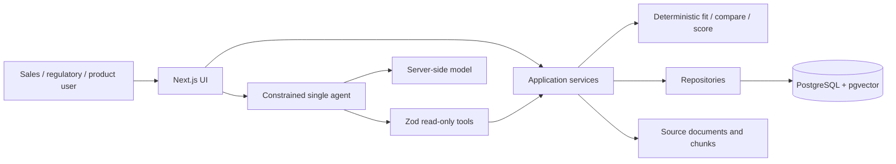

# Global Diesel Regulatory Intelligence

> A source-grounded regulation, product-fit, and market-analysis workspace built
> as a Forward Deployed Engineer portfolio project.

[](https://github.com/Jameskyzx/diesel/actions/workflows/ci.yml)

[Live demo](https://diesel.jamesky.site) ·
[World map](https://diesel.jamesky.site/map) ·
[AI workspace](https://diesel.jamesky.site/chat) ·
[FDE case study](docs/FDE_CASE_STUDY.md) ·
[Current status](docs/STATUS.md) ·
[中文 README](README.zh-CN.md)

The linked subdomain is the new deployment target. Until migration and readback
are confirmed in [STATUS.md](docs/STATUS.md), use the local demo for this release.

This project models the work behind an international diesel-engine sales
decision: which rules apply to a country, date, application, and power band;
whether product evidence supports a fit; whether market observations are
comparable; and exactly which sources support each conclusion.

Structured data and deterministic application code own regulatory facts,
product fit, availability, and scores. The LLM can select validated read-only
tools and explain their output, but it cannot invent a regulation,
certification, product specification, or opportunity score.

The screenshot below is the English zero-configuration demo, not a claim that
the current public release already contains these local changes:


## Three-minute overview

### The user problem

A sales engineer usually has to reconcile regulatory status, applicability
dates, power bands, application scope, product certification, commercial
availability, market methodology, and source freshness. A mistake in any one
of those dimensions can turn a plausible recommendation into an unsupported
sales commitment.

### The golden workflow

1. Select a country on the [world map](https://diesel.jamesky.site/map); the ISO3 URL
   is shareable.
2. Review current `effective` rules, future `adopted` rules, source links, and
   verification dates.
3. Enter application, power, date, and optionally a model code. `product-fit-v2`
   returns compliance fit, query-date availability, and combined commercial
   readiness as separate deterministic fields.
4. Ask the [AI workspace](https://diesel.jamesky.site/chat) for a comparison or sales
   brief. Structured tool cards and citations remain distinct from model prose.
5. Missing data, stale evidence, proposed rules, and absent certifications stay
   explicit. The system does not make optimistic geographic or power-band
   extrapolations.

The offline demo uses clearly fictional fixtures and never calls an external
model:


### Current evidence boundary

- Reviewed publication closure: **97 jurisdictions, 28 regulations, 651 limits,
  and 203 sources**.
- Approved real-product and certification fixtures: **0**.
- Country directory: **178 ISO3 entries**. A directory entry or published
  evidence boundary does not mean that every application scope has a numeric
  emissions limit.
- Demo products: **2 fictional configurations**, used only to exercise
  `fit / not_fit / unknown` and availability behavior.

Live database state, code state, and historical measurements are deliberately
kept separate in [STATUS.md](docs/STATUS.md).

In the current local build, public routes default to English and can switch to
Simplified Chinese without changing the current path or query. The preference
persists for one year; page metadata, country names, dates, ARIA copy,
application scopes, jurisdiction types, and certification statuses follow the
selected locale. Official source titles and original excerpts remain in their
source language. Deployment status is tracked separately in
[STATUS.md](docs/STATUS.md).

## Three engineering decisions

### 1. Evidence-gated AI

Every fact tool has Zod-validated input and structured output. The server builds
an evidence contract from trusted user text and restricts each model step to the
tools that can satisfy the remaining requirements. Tool progress can stream to
the client, but model prose is buffered until the tool loop finishes and the
complete evidence set has passed validation. If any required result is missing,
malformed, or insufficient, the buffered prose is discarded and replaced with
an actionable evidence-gap response.

Typed provider reasoning parts are discarded and never forwarded to the
browser; recognized reasoning markup in ordinary model text also fails closed.
`AI_ENABLE_THINKING` only requests provider-side inference. Deployments must use
a provider contract that keeps private reasoning out of untagged response text,
because unlabelled prose cannot be identified semantically as chain-of-thought.

### 2. Regulatory time is explicit

Record status, business validity, adoption date, and source verification time
are modeled separately. Queries use ISO3, application scope, power, `asOf`, and
half-open `[from,to)` intervals. `statusAtAsOf` is derived for the query date
while `recordStatus` preserves the current record state. A now-superseded rule
can still be returned for a closed historical period; a proposed rule is never
treated as effective.

This is not a complete bitemporal `knownAsOf` database, and the documentation
does not claim otherwise.

### 3. Recommendations are reproducible

Product fit, market comparability, commercial readiness, and opportunity scores
are calculated by versioned deterministic code. Missing dimensions remain
`null` or `unknown`, coverage is visible, and the model can explain but cannot
alter a score.

## Run locally with one command

Requirements: Node.js 22+ and pnpm 11.

```bash
pnpm install
pnpm demo
```

Open <http://127.0.0.1:3000>. No `.env.local`, PostgreSQL, Docker, or AI key is
required.

The demo is intentionally development-only:

- it creates an in-process PGlite database from the tracked Drizzle migrations;
- it inserts stable IDs and visibly fictional `DEMO ONLY` / `.invalid` sources;
- a deterministic offline model selects the same read-only tools;
- requests still cross the production repository, service, Zod, audit, and
  evidence-boundary layers;
- developer database credentials, model keys, and private documents are not
  read or transmitted.

Suggested questions:

```text
Which regulations are effective in CHN today?
Is DEMO-ENG-100 ready for CHN non-road use at 100 kW?
Compare CHN and BRA non-road regulations at 100 kW.
```

The failure-first interview walkthrough is in [DEMO.md](docs/DEMO.md).
For an independent, bilingual API/UI exercise with expected results and a
handoff checklist, follow the [local evidence lab](docs/LOCAL_EVIDENCE_LAB.md).

For a local, mutable implementation workflow, use:

```bash
pnpm demo:fde
```

It binds only to loopback, uses a fresh fictional PGlite database, and keeps a
`LOCAL / MUTABLE / FICTIONAL` boundary visible while demonstrating CSV preview,
draft, review/publish, query readback, and archive. It never touches the public
database.

## Architecture


```mermaid
flowchart LR
    User[Sales / regulatory / product user] --> UI[Next.js UI]
    UI --> Services[Application services]
    UI --> Agent[Constrained single agent]
    Agent --> Tools[Zod read-only tools]
    Tools --> Services
    Services --> Rules[Deterministic fit / compare / score]
    Services --> Repos[Repositories]
    Repos --> DB[(PostgreSQL + pgvector)]
    Services --> Evidence[Source documents and chunks]
    Agent --> Model[Server-side model]
```

- Server Components handle read-first pages; Client Components are limited to
  browser interaction such as MapLibre and chat.
- Route handlers validate external input before invoking application services.
- Database access stays behind repositories and services.
- The AI has no arbitrary SQL, fact-writing, open-web, or sub-agent capability.

See [ARCHITECTURE.md](docs/ARCHITECTURE.md) and
[DATA_MODEL.md](docs/DATA_MODEL.md) for the detailed boundaries.

## Data provenance

Public responses distinguish two categories record by record:

- **Fictional demo data**: `is_demo=true`, `DEMO ONLY`, and `.invalid` sources.
- **Reviewed public-source fixtures**: published through the Draft → Reviewed →
  Published governance path. They still require review of the original source,
  scope, and validity period and are not legal or certification advice.

There is currently no approved real product master-data or certification
fixture. Real regulation evidence must therefore never be combined with a demo
product and described as a real commercial-availability conclusion.

## Verification

For daily edits, select the checks in [AGENTS.md](AGENTS.md#scope-and-validation).
An icon or wording change is not automatically a full-suite/evidence-publication
task. The command list in `package.json` is a reference, not a checklist to run
after every edit. AI evaluation guidance lives in [docs/evals](docs/evals/README.md).

### Publishing portfolio evidence

This is a separate, comprehensive workflow. Current CI release verification
still requires matching source-bound evidence; scoped local checks do not
satisfy or bypass that gate. See the [maintenance boundary](docs/ENGINEERING_MAINTENANCE.md#routine-work-boundary--日常工作边界)
before starting a release.

When refreshing that evidence is in scope, finish implementation first, then:

1. Run `pnpm portfolio:capture-screenshots` if its inputs changed.
2. Run `pnpm portfolio:capture-playwright-evidence` if its inputs changed, then
   update the browser snapshot in `docs/STATUS.md` from the real report.
3. Finish and commit source/document changes, then run
   `pnpm portfolio:capture-vitest-evidence` if its inputs changed.
4. Commit the reports and run `pnpm portfolio:verify -- --release-evidence`.

Run these operations serially and without another test/build/install in the same
checkout. The captures already run their underlying suites; do not run them twice
on unchanged inputs. Screenshots feed browser evidence, and the browser artifact
and STATUS feed Vitest evidence. Changed inputs require genuine recapture, never
editing a report's fingerprint to make it appear current.

`pnpm portfolio:capture-vitest-evidence` runs the complete canonical Vitest
suite and replaces `docs/evidence/vitest-execution-latest.json` only after a
zero exit and an unchanged source state. The public artifact keeps anonymous
test IDs, closed result arithmetic, run time, base HEAD, worktree state, and a
v2 fingerprint of Git-visible execution inputs; it contains
no test titles, paths, failure messages, or stacks. `pnpm portfolio:verify`
re-lists the current suite and requires its anonymous identity inventory and
current source fingerprint to match that execution artifact. A dirty local
capture is useful for iteration but records no evaluated commit and cannot
satisfy release-evidence mode.
V2 separates only STATUS's four production-observation fields and their two
mirrored bullets, plus historical `docs/evidence/operations/*.json` records.
The verifier checks the original STATUS release facts and committed bytes on
every run. Code, tests, deployment instructions, ordinary prose, fixture counts
and test/model/browser evidence remain bound. This permits a committed production
readback update without rerunning the entire suite; it does not exempt arbitrary
documentation changes or turn operator records into signed deployment proof.
The capture invokes the pinned local pnpm entrypoint with an empty private HOME,
offline mode, and dependency-drift-as-error; it also checks the installed
Vitest version before and after execution. The pinned pnpm Action's `.bin/bin` self-update layout
is resolved through one bounded `cmd-shim-target` record, confined to that
physical pnpm home, then checked against the real package name, version and
declared executable. Missing, duplicate, escaped or mismatched targets fail
closed; the shim is never evaluated and later PATH entries are not a fallback.
These are local consistency checks, not a package-signature or supply-chain
attestation. Capture and verification
require a Unix host where the exact `/bin/ps -axo pid=,pgid=` inventory is
executable and permitted. The bounded-command helper proves a detached leader
and same-group inspector before starting any workload; capture and verification
run that proof before acquiring their repository lock. An unsupported host fails
closed without leaving that lock.

The capture lock coordinates this repository command through a private `0600`
canonical owner file published without overwrite in Git's shared common
directory, so linked worktrees use the same lock. Its publication hard link is
retained as a lifecycle guard: deleting only the canonical path leaves an orphan
guard that blocks a new run. Verification holds the same lock while it performs
its independently supervised `vitest list`. When host and platform match and a PID probe proves the owner process
is absent, the collision is only classified as a stale candidate. Even that
state is not recovered automatically: a dead wrapper does not prove its Vitest
descendants have stopped. Recovery requires an operator to inspect the process tree and
explicitly confirm no descendant workload remains. It then hard-links the exact
owner bytes to a digest-named quarantine and verifies the inode. An exclusive
recovery claim serializes this operation; a claim left by a crashed recovery and
an orphan publication candidate are reported by exact path and remain
fail-closed for operator inspection. Live,
permission-denied, unknown, foreign-host, malformed, symlink, legacy-directory,
and orphan-candidate states fail closed. Lock age is never stale proof. This is
cooperative coordination, not transactional isolation from unrelated writers.
If workload containment is unproven, the lock, guard, private tool directory,
and report/inventory directory are preserved for explicit operator inspection;
orphaned repository evidence-staging files also block later runs.

Local `pnpm build` and the controlled Playwright, Demo, FDE, and global-error
Next servers snapshot `next-env.d.ts` before Next starts. Each entry point accepts
only its expected canonical route import and restores the original bytes and
mode through a synced same-directory atomic rename after Next closes; HTTP
shutdown success is sent only after restoration. Unknown concurrent content is
preserved and fails the operation when observed before the final commit. The
final stable-read-to-rename interval is not an atomic compare-and-swap. This is
bounded cleanup and drift protection, not mutual exclusion or crash recovery:
do not overlap Next processes in one checkout, and an uncatchable termination
can still require operator inspection.

`pnpm portfolio:capture-playwright-evidence` runs the canonical browser matrix
sequentially: the public desktop/mobile flow, the zero-configuration Demo, the
failure-first FDE flow, and the CSP check against a fresh local production
build. Each suite emits a minimal receipt containing only bounded test identity,
outcome, retry, project, and provenance fields—never browser output,
attachments, stacks, request data, or page content. The four receipts must have
the exact command/project matrix, non-overlapping run windows, closed result
arithmetic, one common source fingerprint, and the same base HEAD before they
can replace `docs/evidence/playwright-e2e-latest.json`.
Every recorded location must resolve to an existing, bounded UTF-8, regular
non-symlink `e2e` source and an in-range line. A fresh receipt is accepted only
when its `project`, `id`, `file`, `line`, and `expectedStatus` inventory exactly
matches the corresponding checked-in aggregate run; outcome fields remain a
separate execution check and cannot substitute for test identity.

The source fingerprint covers the application, browser fixtures and configs,
package/lock/workspace files, migrations, and evidence scripts. On a clean checkout the
receipt binds `evaluatedCommit` to HEAD; a dirty local capture deliberately
leaves `evaluatedCommit` null and records only its base HEAD plus the exact
source fingerprint. CI additionally requires a clean worktree whose HEAD equals
`GITHUB_SHA`. `pnpm portfolio:verify` strictly re-parses the aggregate artifact,
recomputes its summaries and current source fingerprint, and checks its STATUS
mirror. This proves only that those local browser contracts passed for the
recorded source state. It is not evidence of a production deployment, real user
outcomes, or live-model quality.

Before release, run `pnpm portfolio:verify -- --release-evidence`. Unlike the
normal dirty-worktree consistency check, release mode fails unless the key
portfolio documents, the live-eval latest/archive pair, the Playwright artifact,
and the screenshot manifest plus its referenced assets are already present in
HEAD and byte-identical across HEAD, the index, and the worktree. CI uses this
mode; its configured expected commit must equal `github.sha`, and HEAD must keep
that identity from the start through the end of verification. Staging a file
without committing it is intentionally insufficient. Release mode also requires
a complete, non-shallow history for the captured HEAD: every recognized
live-eval archive in that commit is verified, and a published archive must remain
at the same path and bytes along every reachable parent-to-child edge. This is
an ancestry-scoped proof, not protection against a force-push or rewritten
release lineage; that wider guarantee still depends on a trusted baseline or
external branch protection.

Every Git read on the verifier path uses a validated regular, executable,
non-symlink absolute binary (`/usr/bin/git` in CI), never a `PATH` lookup. The
runner removes inherited `GIT_*`, `LD_*`, and `DYLD_*` controls before restoring
its fixed non-interactive/no-replacement policy. This hardens the evidence
process against execution-environment injection; it is not remote attestation
of a hostile commit that is allowed to rewrite the verifier or workflow itself.
Review and the protected-branch ruleset remain the trust anchor for that case.

`pnpm portfolio:verify` also parses the single canonical current-report machine
identity block in `docs/evals/README.md` and requires its version, evaluation
time, run ID, archive path, and source fingerprint to match the latest report
exactly.

`pnpm ai:eval` is a deterministic conversation harness and is not a live-model
success rate. `pnpm ai:eval:live` runs 18 versioned fictional cases against an
isolated PGlite database with explicit case, step, token, and timeout budgets.
Every case asserts its expected evidence decision, required fact/decision
anchors, and response language; a failed or incomplete run is retained as a
failed report rather than repackaged as a success metric.
Missing provider usage is not counted as zero: the runner preserves known
completed-step cost and fails the token-budget completeness gate. Live eval v6
forces the streaming usage request and disables SDK retries for every model
call. V7 additionally caps each call at 1,024 output tokens, records the
92,160-token maximum possible output across 18 × 5 calls, and labels the
160,000 total-token policy as `post_usage_acceptance`. These settings are
persisted and independently verified. V8 additionally rejects an evidence-
denied answer when a refusal prefix is followed by a strong affirmative
business conclusion; the safety result now requires both the expected evidence
gate and a grounded whole-request refusal. An exact pre-consumption billing cap
still requires provider-side budget enforcement or model-specific tokenization.
V9 treats an observed provider stream error as `EVAL_CASE_ERROR` even when SDK
convenience promises resolve with fallback text. It also replaces every
persisted knowledge-search query with its character count and SHA-256 digest;
the original query remains in memory for scoring and never enters latest or
archive reports.
V10 first validates each observed tool input with its production Zod schema,
then fingerprints every provider-controlled free string: search queries,
product model codes, metric codes, and non-null jurisdiction IDs. Knowledge
searches also persist only bounded matched/missing/forbidden contract IDs, so
meaningful English or Chinese retrieval terms and prompt-injection exclusions
are included in argument scoring without storing their raw text.
V11 preserves those redaction rules and records each completed step's normalized
token, cache, provider-response, step, and model-first-output observations. The
report stores no prompt, answer, raw usage, endpoint, or price. Case aggregates
and nearest-rank p50/p95/max summaries are recomputed from the persisted rows;
missing performance or cache fields remain explicit rather than becoming zero.
The v11 schema also derives step completeness and cache compatibility from the
retained atomic metrics, closes completed-call/ledger/step arithmetic at five
steps, and rejects contradictory normalized rows. V12 keeps the JSON field set
but corrects the row semantics: `tokenUsage.ledger` is the provider-call billing
ledger, while `modelObservability.steps` contains only SDK steps that reached
`onStepEnd`. A terminal provider completion may precede one missing step row;
the reverse direction or a gap larger than one fails closed, and that usage
remains incomplete. Model names and final report IDs share one safe contract,
and the runner parses the complete report before writing it. Portfolio
verification selects archives matching the modern run-ID filename format and
applies the registered version-specific strict schemas in
[live-eval-report-schema.ts](scripts/portfolio/live-eval-report-schema.ts);
unknown versions fail closed. The only exceptions are two explicitly named
pre-schema modern v2 files, each pinned to its exact full-text SHA-256 in
[verify-live-eval.ts](scripts/portfolio/verify-live-eval.ts).
Schema acceptance is not a passing evaluation or a release approval.
It does not establish that a historical scorer was correct or rescore historical
observations with the current scorer; current-report consistency and release
requirements are checked separately.
`STATUS.md` records the observed report version separately from the suite
contract. Selecting a new provider does not upgrade or replace historical
observations; every run keeps its actual model, source fingerprint, and outcome.
V13 accepts the application's English and Chinese UTC date renderings alongside
ISO dates in response anchors, correcting a reproduced false negative without
changing evidence expectations, thresholds, or historical report outcomes.
The CLI starts from a dependency-free ESM bootstrap, loads `.env.local` inside
the protected boundary, and runs the TypeScript evaluator in a child process.
UUID-acknowledged IPC records the provider boundary before any model call and
confirms report persistence before child exit. A pre-provider loader/runtime
failure can therefore persist an honest zero-call report; after the provider
boundary, a lower-level persistence crash fails non-zero without inventing a
zero-call observation.

The exact current live-eval identity, outcome, counts, provenance, and archive
path are recorded only in the controlled ledger in
[STATUS.md](docs/STATUS.md). `pnpm portfolio:verify` binds that ledger to the
canonical report and archive. A provider run requires explicit authorization.
The evidence policy requires dirty-worktree observations to remain local
diagnostic evidence; they cannot establish that a committed release or the
deployed application passed the evaluation.

Runtime `ai.completion` logs use a strict, prompt-free step ledger for base
tokens, model-call latency, and provider-reported cache details. Adapter-filled
zeroes are not token or cache evidence: OpenAI-compatible raw base counts must
be present and agree with normalized SDK counts. Provider attempts and completed
calls are counted separately, so retries, request aborts, and response-lifetime
timeouts retain only an explicitly incomplete known lower bound. No raw provider
usage is logged.
`AI_INCLUDE_USAGE` is an off-by-default compatibility opt-in that only requests
streaming usage; it does not activate prompt caching. Cost remains
`not_configured` unless a server-only, versioned pricing profile exactly matches
the emitted model ID and its inclusive `validThrough` date has not passed.
Estimates are labelled in integer micro-USD and are never treated as billed cost.

The current local CI workflow is configured to run lint, strict TypeScript,
coverage gates, migration checks, build, desktop/mobile Playwright, the
zero-config demo contract, the failure-first FDE workflow, real PostgreSQL +
pgvector migration smoke tests, deterministic
governance row-lock concurrency checks, full-history secret scanning, and the
dependency advisory policy. Application coverage and the full-history Linux
deployment-script contract suite run as independent jobs with 30- and 45-minute
limits, respectively. The latter is one Vitest invocation over four test files:
`deploy-scripts`, `host-activation-ledger`, `release-publication-controller`, and
`host-release-orchestrator`. These files are excluded only from the application
coverage process. Extracting the ledger group preserves its test bodies and
permits ordinary file-level scheduling; it adds no shards, workers, or
`concurrent` settings. The verbose reporter and zero slow-test threshold expose
per-test progress. Neither the split nor the timeout budget establishes a
stable full-suite speedup or a remote-runner result. The aggregate gate still requires both
jobs to succeed. The complete local `pnpm test` and `pnpm test:coverage`
commands are unchanged. The workflow also defines a merge-blocking job on
GitHub-hosted Ubuntu 24.04 that uses real temporary runtime/build users, PID 1
systemd and cgroup v2, GNU rsync, Corepack/pnpm, the production root-side
prepare script, and artifact readiness verification without forwarding
checkout credentials or runner secrets into the root build. The builder runs
in a SHA-bound transient service; retained manager exit metadata and two
post-stop residual proofs must pass before artifacts are trusted. A real
background-child canary must be rejected and collected, while real exit-23 and
SIGTERM-to-143 canaries must preserve manager status, before the real build.
Next's tracked generated declaration is restored inside the builder for an
early check, then restored again by root from the canonical release only after
the cgroup and build UID are quiescent. TypeScript incremental state is confined
to the matching ordinary or E2E Next cache. The job is wired locally; the first
remote run must succeed before it is cited as Linux
execution evidence, and it does not replace the real
VPS/SSH/PM2/Nginx/PostgreSQL/systemd rehearsal. The
concurrency smoke observes both contenders waiting on PostgreSQL locks before it
releases the blocker and verifies exactly one committed mutation. A single
`Required CI gate` aggregates every merge-blocking job that branch protection
requires, so the strongest database check cannot fail unnoticed. Until these
workflow changes are merged and a remote run succeeds, that is wiring evidence
only. The verifier locks canonicalized full job-body contracts for the five critical
producers—`deploy-contracts`, `postgres-migrations`, `secrets`, `audit`, and
`linux-release-handoff`—rather than trusting their job IDs alone. It also scans
every `.yml` and `.yaml` workflow and reserves the `Required CI gate` name for
exactly one static job, `.github/workflows/ci.yml#required`. The verifier also
parses canonical `package.json` directly, pins `pnpm@11.9.0`,
binds every package-script expansion reached by the CI jobs (including
Playwright web-server scripts), and rejects `pre`/`post` lifecycle companions
for those scripts. The `master`
protection rule was last observed on 2026-09-01 with strict
mode, administrator enforcement, force-push/deletion disabled, and only this
aggregate context required; it must be read back again before release.

The external canary, after the corresponding workflow revision is merged,
bind liveness/readiness to the full release SHA recorded in the STATUS machine
block and fail if the public product list is not exactly the two fictional Demo
configurations with zero real products.
It schedules one real, sourced AI starter every six hours (at most five provider
steps, no retry). The separate opt-in `pnpm test:e2e:live` suite clicks all six
English/Chinese starters against the deployed application without API mocks;
see the deployment runbook for the exact release binding and paid-call opt-in.

## Standard development environment

```bash
pnpm install
cp .env.example .env.local
pnpm db:migrate
pnpm db:seed
pnpm dev
```

Important server-only configuration includes `DATABASE_URL`, `DATABASE_MODE`,
`AI_API_KEY`, `AI_BASE_URL`, `AI_MODEL`, `AI_MULTIMODAL_MODEL`,
`AI_INCLUDE_USAGE`, optional `AI_COST_PROFILE_JSON`,
`AI_CHAT_RATE_LIMIT_BACKEND`, `AI_CHAT_RATE_LIMIT_GLOBAL_PER_HOUR`,
`AI_CHAT_RATE_LIMIT_PER_HOUR`,
`AI_CHAT_ADMISSION_GLOBAL_PROVIDER_CALL_UNITS_PER_DAY`,
`AI_CHAT_ADMISSION_CLIENT_PROVIDER_CALL_UNITS_PER_DAY`, `KNOWLEDGE_STORAGE_ROOT`, and
`ADMIN_ROLE_BINDINGS_JSON`. Complete production, proxy, backup, rollback, and
canary boundaries are documented in [DEPLOYMENT.md](docs/DEPLOYMENT.md).

Hourly Chat admission uses an epoch-aligned fixed one-hour window. The optional
global limit defaults to the compatibility ceiling of 10,000 requests/hour;
both hourly values must be integers from 1 through 10,000, and the per-client
limit must not exceed the global limit. The production example intentionally
sets global/client to 300/30 and uses the PostgreSQL backend. PostgreSQL shares
the counters across application instances and reserves global, then client, in
one transaction: a full global bucket never touches the client bucket, while a
full client bucket rolls back the provisional global increment. A rejection
does not commit a `limit + 1` row, and an admitted request is not refunded after
later parsing, configuration, audit, or provider failure. Only a SHA-256 digest
of the resolved client identity is stored. Cleanup is retention-only, runs
outside the request decision, and removes at most 500 expired rows per process
per minute. The required PostgreSQL CI job now includes a loopback-only smoke
that asserts five distinct backend sessions and reads back both global- and
client-exhaustion rollback scenarios. This working tree has not yet received
that remote CI receipt, and none of these changes prove that the current public
deployment has been upgraded.

## Review paths

- Why a modular monolith instead of microservices? See
  [ARCHITECTURE.md](docs/ARCHITECTURE.md).
- How does the evidence gate fail closed? See the sales-chat service and its
  adversarial tests.
- How are source validity and product availability queried? See
  [DATA_MODEL.md](docs/DATA_MODEL.md).
- Which data is real, reviewed, demo-only, or still absent? See
  [STATUS.md](docs/STATUS.md), [ACCEPTANCE.md](docs/ACCEPTANCE.md), and
  [PRODUCT_EVIDENCE.md](docs/PRODUCT_EVIDENCE.md).
- What incremental development history survived the consolidated public
  snapshot? See [DEVELOPMENT_HISTORY.md](docs/DEVELOPMENT_HISTORY.md) and run
  `pnpm history:verify` to replay the read-only topology checks; the unresolved
  redistribution-license gate still prevents publication.

## AI-assisted development disclosure

Coding agents assisted with implementation, mechanical organization, and
adversarial review. The author owns problem framing, data boundaries, schema and
ADR decisions, acceptance criteria, publication red lines, and final review.
Agent output cannot bypass source readback, automated tests, migrations, or
human approval.

## Disclaimer

This is a public portfolio project, not an official system of any engine
manufacturer, regulator, or employer. Verify original sources, applicability,
effective dates, and formal certifications before use. Nothing here constitutes
legal, certification, sales, investment, or regulatory advice.
