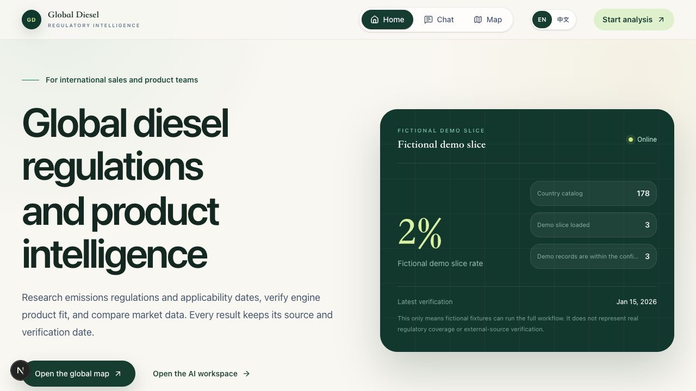
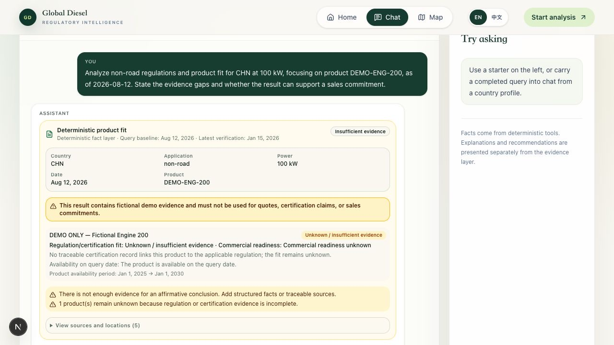
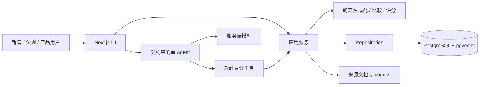

# 全球柴油机法规情报工作台

> 一个以来源证据为基础的法规、产品适配与市场分析工作台，也是 Forward Deployed
> Engineer 作品项目。

[](https://github.com/Jameskyzx/diesel/actions/workflows/ci.yml)

[公开演示](https://jamesky.site) ·
[世界地图](https://jamesky.site/map) ·
[AI 工作台](https://jamesky.site/chat) ·
[FDE 项目案例](docs/FDE_CASE_STUDY.md) ·
[当前状态](docs/STATUS.md) ·
[English README](README.md)

项目模拟海外柴油机销售决策背后的工作：某个国家、日期、应用和功率带适用哪些法规；
产品证据是否足以支持适配结论；市场观测能否比较；每个结论究竟由哪些来源支撑。

法规事实、产品适配、供应状态和评分都由结构化数据与确定性代码负责。LLM 可以选择经过
校验的只读工具并解释结果，但不能虚构法规、认证、产品规格或机会分。

下图来自英文零配置本地 Demo，不代表当前公开 release 已包含这些本地改动：



## 三分钟概览

### 用户问题

销售工程师通常要同时核对法规状态、实施日期、功率带、应用 scope、产品认证、商业供应期、
市场统计口径和来源新鲜度。任一维度出错，都可能把看似合理的建议变成没有证据的销售承诺。

### Golden workflow

1. 在[世界地图](https://jamesky.site/map)选择国家；ISO3 URL 可分享。
2. 查看当前 `effective`、未来 `adopted` 法规、来源链接和核验日期。
3. 输入应用、功率、日期和可选型号。`product-fit-v2` 将合规适配、查询日供应状态和组合后的
   商业就绪度作为独立的确定性字段返回。
4. 在 [AI 工作台](https://jamesky.site/chat)请求法规比较或销售简报。结构化工具卡、引用与
   模型文本保持分离。
5. 缺失数据、过期证据、proposed 法规和缺失认证继续显式呈现；系统不会乐观地跨地域或
   功率带外推。

离线 Demo 只使用明确虚构的 fixture，也不会调用外部模型：



### 当前证据边界

- 经复核的发布闭包：**97 个辖区、28 条法规、651 条限值、203 个来源**。
- 获准公开的真实产品和认证 fixture：**0**。
- 国家目录：**178 个 ISO3 条目**。目录存在或证据边界已发布，不代表每个应用 scope 都有
  数值排放限值。
- Demo 产品：**2 个虚构配置**，仅用于验证 `fit / not_fit / unknown` 和供应状态行为。

运行库状态、代码状态和历史测量在 [STATUS.md](docs/STATUS.md) 中明确分开。

## 三个工程决策

### 1. 证据门控 AI

每个事实工具都有 Zod 校验输入和结构化输出。服务端从可信用户文本建立 evidence contract，
并将每一步模型调用限制在仍能满足缺失要求的工具集合。工具进度可向客户端流式发送，但最终
模型文本会缓冲到工具循环结束且完整证据集通过校验。任何必要结果缺失、畸形或不足时，缓冲
文本会被丢弃，并替换为可操作的证据缺口提示。

Provider reasoning 永不发送到浏览器。启用 thinking model 只改变 provider 内部推理，不会
通过 `/api/chat` 暴露 chain-of-thought。

### 2. 法规时态显式建模

记录状态、业务有效期、采纳日期和来源核验时间分别保存。查询使用 ISO3、应用 scope、功率、
`asOf` 和半开区间 `[from,to)`。`statusAtAsOf` 根据查询日派生，
`recordStatus` 保留当前记录状态。现在已经 superseded 的法规仍可在闭合历史区间返回；
proposed 法规永不当作 effective。

这不是完整的双时态 `knownAsOf` 数据库，文档也不会如此宣称。

### 3. 推荐结果可复现

产品适配、市场可比性、商业就绪度和机会分都由版本化确定性代码计算。缺失维度保持
`null` 或 `unknown`，覆盖边界可见；模型只能解释，不能修改评分。

## 一条命令本地运行

要求：Node.js 22+ 与 pnpm 11。

```bash
pnpm install
pnpm demo
```

打开 <http://127.0.0.1:3000>。不需要 `.env.local`、PostgreSQL、Docker 或 AI key。

Demo 明确只面向开发环境：

- 用仓库内 Drizzle migrations 建立进程内 PGlite；
- 插入稳定 ID 与明显标记为 `DEMO ONLY` / `.invalid` 的虚构来源；
- 确定性离线模型选择相同的只读工具；
- 请求仍经过生产用 repository、service、Zod、audit 和 evidence boundary；
- 不读取或传输开发者数据库凭据、模型密钥和私有文档。

建议问题：

```text
Which regulations are effective in CHN today?
Is DEMO-ENG-100 ready for CHN non-road use at 100 kW?
Compare CHN and BRA non-road regulations at 100 kW.
```

失败优先的面试演示流程见 [DEMO.md](docs/DEMO.md)。

本地可变的完整实施流程使用：

```bash
pnpm demo:fde
```

它只绑定 loopback，使用全新的虚构 PGlite，并持续显示
`LOCAL / MUTABLE / FICTIONAL`，演示 CSV Preview、Draft、Review/Publish、查询读回与
Archive，永不接触公开数据库。

## 架构



- Server Components 负责读优先页面；Client Components 只用于 MapLibre、chat 等浏览器交互。
- Route handler 校验外部输入后才调用应用服务。
- 数据库访问保持在 repository/service 之后。
- AI 没有任意 SQL、事实写入、开放网络搜索或 sub-agent 能力。

详细边界见 [ARCHITECTURE.md](docs/ARCHITECTURE.md) 与
[DATA_MODEL.md](docs/DATA_MODEL.md)。

## 数据来源语义

公开响应逐条区分：

- **虚构 Demo 数据**：`is_demo=true`、`DEMO ONLY` 与 `.invalid` 来源；
- **复核后的公开来源 fixture**：经 Draft → Reviewed → Published 治理路径发布，但使用者
  仍需复核原始来源、scope 和有效期；它们不构成法律或认证建议。

目前没有获准公开的真实产品主数据或认证 fixture。因此绝不能把真实法规证据与 Demo 产品
组合后描述成真实商业可售结论。

## 验证命令

```bash
pnpm lint
pnpm typecheck
pnpm test
pnpm test:coverage
pnpm ai:eval
pnpm ai:eval:live
pnpm portfolio:verify
pnpm db:check
pnpm build
pnpm playwright test
pnpm test:e2e:demo
pnpm test:e2e:fde
pnpm audit:security
```

`pnpm ai:eval` 是确定性对话 harness，不是 live-model 成功率。
`pnpm ai:eval:live` 在隔离 PGlite 上运行 18 条版本化虚构 case，并设置 case、step、
token 和超时预算。每条 case 都断言期望证据决策；失败或未完成运行仍作为失败报告保存，
不会包装成成功指标。

GitHub CI 执行 lint、严格 TypeScript、coverage 门、migration check、build、桌面/移动
Playwright、零配置 Demo 合同、真实 PostgreSQL + pgvector migration smoke、完整历史
密钥扫描和依赖告警策略。唯一的 `Required CI gate` 汇总计划由分支保护要求的所有 job，
避免最强的数据库检查失败却未被汇总。工作流只定义该 gate；GitHub 仓库的分支保护仍需
单独配置并在线核验。

## 标准开发环境

```bash
pnpm install
cp .env.example .env.local
pnpm db:migrate
pnpm db:seed
pnpm dev
```

重要的 server-only 配置包括 `DATABASE_URL`、`DATABASE_MODE`、`AI_API_KEY`、
`AI_BASE_URL`、`AI_MODEL`、`AI_MULTIMODAL_MODEL`、
`AI_CHAT_RATE_LIMIT_BACKEND`、`KNOWLEDGE_STORAGE_ROOT` 和
`ADMIN_ROLE_BINDINGS_JSON`。完整生产、代理、备份、回滚和 canary 边界见
[DEPLOYMENT.md](docs/DEPLOYMENT.md)。

## 审阅路径

- 为什么采用模块化单体而非微服务：见 [ARCHITECTURE.md](docs/ARCHITECTURE.md)。
- 证据门如何失败关闭：见 sales-chat service 及其对抗测试。
- 来源有效期与产品供应期如何查询：见 [DATA_MODEL.md](docs/DATA_MODEL.md)。
- 哪些数据是真实已复核、Demo-only 或仍缺失：见 [STATUS.md](docs/STATUS.md)、
  [ACCEPTANCE.md](docs/ACCEPTANCE.md) 与 [PRODUCT_EVIDENCE.md](docs/PRODUCT_EVIDENCE.md)。
- 合并后的公开快照之外还保留了哪些增量开发证据：见
  [DEVELOPMENT_HISTORY.md](docs/DEVELOPMENT_HISTORY.md)。

## AI 辅助开发说明

编程 Agent 协助实现、机械性整理与对抗审查。作者负责问题定义、数据边界、schema 与 ADR
决策、验收标准、发布红线和最终 review。Agent 输出不能绕过来源读回、自动化测试、
migration 或人工批准。

## 免责声明

这是公开作品项目，不是任何发动机厂商、监管机构或雇主的官方系统。使用前请核对原始来源、
适用范围、生效日期和正式认证。本文与系统输出均不构成法律、认证、销售、投资或监管建议。
