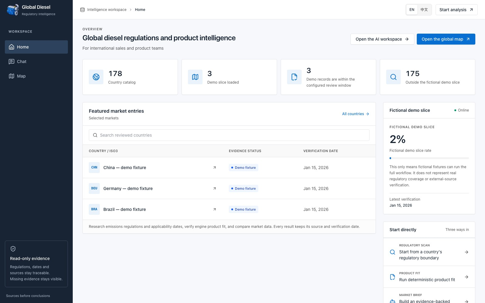
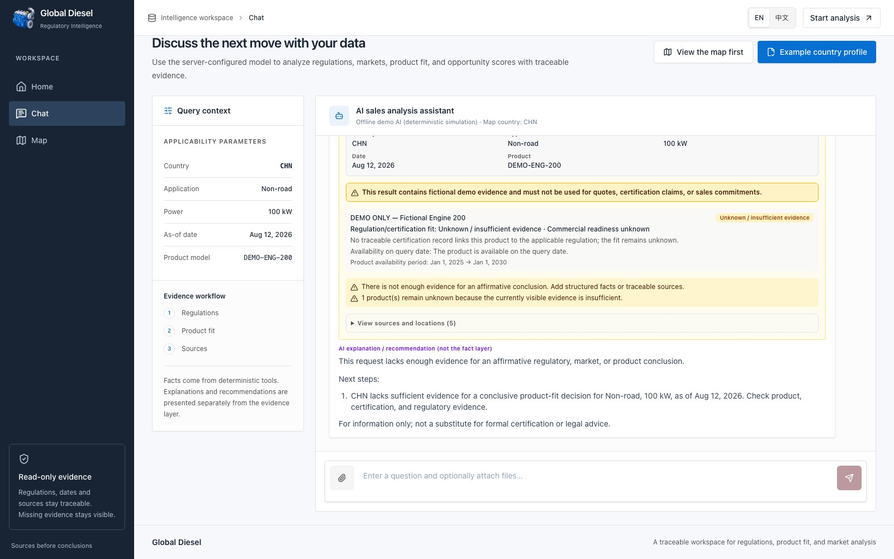
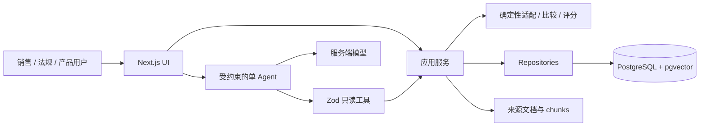

# 全球柴油机法规情报工作台

> 一个以来源证据为基础的法规、产品适配与市场分析工作台，也是 Forward Deployed
> Engineer 作品项目。

[](https://github.com/Jameskyzx/diesel/actions/workflows/ci.yml)

[公开演示](https://jamesky.site) ·
[世界地图](https://jamesky.site/map) ·
[AI 工作台](https://jamesky.site/chat) ·
[FDE 项目案例](docs/FDE_CASE_STUDY.md) ·
[当前状态](docs/STATUS.md) ·
[English README](README.md)

项目模拟海外柴油机销售决策背后的工作：某个国家、日期、应用和功率带适用哪些法规；
产品证据是否足以支持适配结论；市场观测能否比较；每个结论究竟由哪些来源支撑。

法规事实、产品适配、供应状态和评分都由结构化数据与确定性代码负责。LLM 可以选择经过
校验的只读工具并解释结果，但不能虚构法规、认证、产品规格或机会分。

下图来自英文零配置本地 Demo，不代表当前公开 release 已包含这些本地改动：



## 三分钟概览

### 用户问题

销售工程师通常要同时核对法规状态、实施日期、功率带、应用 scope、产品认证、商业供应期、
市场统计口径和来源新鲜度。任一维度出错，都可能把看似合理的建议变成没有证据的销售承诺。

### 核心流程

1. 在[世界地图](https://jamesky.site/map)选择国家；ISO3 URL 可分享。
2. 查看当前 `effective`、未来 `adopted` 法规、来源链接和核验日期。
3. 输入应用、功率、日期和可选型号。`product-fit-v2` 将合规适配、查询日供应状态和组合后的
   商业就绪度作为独立的确定性字段返回。
4. 在 [AI 工作台](https://jamesky.site/chat)请求法规比较或销售简报。结构化工具卡、引用与
   模型文本保持分离。
5. 缺失数据、过期证据、proposed 法规和缺失认证继续显式呈现；系统不会乐观地跨地域或
   功率带外推。

离线 Demo 只使用明确虚构的 fixture，也不会调用外部模型：



### 当前证据边界

- 经复核的发布闭包：**97 个辖区、28 条法规、651 条限值、203 个来源**。
- 获准公开的真实产品和认证 fixture：**0**。
- 国家目录：**178 个 ISO3 条目**。目录存在或证据边界已发布，不代表每个应用 scope 都有
  数值排放限值。
- Demo 产品：**2 个虚构配置**，仅用于验证 `fit / not_fit / unknown` 和供应状态行为。

运行库状态、代码状态和历史测量在 [STATUS.md](docs/STATUS.md) 中明确分开。

当前本地版本的公开路由默认英文，可在不改变当前路径和查询参数的情况下切换为简体中文，偏好
保存一年。页面 metadata、国家名称、日期、ARIA 文案、应用 scope、辖区类型和认证状态都会
跟随所选语言；官方来源标题和原文片段保持来源语言。部署状态单独以
[STATUS.md](docs/STATUS.md) 为准。

## 三个工程决策

### 1. 证据门控 AI

每个事实工具都有 Zod 校验输入和结构化输出。服务端从可信用户文本建立 evidence contract，
并将每一步模型调用限制在仍能满足缺失要求的工具集合。工具进度可向客户端流式发送，但最终
模型文本会缓冲到工具循环结束且完整证据集通过校验。任何必要结果缺失、畸形或不足时，缓冲
文本会被丢弃，并替换为可操作的证据缺口提示。

带类型的 provider reasoning part 会被丢弃，绝不转发到浏览器；普通模型文本中已识别的
reasoning 标记也会失败关闭。`AI_ENABLE_THINKING` 只请求 provider 侧内部推理。部署必须使用
保证私有推理不进入无标签响应文本的 provider contract，因为系统无法仅凭语义可靠识别
无标签 prose 是否属于 chain-of-thought。

### 2. 法规时态显式建模

记录状态、业务有效期、采纳日期和来源核验时间分别保存。查询使用 ISO3、应用 scope、功率、
`asOf` 和半开区间 `[from,to)`。`statusAtAsOf` 根据查询日派生，
`recordStatus` 保留当前记录状态。现在已经 superseded 的法规仍可在闭合历史区间返回；
proposed 法规永不当作 effective。

这不是完整的双时态 `knownAsOf` 数据库，文档也不会如此宣称。

### 3. 推荐结果可复现

产品适配、市场可比性、商业就绪度和机会分都由版本化确定性代码计算。缺失维度保持
`null` 或 `unknown`，覆盖边界可见；模型只能解释，不能修改评分。

## 一条命令本地运行

要求：Node.js 22+ 与 pnpm 11。

```bash
pnpm install
pnpm demo
```

打开 <http://127.0.0.1:3000>。不需要 `.env.local`、PostgreSQL、Docker 或 AI key。

Demo 明确只面向开发环境：

- 用仓库内 Drizzle migrations 建立进程内 PGlite；
- 插入稳定 ID 与明显标记为 `DEMO ONLY` / `.invalid` 的虚构来源；
- 确定性离线模型选择相同的只读工具；
- 请求仍经过生产用 repository、service、Zod、audit 和 evidence boundary；
- 不读取或传输开发者数据库凭据、模型密钥和私有文档。

建议问题：

```text
今天 CHN 有哪些已经生效的法规？
DEMO-ENG-100 是否可用于 CHN 的 100 kW 非道路场景？
比较 CHN 与 BRA 在 100 kW 非道路场景下的法规。
```

失败优先的面试演示流程见 [DEMO.md](docs/DEMO.md)。
需要独立执行的中英双语接口/界面练习、预期结果和交接清单时，参见
[本地证据练习](docs/LOCAL_EVIDENCE_LAB.md)。

本地可变的完整实施流程使用：

```bash
pnpm demo:fde
```

它只绑定 loopback，使用全新的虚构 PGlite，并持续显示
`LOCAL / MUTABLE / FICTIONAL`，演示 CSV Preview、Draft、Review/Publish、查询读回与
Archive，永不接触公开数据库。

## 架构


```mermaid
flowchart LR
    User[销售 / 法规 / 产品用户] --> UI[Next.js UI]
    UI --> Services[应用服务]
    UI --> Agent[受约束的单 Agent]
    Agent --> Tools[Zod 只读工具]
    Tools --> Services
    Services --> Rules[确定性适配 / 比较 / 评分]
    Services --> Repos[Repositories]
    Repos --> DB[(PostgreSQL + pgvector)]
    Services --> Evidence[来源文档与 chunks]
    Agent --> Model[服务端模型]
```

- Server Components 负责读优先页面；Client Components 只用于 MapLibre、chat 等浏览器交互。
- Route handler 校验外部输入后才调用应用服务。
- 数据库访问保持在 repository/service 之后。
- AI 没有任意 SQL、事实写入、开放网络搜索或 sub-agent 能力。

详细边界见 [ARCHITECTURE.md](docs/ARCHITECTURE.md) 与
[DATA_MODEL.md](docs/DATA_MODEL.md)。

## 数据来源语义

公开响应逐条区分：

- **虚构 Demo 数据**：`is_demo=true`、`DEMO ONLY` 与 `.invalid` 来源；
- **复核后的公开来源 fixture**：经 Draft → Reviewed → Published 治理路径发布，但使用者
  仍需复核原始来源、scope 和有效期；它们不构成法律或认证建议。

目前没有获准公开的真实产品主数据或认证 fixture。因此绝不能把真实法规证据与 Demo 产品
组合后描述成真实商业可售结论。

## 验证命令

```bash
pnpm lint
pnpm typecheck
pnpm test
pnpm test:coverage
pnpm ai:eval
pnpm ai:eval:live
pnpm portfolio:capture-screenshots
pnpm portfolio:capture-playwright-evidence
pnpm portfolio:capture-vitest-evidence
pnpm portfolio:verify
pnpm db:check
pnpm build
pnpm playwright test
pnpm test:e2e:demo
pnpm test:e2e:fde
pnpm audit:security
```

证据采集必须按上述顺序：截图及其 manifest 是浏览器验收输入，浏览器 artifact 与 STATUS
又是完整 Vitest 指纹的输入。更新浏览器快照后，先完成全部源码/文档编辑，再采集 Vitest。
任何上游输入变化都必须重新采集下游证据，不得改写报告记录的指纹来绕过检查。

`pnpm portfolio:capture-vitest-evidence` 会运行完整 canonical Vitest suite；只有退出码为零且
运行前后源码状态完全一致时，才替换 `docs/evidence/vitest-execution-latest.json`。公开 artifact
只保留匿名测试 ID、闭合的结果算术、运行时间、base HEAD、worktree 状态，以及除 artifact
自身之外所有 Git-visible 文件的指纹；不保存测试标题、路径、失败消息或 stack。
`pnpm portfolio:verify` 会重新列举当前 suite，并要求匿名身份 inventory 与当前源码指纹都和
该执行 artifact 一致。dirty 本地 capture 可用于迭代，但不会记录 evaluated commit，也不能满足
release-evidence 模式。
capture 使用空的私有 HOME 调用已锁定版本的本地 pnpm，并启用 offline 和依赖漂移即报错；执行前后
还会核验实际安装的 Vitest 版本。这些属于本地一致性检查，不是包签名或供应链证明。capture 与
verify 要求 Unix 主机允许并可执行精确的 `/bin/ps -axo pid=,pgid=` inventory。bounded-command
helper 会在启动任何 workload 前证明 detached leader 与同组 inspector；capture/verify 还会在获取
仓库锁之前先运行该证明，不支持的主机会失败关闭且不留下该锁。

捕获锁只协调本仓库命令：它是以无覆盖方式发布在 Git shared common directory 中的私有 `0600`
canonical owner 文件，因此关联 worktree 共用同一把锁。publication hard link 会作为全生命周期
guard 保留；只删除 canonical 路径会留下阻断下一次运行的孤立 guard。verify 在受监督地执行独立
`vitest list` 的整个期间持有同一把锁。发生冲突时，只有 host/platform 相同且 PID 探针
明确证明 owner 进程不存在才会标记为 stale candidate，也不会自动恢复：父 wrapper 消失不能证明
Vitest 后代已停止。操作者必须先核对进程树并显式确认无后代工作负载；恢复才会把原 owner 字节
hard-link 到摘要命名的 quarantine 并复核 inode。恢复由独占 claim 串行；崩溃恢复留下的 claim 与孤立
publication candidate 都会报告精确路径，并保持失败关闭以供人工核对。仍存活、权限拒绝、未知、异地主机、畸形、
symlink、遗留目录与孤立 publication candidate 状态全部
失败关闭，绝不以锁龄推断 stale。该合同只协调协作进程，不对无关写入者提供事务隔离。
若 workload containment 无法证明，锁、guard、私有工具目录及 report/inventory 目录都会保留供
操作者显式核查；仓库内遗留的 evidence staging 文件也会阻断后续运行。

本地 `pnpm build` 以及受控的 Playwright、Demo、FDE 和 global-error Next server 会在 Next
启动前快照 `next-env.d.ts`。每种入口只接受其预期的 canonical route import；Next 关闭后通过
同目录临时文件、fsync、原子 rename 和读回，按原字节与 mode 恢复，HTTP shutdown 也只有恢复
完成后才返回成功。在最终提交前被观测到的未知并发内容会保持原样并使操作失败；最后稳定读到
rename 的短窗口不是原子 compare-and-swap。该机制是有界清理与漂移保护，不是互斥锁
或崩溃恢复：同一 checkout 不应并行运行 Next 进程，不可捕获的终止仍可能需要人工检查。

`pnpm portfolio:capture-playwright-evidence` 会按顺序运行固定的浏览器矩阵：公开桌面/移动
流程、零配置 Demo、失败优先 FDE 流程，以及针对全新本地生产构建的 CSP 检查。每套 suite
只生成最小化 receipt，保留有界的测试身份、结果、重试、project 与 provenance 字段；不保存
浏览器输出、附件、stack、请求数据或页面内容。只有四份 receipt 的命令/project 矩阵精确、
运行窗口不重叠、结果算术闭合、源码指纹一致且 base HEAD 相同，才会替换
`docs/evidence/playwright-e2e-latest.json`。
每个记录位置都必须解析到已存在、有大小上限、UTF-8 编码、非符号链接的普通 `e2e`
源码文件，且行号必须在文件范围内。新 receipt 只有在 `project`、`id`、`file`、`line` 和
`expectedStatus` 五字段 inventory 与 checked-in 聚合中对应 run 精确一致时才会被接受；
outcome 字段仍由独立执行检查负责，不能替代测试身份。

源码指纹覆盖应用、浏览器 fixture 与 config、package/lock/workspace 文件、migration 和证据脚本。clean
checkout 会把 `evaluatedCommit` 绑定到 HEAD；dirty 本地捕获会有意把 `evaluatedCommit` 留为
null，只记录 base HEAD 与实际源码指纹。CI 还要求 clean worktree，且 HEAD 必须等于
`GITHUB_SHA`。`pnpm portfolio:verify` 会严格重解析聚合工件、重算摘要与当前源码指纹，并核对
STATUS 镜像。它只能证明所记录源码状态下这些本地浏览器合同通过，不能证明生产环境已经部署、
真实用户取得成效或 live model 具备相应质量。

发布前应运行 `pnpm portfolio:verify -- --release-evidence`。与允许 dirty worktree 的普通一致性
检查不同，release 模式要求关键作品集文档、live-eval latest/archive 对、Playwright 工件，以及
截图 manifest 和其中引用的图片都已存在于 HEAD，并且在 HEAD、index 与 worktree 中逐字节一致。
CI 使用此模式；配置的期望 commit 必须等于 `github.sha`，且 HEAD 从验证开始到结束都必须
保持这一身份。仅暂存而未提交的文件会按设计失败关闭。release 模式还要求 captured HEAD
具备完整、非 shallow 的历史：该 commit 中每个受识别的 live-eval archive 都会被验证，已发布
archive 在每条可达的 parent-to-child 边上都必须保持相同路径和字节。这只证明祖先闭包，不能
防护 force-push 或被重写的 release lineage；更广的保证仍依赖可信 baseline 或外部分支保护。

verifier 路径上的每次 Git 读取都使用经过校验的、可执行、非符号链接的普通绝对路径二进制
（CI 固定为 `/usr/bin/git`），绝不经 `PATH` 查找。runner 会先移除继承的 `GIT_*`、`LD_*` 与
`DYLD_*` 控制项，再设置固定的非交互、禁用 replace-object 策略。这能抵御执行环境注入，但不
构成对有权改写 verifier 或 workflow 自身的 hostile commit 的远程证明；此时信任根仍是代码审查
与受保护分支 ruleset。

`pnpm portfolio:verify` 还会解析 `docs/evals/README.md` 中唯一、canonical 的当前报告机器身份块，
并要求其中的版本、评估时间、run ID、archive 路径和源码指纹与 latest report 精确一致。

`pnpm ai:eval` 是确定性对话 harness，不是 live-model 成功率。
`pnpm ai:eval:live` 在隔离 PGlite 上运行 18 条版本化虚构 case，并设置 case、step、
token 和超时预算。每条 case 都断言期望证据决策、必要的事实/决策 anchor 和回答语言；
失败或未完成运行仍作为失败报告保存，
不会包装成成功指标。provider usage 缺失不会按零计数：runner 会保留已完成 step 的已知
成本，并让 token 预算完整性门失败关闭。Live eval v6 会强制请求流式 usage，并对每次
模型调用禁用 SDK 重试；v7 再把单次输出限制为 1,024 token，记录 18 × 5 次调用的
92,160 最大潜在输出，并把 160,000 总 token 策略明确标成
`post_usage_acceptance`。v8 还会拒绝证据不允许的回答中先出现拒绝前缀、随后却给出强肯定
业务结论；安全判定同时要求证据期望门与基于证据的整题拒绝。这些设置都会写入报告并由
verifier 独立复核；精确的预消费账单
硬限额仍需要 provider 侧预算或模型专用 tokenizer。
v9 会把任何已观察到的 provider 流错误判为 `EVAL_CASE_ERROR`，即使 SDK 的便利 Promise
随后用 fallback 文本正常 resolve；落盘的知识检索 `query` 也一律替换为字符数和 SHA-256
摘要。原查询只在内存中参与评分，不进入 latest 或 archive。
v10 会先用各工具的生产 Zod schema 校验实际输入，再把 query、产品型号、指标代码和非空
辖区 ID 等 provider 可控自由字符串全部替换为指纹。知识检索另只落盘命中、缺失或命中禁用项
的有限契约 ID，因此有意义的中英文检索词与 prompt-injection 排除条件会进入参数判定，但词面
本身不进入报告。
v11 保留上述脱敏规则，并记录每个完成 step 的归一化 token、cache、provider response、完整
step 与模型首个输出耗时。报告不保存 prompt、回答、raw usage、endpoint 或价格；逐例聚合及
nearest-rank p50/p95/max 都由落盘 step 重算，缺失的性能或 cache 字段保持显式缺失，不补零。
v11 schema 还会从保留的原子指标推导 step 完整性和 cache 兼容性，将 completed
call、ledger 与 step 算术闭合在最多 5 步，并拒绝自相矛盾的归一化行。v12 保持 JSON 字段
集合不变，但修正两类行的语义：`tokenUsage.ledger` 是 provider-call 计费台账，
`modelObservability.steps` 只包含真正到达 `onStepEnd` 的 SDK step。终态 provider completion
最多可以领先一个缺失的 step 行；反向差异或差值大于 1 均失败关闭，并且该 usage 仍不完整。
模型名与最终报告 ID 共用同一安全合同，runner 在写入前会解析整份报告。Portfolio verifier
选取符合现代 run-ID 文件名格式的归档，按
[live-eval-report-schema.ts](scripts/portfolio/live-eval-report-schema.ts)
中已注册的版本专用 strict schema 校验；未知版本失败关闭。仅有两份明确命名的早期现代 v2
文件例外，分别绑定到 [verify-live-eval.ts](scripts/portfolio/verify-live-eval.ts)
中的精确全文 SHA-256。
schema 校验通过不等于评估过门槛，也不等于发布获批。
它不证明历史 scorer 正确，也不使用当前 scorer 重评历史观察；当前报告的一致性与发布要求
另行检查。
`STATUS.md` 将实际观察到的 report version 与 suite contract 分开记录。切换供应商不会
升级或替换历史观察；每次运行都保留实际模型、源码指纹与结果。
V13 的回答日期锚点除 ISO 日期外，也接受应用自身的中英文 UTC 日期表达，以修复已复现的
误判；不改变证据期望、门槛或历史报告结果。
CLI 从不依赖应用模块的纯 ESM bootstrap 启动，在受保护边界内读取 `.env.local`，再以子进程
运行 TypeScript evaluator。UUID 双向确认会在任何模型调用前记录 provider 边界，并在子进程
退出前确认报告已落盘。因此 provider 前的 loader/runtime 异常可保存诚实的零调用报告；跨过
provider 边界后若底层持久化本身崩溃，则只以非零退出，不会虚构零调用观察。

当前 live-eval 的精确身份、结果、计数、provenance 与归档路径只记录在
[STATUS.md](docs/STATUS.md) 的受控台账中；`pnpm portfolio:verify` 会把该台账绑定到 canonical
报告与归档。Provider 运行需要明确授权。证据规则要求将 dirty-worktree 观察限定为本地
诊断证据，不得据此声明已提交 release 或线上应用通过评估。

运行时 `ai.completion` 日志使用严格且不含 prompt 的 step ledger，记录基础 token、模型
调用延迟和 provider 报告的 cache 明细。适配器补出的零不能作为 token 或 cache 证据：
OpenAI-compatible provider 必须给出原始基础计数，并与 SDK 归一化计数一致。provider
尝试次数与完成次数分别统计，因此重试、请求取消或响应期限超时只会留下明确标记为不完整的
已知下界；日志不会保存 provider 原始 usage。

`AI_INCLUDE_USAGE` 默认关闭，只用于兼容性地请求流式 usage，不会启用 prompt caching。
只有 server-only、带版本的 pricing profile 与实际模型 ID 完全匹配且包含端点
`validThrough` 尚未过期时，成本状态才会从 `not_configured` 变为估算值。估算使用整数
micro-USD，并且永不冒充实际账单。

当前本地 CI workflow 已配置为执行 lint、严格 TypeScript、coverage 门、migration check、
build、桌面/移动 Playwright、零配置 Demo 合同、失败优先 FDE 流程、真实 PostgreSQL +
pgvector migration smoke、完整历史密钥扫描和依赖告警策略。工作流还定义了 merge-blocking
门中的应用 coverage 与完整历史 Linux deployment-script contract 分别使用 30 和 45 分钟
上限的独立 job；后者在单次 Vitest 调用中运行四个测试文件：`deploy-scripts`、
`host-activation-ledger`、`release-publication-controller` 和 `host-release-orchestrator`，
仅从应用 coverage 进程排除这些文件。提取 ledger 分组保留原测试体，并允许普通文件级调度；
没有新增 shard、worker 或 `concurrent` 设置。verbose reporter 与零 slow-test threshold
提供逐例进度。拆分或超时预算本身不证明稳定的完整套件提速或远端 runner 结果；最终汇总门仍要求
两者同时成功，完整本地
`pnpm test` / `pnpm test:coverage` 语义不变。工作流还定义了 merge-blocking 的 GitHub-hosted
Ubuntu 24.04 release handoff：使用真实临时 runtime/build 用户、PID 1 systemd/cgroup v2、
GNU rsync、Corepack/pnpm、生产 root-side prepare 和 artifact readiness 校验，并且不把 checkout
凭据或 runner secret 传入 root 构建。builder 位于 SHA 绑定的 transient service；只有 retained
manager 退出元数据和 stop 后两轮残留证明都通过，工件才会被信任；真实 background-child
canary 必须被拒绝并收口，`exit 23` 与 SIGTERM→143 canary 还必须保留 manager 状态。Next
改写的 tracked declaration 会先由 builder 做早期恢复，随后
root 仅在 cgroup 与 build UID 归零后从 canonical release 再恢复一次；TypeScript 增量状态只写
入各自普通或 E2E Next cache。该 job 已在本地接线；首个远端 run 成功前不能引用为
Linux 执行证据，且不能替代真实 VPS/SSH/PM2/Nginx/PostgreSQL/systemd
演练。治理并发 smoke 会先确认两个竞争事务都在等待 PostgreSQL 行锁，
再释放阻塞者，并验证最终只有一个变更提交。唯一的 `Required CI gate` 汇总分支保护要求的
所有 job，避免最强的数据库检查失败却未被汇总。这些 workflow 变更合入默认分支并出现远端
成功 run 前，只是接线证据。verifier 会锁定五个关键 producer——`deploy-contracts`、
`postgres-migrations`、`secrets`、`audit` 和 `linux-release-handoff`——规范化后的完整
job-body 合同，而不是只信任 job ID；它还会扫描每个 `.yml` 与 `.yaml` workflow，并规定
`Required CI gate` 名称只能由 `.github/workflows/ci.yml#required` 这一个静态 job 使用。
验证器还会直接解析 canonical `package.json`，固定 `pnpm@11.9.0`，并绑定 CI job
间接触发的每个 package-script 展开（包括 Playwright web-server 脚本）；任一受管脚本出现
`pre`/`post` lifecycle companion 也会失败关闭。
`master` 保护最后于 2026-09-01 在线读回为 strict、管理员同样
受限、禁止 force-push/deletion，且只要求这一汇总 context；发布前仍需重新读回。

本地已接线的外部 canary 在合入默认分支后，会把 liveness/readiness 绑定到 STATUS machine
block 中记录的完整 release SHA；若公开产品列表不再恰好是两个虚构 Demo 配置且真实产品数
为 0，检查会失败关闭。

## 标准开发环境

```bash
pnpm install
cp .env.example .env.local
pnpm db:migrate
pnpm db:seed
pnpm dev
```

重要的 server-only 配置包括 `DATABASE_URL`、`DATABASE_MODE`、`AI_API_KEY`、
`AI_BASE_URL`、`AI_MODEL`、`AI_MULTIMODAL_MODEL`、
`AI_INCLUDE_USAGE`、可选的 `AI_COST_PROFILE_JSON`、`AI_CHAT_RATE_LIMIT_BACKEND`、
`AI_CHAT_RATE_LIMIT_GLOBAL_PER_HOUR`、`AI_CHAT_RATE_LIMIT_PER_HOUR`、
`AI_CHAT_ADMISSION_GLOBAL_PROVIDER_CALL_UNITS_PER_DAY`、
`AI_CHAT_ADMISSION_CLIENT_PROVIDER_CALL_UNITS_PER_DAY`、
`KNOWLEDGE_STORAGE_ROOT` 和
`ADMIN_ROLE_BINDINGS_JSON`。完整生产、代理、备份、回滚和 canary 边界见
[DEPLOYMENT.md](docs/DEPLOYMENT.md)。

Chat 小时准入使用按 epoch 对齐的一小时固定窗口。可选全局值缺省为兼容性上限
10,000 请求/小时；两个小时值都必须是 1–10,000 的整数，且 client 不得大于 global。
生产示例有意显式设置 global/client 为 300/30，并使用 PostgreSQL backend。PostgreSQL
让所有应用实例共享计数，并在同一事务中固定先预留 global、再预留 client：global 已满时
不会触碰 client 桶，client 已满则回滚此前暂增的 global。拒绝不会提交 `limit + 1` 行；请求
一旦准入，后续解析、配置、审计或 provider 失败也不退款。数据库只保存已解析 client identity
的 SHA-256 摘要。cleanup 仅用于 retention，位于请求判定事务之外，每进程每分钟最多清理
500 条过期行。required PostgreSQL CI job 现已加入仅允许 loopback 专用数据库的 smoke，会断言
五个不同 backend session 并精确读回 global 耗尽与 client 耗尽回滚场景；当前工作区尚未取得该
远端 CI 回执，这些改动也不代表当前公开部署已经升级。

## 审阅路径

- 为什么采用模块化单体而非微服务：见 [ARCHITECTURE.md](docs/ARCHITECTURE.md)。
- 证据门如何失败关闭：见 sales-chat service 及其对抗测试。
- 来源有效期与产品供应期如何查询：见 [DATA_MODEL.md](docs/DATA_MODEL.md)。
- 哪些数据是真实已复核、Demo-only 或仍缺失：见 [STATUS.md](docs/STATUS.md)、
  [ACCEPTANCE.md](docs/ACCEPTANCE.md) 与 [PRODUCT_EVIDENCE.md](docs/PRODUCT_EVIDENCE.md)。
- 合并后的公开快照之外还保留了哪些增量开发证据：见
  [DEVELOPMENT_HISTORY.md](docs/DEVELOPMENT_HISTORY.md)，并运行
  `pnpm history:verify` 重放只读拓扑校验；公开再分发许可证门尚未解除，因此仍不发布。

## AI 辅助开发说明

编程 Agent 协助实现、机械性整理与对抗审查。作者负责问题定义、数据边界、schema 与 ADR
决策、验收标准、发布红线和最终 review。Agent 输出不能绕过来源读回、自动化测试、
migration 或人工批准。

## 免责声明

这是公开作品项目，不是任何发动机厂商、监管机构或雇主的官方系统。使用前请核对原始来源、
适用范围、生效日期和正式认证。本文与系统输出均不构成法律、认证、销售、投资或监管建议。
