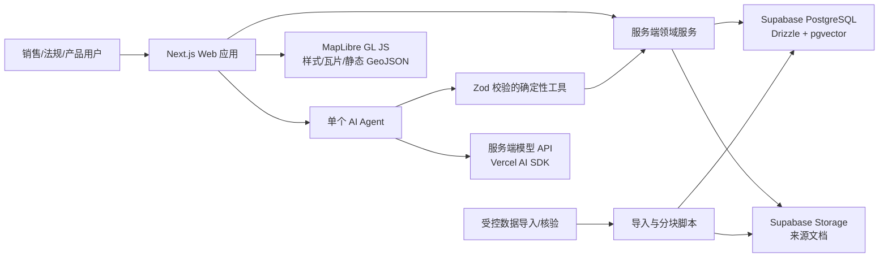
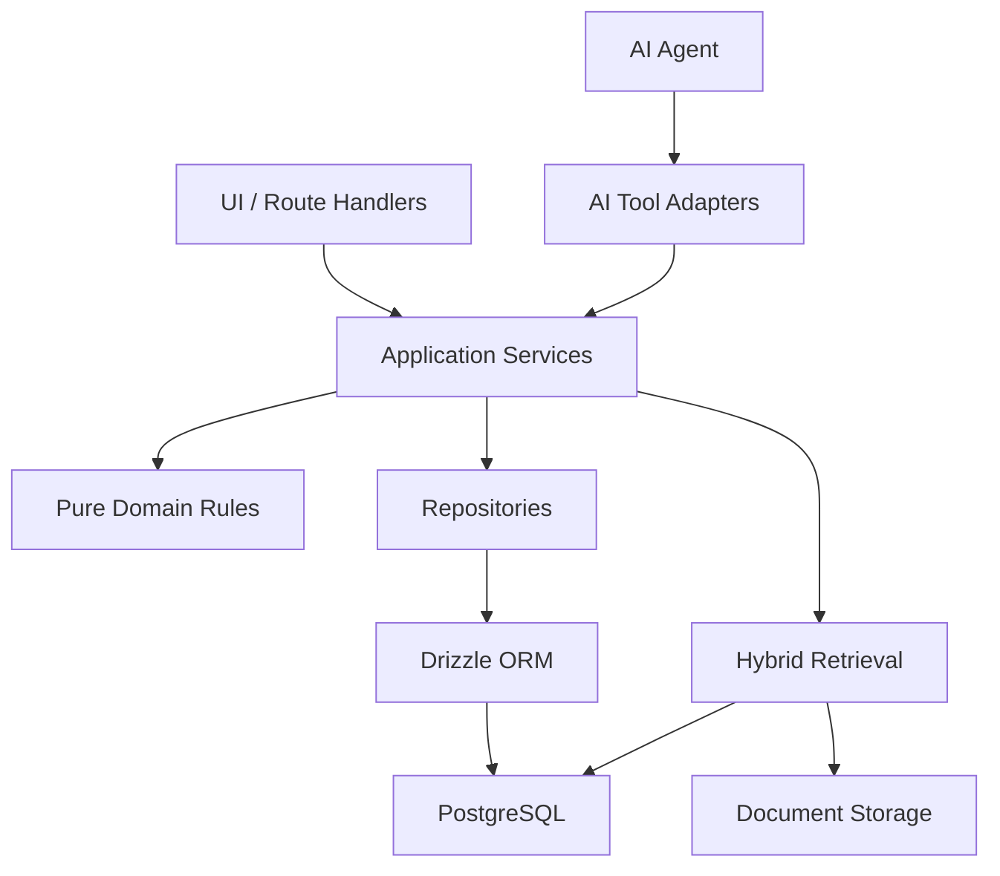
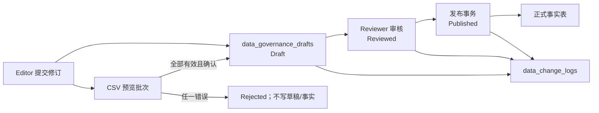

# 系统架构

## 1. 架构目标

本系统采用 Next.js 模块化单体。交互式地图、国家详情和 AI UI 位于同一 Web 应用；领域服务、数据库访问、知识检索和模型调用只在服务端运行。MVP 使用单个 Agent 和多个确定性、只读工具，不使用多 Agent。

架构首先保证：

- 法规、市场、产品和认证事实可结构化查询并可追溯。
- LLM 不成为事实来源，也不能直接访问数据库。
- 应用范围、状态、功率和有效期在查询链路中显式传递。
- 地图按 ISO3 连接静态几何和数据库摘要。
- 模块边界可测试，后续可在有证据时拆分，而不是提前微服务化。

## 2. 系统上下文



## 3. 运行时边界

### 3.1 浏览器

浏览器只负责：

- MapLibre 地图渲染和 hover/click/focus 交互。
- 国家筛选器、产品选择器和 AI 对话交互。
- 展示 Server Components 或 route handler 返回的最小必要数据。
- 使用公开、非敏感的地图配置。

浏览器不得持有：

- Supabase service role key、数据库连接串或模型 API Key。
- 任意 SQL 能力。
- 大型文档原文或完整世界几何的 React state 副本。
- product-fit 或营销评分的权威计算逻辑。

### 3.2 Next.js 服务端

- Server Components 负责首屏和可缓存的只读查询。
- Client Components 仅用于 MapLibre、触摸/指针状态、筛选交互和流式聊天。
- Route Handlers 接受外部输入时先通过 Zod 验证，再调用 application service。
- Server Actions 只在写入流程确定后使用；MVP 默认数据导入不通过面向销售的 UI。
- `server-only` 模块承载数据库、对象存储、AI provider 和密钥访问。

### 3.3 数据层

- Drizzle schema 和迁移是结构化数据库定义的唯一代码来源。
- Repository 封装查询，不向 UI 暴露 ORM。
- Service 组合 repository、有效期判断、单位规则、fit/score 规则和来源聚合。
- 对象存储保存文档二进制；数据库保存文档元数据、哈希、定位信息和 chunks。

## 4. 逻辑分层



- **UI 层**：展示和交互，不含事实判断。
- **Application Service 层**：用例编排、权限检查、事务、查询和输出 DTO。
- **Domain 层**：纯函数实现状态/有效期、功率区间、可比性、product-fit 和评分。
- **Repository 层**：Drizzle 查询和数据库映射。
- **AI Tool Adapter 层**：将 Zod 输入映射到 application service，并返回结构化、可引用结果。
- **Retrieval 层**：元数据过滤、关键词/向量召回、融合排序和证据安全检查。

## 5. 建议目录结构

```text
.
├─ AGENTS.md
├─ docs/
│  ├─ PRD.md
│  ├─ ARCHITECTURE.md
│  ├─ DATA_MODEL.md
│  ├─ TASKS.md
│  └─ DECISIONS.md
├─ drizzle/
│  ├─ migrations/
│  └─ meta/
├─ public/
│  └─ geo/
│     └─ world-countries.geojson
├─ scripts/
│  ├─ ingest/
│  └─ seed/
├─ src/
│  ├─ app/
│  │  ├─ (app)/
│  │  │  ├─ page.tsx
│  │  │  └─ countries/
│  │  │     └─ [iso3]/
│  │  │        ├─ page.tsx
│  │  │        ├─ loading.tsx
│  │  │        └─ error.tsx
│  │  ├─ api/
│  │  │  └─ ai/
│  │  │     └─ route.ts
│  │  ├─ layout.tsx
│  │  └─ globals.css
│  ├─ components/
│  │  ├─ ai/
│  │  ├─ countries/
│  │  ├─ map/
│  │  ├─ market/
│  │  ├─ products/
│  │  ├─ regulations/
│  │  └─ ui/
│  ├─ features/
│  │  ├─ countries/
│  │  ├─ regulations/
│  │  ├─ markets/
│  │  ├─ products/
│  │  └─ product-fit/
│  ├─ server/
│  │  ├─ ai/
│  │  │  ├─ agent.ts
│  │  │  ├─ prompts/
│  │  │  └─ tools/
│  │  ├─ auth/
│  │  ├─ db/
│  │  │  ├─ client.ts
│  │  │  └─ schema/
│  │  ├─ knowledge/
│  │  ├─ repositories/
│  │  ├─ services/
│  │  └─ storage/
│  ├─ lib/
│  │  ├─ dates/
│  │  ├─ units/
│  │  └─ validation/
│  └─ env.ts
├─ tests/
│  ├─ fixtures/
│  ├─ integration/
│  └─ unit/
├─ e2e/
├─ drizzle.config.ts
├─ next.config.ts
├─ package.json
├─ playwright.config.ts
├─ tailwind.config.ts
├─ tsconfig.json
└─ vitest.config.ts
```

说明：

- 目录表示目标结构，不要求一次创建全部空目录。
- `features/` 放共享 DTO、展示模型和领域相关的非服务端代码；`server/` 不得被 Client Component 引入。
- schema 按领域拆文件，迁移仍保持单一有序序列。
- 静态世界边界只保存适合 Web 的简化版本和许可说明。

## 6. 页面和 URL

- `/`：业务工作台首页，提供覆盖概览和工作流快捷入口。
- `/map`：世界地图与国家摘要入口。
- `/chat`：AI 销售分析对话工作区。
- `/countries/[iso3]`：可分享国家详情，`iso3` 在服务端标准化为大写并验证存在性。
- 建议筛选状态进入 query string，例如 `scope`、`powerKw` 和 `asOf`，以便复现；允许的值需 Zod 验证。
- AI 可以作为同一 app shell 的侧栏/抽屉，不需要独立页面。

使用 Next.js App Router 的 route segment loading/error boundary。国家详情优先使用 Server Component；MapLibre 与依赖浏览器 API 的控件使用小型 Client Component。

## 7. 地图架构

1. 构建时或静态资源加载简化 GeoJSON。
2. 每个 feature 必须含 canonical `ISO3`。
3. 服务端提供轻量国家覆盖摘要，前端以 ISO3 设置 feature-state 或构建小型 lookup。
4. hover 只维护当前 ISO3，不复制几何。
5. click 导航到国家 URL；触摸设备以 click 为主。
6. 国家详情来自数据库，不嵌入 GeoJSON。
7. 普通国家选择不使用 PostGIS。只有未来出现距离、包含、经销区域或空间聚合需求时才提交 ADR 和空间查询。

地图样式/瓦片和 GeoJSON 数据源必须在部署前完成许可核验。

### 7.1 阶段 3 已实现切片

- `public/geo/world-countries.geojson` 使用 Natural Earth 1:110m 公共领域边界，
  只保留 `ISO3`、英文名称和几何；来源 revision 与转换规则记录在同目录
  `README.md`。
- MapLibre 直接加载静态 GeoJSON；React state 只保留国家索引、数据库摘要、
  当前选择和单个 Tooltip，不保存世界几何。
- `/api/countries` 返回地图覆盖摘要，`/api/countries/[iso3]` 返回国家、司法
  辖区、法规状态/有效日期、来源和核验日期；二者均通过 Zod 输出 schema。
- 国家地图与详情的公开 PostgreSQL 出口不发布 Demo 分类事实：Demo 国家摘要保留
  ISO3 目录位置但降为 `no_data`，Demo 国家详情失败关闭；非 Demo 国家中的辖区、
  成员关系、法规、市场指标或任一直接来源只要标为 Demo，整条依赖事实即从详情与
  AI 国家画像中排除。只有显式 `DATABASE_MODE=pglite-demo` 的本地作品演示继续返回
  Demo fixture，不能依靠前端徽标掩盖生产混合数据。
- 国家详情 Repository 强制接收 `asOf`，辖区成员关系与法规均按 `[from,to)`
  有效期过滤。公开 DTO 只返回当前 `effective` 与未来 `adopted` 两组法规，来源和
  AI 引用也只从这两组可见事实生成，不暴露 `proposed`、`superseded` 或历史原始
  法规数组。
- 适用司法辖区同时返回辖区实体来源与国家成员关系来源；国家详情中的每条可见法规
  也直接携带其适用辖区、目标国家成员关系、半开有效期和两类来源，页面与 AI
  citation 通过 `regulationId` 保留这条对应关系，不把辖区证据降成无法映射的全局列表。
  法规、市场和 product-fit 的正式查询沿完整依赖链过滤国家、国家来源、辖区、辖区
  来源、成员关系、成员来源、事实记录及其直接来源的 `archived_at`。任一依赖证据
  归档后，不继续产生公开结论。
- `/countries/[iso3]` 是可分享状态，地图页面与国家路由复用同一个 Explorer；
  Drawer 关闭返回 `/map`，刷新或浏览器导航恢复当前国家。
- 原生 `<select>` 提供与地图 click 等价的键盘/触控入口；hover 只作为指针
  设备增强，不承载唯一关键信息。
- MapLibre 通过 `next/dynamic` 在客户端按需加载；Tooltip 位置按实际地图容器宽高
  限界，窄屏指针 viewport 不会把内容推出可视区域。
- 同一国家内 product-fit 成功写回新的 `asOf` 后，详情请求以 `ISO3 + asOf` 为
  身份重新获取法规分组，避免 URL/评估日期已更新而国家详情仍显示旧时点。
- 产品适配评估在输入变化、重复提交、国家切换和组件卸载时取消旧请求，并以请求
  序号二次拒绝陈旧响应；旧国家的迟到结果不能写回筛选 URL 或覆盖新评估状态。
- 管理写操作与其后的 dashboard 刷新使用分离的错误语义：事实/草稿动作已经成功时，
  后续快照读取失败只报告“操作已完成但刷新失败”，并保留成功通知，不能把已提交
  动作误报为失败而诱导重复写入。管理客户端只从结构化 JSON 错误信封读取服务端
  文案；HTML、纯文本或畸形响应固定回退，不把代理/上游原文渲染到页面。
- 市场 CSV 文件控件具有显式可访问标签；已生成 Preview 后一旦改选文件，客户端立即
  清除旧批次与确认入口；每次重新预览开始前也先失效旧批次，因此重试失败不能继续
  确认此前结果，避免界面与持久化批次身份错位。
- Playwright 和 `pnpm demo` 通过显式 `DATABASE_MODE=pglite-demo` 在进程内执行
  真实 Migration 与确定性 Seed。作品 Demo 还必须满足
  `PORTFOLIO_DEMO_MODE=true + NODE_ENV=development`，并使用确定性离线模型选择
  现有只读工具；工具证据门和结构化结果不做旁路。默认模式始终是 PostgreSQL，
  生产环境拒绝该组合，连接失败也不会自动降级为 Demo 数据库。

## 8. 结构化查询路径

### 8.1 法规

`country ISO3 -> applicable jurisdictions -> regulations -> requirements -> emission limits -> sources`

查询条件必须显式包含：

- `asOf` 日期。
- application scope。
- `powerKw`，若用例涉及功率。
- 是否包含 proposed；默认当前合规视图不混入 proposed。
- `adopted` 且生效日期未知的法规，只有在 `adoptedOn` 已知且不晚于查询日时才保留在
  未来/待定风险组；不得当作 `effective`。

法规状态分为两个层次：

- `recordStatus` 是当前持久记录的生命周期状态（国家详情兼容 DTO 仍以 `status`
  返回该值），用于保留该记录现在是 `effective`、`adopted` 或 `superseded`；
- `statusAtAsOf` 是 service 根据生命周期日期和查询 `asOf` 派生的查询时状态，只能为
  `effective` 或 `adopted`。`[effectiveFrom,effectiveTo)` 覆盖查询日时，当前
  `recordStatus=superseded` 的记录仍以 `statusAtAsOf=effective` 进入历史详情、比较与
  product-fit，并在解释层标为“当时有效、现已取代”；该历史区间必须有非空
  `effectiveTo`。未来记录的 `adoptedOn` 必须已知且不得晚于 `asOf`。缺失采纳日或
  superseded 终止日的异常记录在数据库中保留供数据治理，但从确定性的查询日
  effective/adopted 集合中 fail-closed 排除。proposed 永远不能派生为 effective。

Repository 负责按成员期、法规期、限值期、scope 和功率形成候选集；service 统一派生
`statusAtAsOf`，DTO 同时保留 `recordStatus`，AI citation 不得把派生状态覆盖成永久
记录状态。该设计只有一个业务有效时间轴，不提供完整双时态：系统尚无独立
`knownAsOf` / transaction-time，`verifiedAt` 也不能用于重演“当时系统知道什么”。

适用性由数据库条件和纯领域函数共同验证。SQL 做候选过滤，领域函数生成可解释的最终判断，避免边界语义分散。
跨国法规比较为每项法规保留适用辖区与国家成员关系对象，并把两类来源加入
`AnalysisSource`；机会评分、销售简报和 AI citation 因而沿用同一完整适用性证据链。

### 8.2 市场

`country + metric definition + period -> observations -> source`

比较服务先验证指标定义文本、单位、币种/汇率策略、期间和方法是否兼容；相同代码
但定义不同也明确判定为不可比。MVP 不在 LLM 内做隐式单位或汇率换算。
市场事实、国家指标卡和 `AnalysisSource` 均保留指标自身的 `publishedOn`；AI citation
优先使用指标发布日期，缺失时才回退其来源记录的发布日期，避免把“来源发布”误当成
“这条观测发布”。

### 8.3 产品适配

`product configuration + target context -> specifications + application scopes + certifications + applicable requirements -> ruleset`

阶段 4 已实现的 `product-fit-v1` 由纯 TypeScript 函数计算，Repository 只提供
候选事实，Route Handler 只接受 Zod 校验输入。当前输出包含：

- 总结论：`fit | not_fit | unknown`；`partial_fit` 保留给未来经批准的细粒度
  规则，本版本不会产生。
- 每项检查结果和理由代码。
- 使用的产品版本、`[availableFrom, availableTo)` 供应期事实、法规/认证、as-of
  日期和规则版本。
- 每项法规的适用辖区、国家成员关系、半开有效期，以及辖区/成员关系/法规/
  限值/认证来源和缺失数据。法规比较中的每条限值同时保留自身
  `[validFrom, validTo)`，避免未来多阶段限值在结构化结果中失去期间语义。

规则顺序固定：

1. 产品不存在为 `unknown`。
2. 产品 application scope 或 `[power_min_kw,power_max_kw)` 不覆盖输入时为
   `not_fit`。
3. 没有当前适用的 `effective` 法规时为 `unknown`，不会推断“无要求”。
4. 对每项适用法规，没有认证记录为 `unknown`；认证状态自身为 `unknown` 且没有
   其他明确不覆盖证据时仍为 `unknown`；`valid_from` 缺失时无法证明认证覆盖
   任意历史/未来 `asOf`，同样保持 `unknown`；已知 `valid_from` 且
   `valid_to=NULL` 才表示开放上界。认证 `power_min_kw` 缺失时也不能按负无穷
   推断覆盖；已知 `power_min_kw` 且 `power_max_kw=NULL` 才表示开放功率上界。
   已有记录但状态、scope、功率或
   `[valid_from,valid_to)` 明确不覆盖时为 `not_fit`。
5. 只有产品条件通过，且每项法规至少有一条完全覆盖的 `active` 认证时为
   `fit`。

`/api/products` 提供数据库产品选项，`/api/product-fit` 返回 Zod 校验的结构化
结果。两者都保留产品供应期，产品追溯卡、AI 产品卡和销售简报直接展示该事实；
UI 也显示辖区 ID、法规 ID、认证 ID、适用性来源和核验日期。AI
`findCompatibleProducts` 引用辖区实体与国家成员关系来源，不使用 LLM 修订结论。
所有公开产品消费者都通过 Product Repository 的 publication manifest 边界：Demo 实体和来源
必须同时为 Demo；真实产品必须匹配已签核的实体 ID、来源 ID 与规格版本，真实认证必须匹配
实体 ID 与来源 ID。缺少或漂移均失败关闭。
供应期当前只用于追溯，不改变 `fit/not_fit/unknown`；是否把商业可售性、库存或
供应期纳入适配规则仍需 ADR-021 批准。本规则也不判断完整发动机配置或营销机会评分。

## 9. 知识库与检索

### 9.1 入库

1. 登记文档元数据和许可。
2. 计算内容哈希，避免重复。
3. 存储原文件或外部 URL。
4. 提取文本并按标题/段落/页码分块。
5. 为 chunk 写入显式元数据。
6. 生成 embedding。
7. 运行抽样核验，确认 locator 可回到原文。

结构化事实不能只通过抽取脚本直接成为“已核验事实”；法规专家/数据责任人的核验步骤需在运营方案中定义。

阶段 5 的最小实现位于 `/dev/knowledge`，仅在 `NODE_ENV !== production`
开放。上传 API 同步执行以下状态流：

`保存文件 -> processing 文档记录 -> UTF-8 提取 -> 标题/段落/分页切块 -> embedding + tsvector -> ready`

处理异常会把同一文档记录更新为 `failed` 并保存可见错误；SHA-256 命中已有
`documents.content_sha256` 时返回 `duplicate`。原始文件经 server-only 本地
存储适配器保存，数据库只存相对路径；该适配器仅供本地开发，生产必须替换为
经许可和访问控制批准的 Supabase Storage。

哈希预检查只用于避免常见重复工作；并发相同内容仍由
`documents.content_sha256` 唯一约束裁决。后到创建事务在冲突时删除本次临时来源
并返回既有文档 ID，API 继续报告 `duplicate`，不会产生 500 或无引用来源记录。
新文件使用 `<sha256>/content` 内容寻址路径，原始下载名独立保存在文档记录中；因此
不同文件名的并发重复上传也复用同一物理文件。写入先落同目录临时文件，再原子替换
最终路径，并在写入前后校验哈希，避免并发读取半写文件；既有带文件名的存储路径
保持可读。

当前开发知识导入器只支持 UTF-8 TXT/Markdown。标题层级写入 `heading_path`，
段落 locator 写入 `section_locator`，form-feed 分页写入 `page_from/page_to`。
知识库持久导入的 PDF/OCR/Word 尚未实现；这与 `/chat` 仅在当前请求内、受严格资源
预算约束且不持久化的 PDF 附件文本提取是两条独立信任边界。

文档摘要同时返回处理状态和治理状态；界面只有对 `ready + published` 显示“可检索”，
`ready + draft/reviewed` 分别显示待审核/待发布，避免把处理完成误报成已进入正式检索。

### 9.2 检索

1. 从工具输入得到 ISO3/司法辖区、scope 和 as-of。
2. 先用元数据过滤不适用 chunks。
3. 分别执行 PostgreSQL 全文检索与 pgvector 相似度检索。
4. 使用确定性的融合算法合并排名。
5. 过滤或警告日期/范围冲突。
6. 返回 chunk ID、文档 ID、标题、locator、片段、发布日期、有效期和 URL。

知识检索结果同时保留文档发布日期和来源发布日期；AI citation 的单一
`publishedOn` 优先使用文档发布日期，文档缺失时回退到来源发布日期，不能在已有
结构化日期时静默输出 `null`。

当前调试检索先按 country ISO3、jurisdiction、application scope 和 `[valid_from,
valid_to)` 过滤，再查询 PostgreSQL `tsvector` 与 pgvector cosine distance。
关键词得分经固定函数归一化后，与向量相似度按 `0.5 / 0.5` 融合；调试页同时
显示原始关键词分、向量分和最终顺序。

AI `searchKnowledgeBase` 工具未显式提供 `asOf` 时，以当前 UTC 日期同时作为
结果声明日期和 Repository 有效期过滤日期；不得声明“截至今天”却用空日期过滤
检出已过期或尚未生效的 chunk。开发知识台仍可显式使用空 `asOf` 做人工探索。

chunk 的 `country_iso3` 与 `jurisdiction_id` 是受治理的元数据引用，不只是搜索标签。
混合检索会联接并排除已归档国家或辖区，避免历史/直写错配仍返回属于不可见父实体
的证据。文档从 reviewed 发布时锁定全部 chunk 及其非空父实体，并校验父实体与父
来源未归档、Demo 分类单向兼容；父实体归档与文档发布因此按同一行锁串行。

`local-hash-embedding-v1` 是 128 维、确定性、无外部 API 的开发替身，只用于
验证数据流与过滤语义，不声称具备生产语义检索质量。ADR-017 仍阻塞正式模型
选择；更换 provider/维度必须新增 Migration 并运行检索基准。按照 ADR-013，
当前不创建向量索引。

## 10. AI 架构

### 10.1 单 Agent 约束

- 使用 Vercel AI SDK 在服务端注册有限工具。
- system instruction 明确禁止用模型记忆补充法规、市场、产品和认证事实。
- 工具调用可串行或并行，但仍由同一个 Agent 编排。
- 不提供任意数据库查询、网络搜索或数据写入工具。
- 达到工具步数上限、工具失败或证据不足时，返回限制说明。

### 10.2 工具契约

每个工具包含：

- Zod input schema。
- Zod output schema。
- 权限检查和合理的列表/日期/功率限制。
- 稳定的错误码，例如 `INVALID_SCOPE`、`NO_DATA`、`INCOMPARABLE_METRIC`。
- `facts`、`warnings`、`sources`、`verifiedAt` 和可选 `rulesetVersion`。

工具输出是事实层；LLM 只能选择、压缩和解释，不能修改数值、状态、日期、评分或来源。

### 10.3 回答验证

MVP 采用“结构化结果优先”：

- UI 直接渲染工具结果中的比较、适配、风险和来源卡片。
- 自然语言说明与卡片同时展示。
- 对高风险事实，可在返回前检查回答引用的 fact/source IDs 是否属于本轮工具结果。
- 未被工具支持的声明不作为结构化结论展示。

### 10.4 阶段 6 已实现边界

- `/api/chat` 在 Node.js Route Handler 中通过 Vercel AI SDK
  `streamText` 调用服务端环境变量中的 OpenAI-compatible 配置。真实 Key 只从
  `.env.local` 或部署平台 Secret Manager 读取，不进入浏览器、审计、错误响应或
  `modelId`。接口地址仍经 Zod 校验并限定为公开 HTTPS，拒绝 localhost、私网、
  link-local 和内嵌凭据地址。服务商支持时，服务端可配置 `enable_thinking` 扩展参数。
- 只读工具固定为 `searchKnowledgeBase`、`getCountryProfile`、
  `findCompatibleProducts`、法规/市场比较、机会评分和销售简报。国家与知识工具复用
  既有 service；产品工具在未指定型号时遍历目录，收到 `productModelCode` 时只评估该
  精确型号（包括保留 PRODUCT_NOT_FOUND/unknown），并逐项复用 `product-fit-v1`，不让
  LLM 计算合规结论。销售简报继续复用确定性比较、评分和产品适配结果。
- `getCountryProfile` 输入必须声明本次需要的 `country`、`regulations`、`market`
  主题；工具按所请求主题逐项检查结构化证据。国家记录存在但所问法规或市场数组为空
  时仍返回 profile 卡片，但外层为 `no_data/evidenceSufficient=false`，不能用国家基础
  元数据替缺失主题放行自然语言。
- 无 scope/power 的单国概览可使用 `getCountryProfile`；带精确 scope/power 的
  1–5 国法规查询统一使用 `compareRegulations`。同一问题同时要求法规核对与产品推荐时，
  evidence contract 要求法规比较与产品适配两份独立结构化结果。
- 聊天请求通过消息白名单后，先执行保守的确定性对话分流。问候、能力询问、致谢、
  模糊分析请求，以及明显缺少场景/功率/第二国家的适配或比较请求，直接返回能力说明
  或缺参追问，不初始化模型和审计会话，也不会制造空工具卡片；该路径仍受统一入口
  速率限制。任何可能需要法规、市场、产品或评分事实的问题都不得由分流层作答。
- 进入事实查询后，服务端从 evidence contract 计算尚未满足的 requirements，每一步
  只向模型开放能满足这些 requirement 的工具并使用 `toolChoice=required`；证据齐全、
  任一结果失败/不足、缺参或纯附件概述时切换为 `toolChoice=none`。工具顺序稳定，最多
  执行 5 个工具步骤；模型不再依靠“自觉”决定是否继续或停止。
- system instruction 以 `sales-chat-system-v2` 版本化，并按事实边界、工具路由、循环
  策略、回答契约和附件边界分段。离线 `pnpm ai:eval` 用固定 golden prompts 检查分流、
  缺参、初始工具集合和停止阶段，不调用外部模型；它不冒充真实 provider 成功率评估。
- 流级 evidence boundary 跟踪本轮结构化工具结果；工具结果卡片继续即时流式输出，
  模型自然语言则缓冲到完整顺序/并行工具链结束后再判定。若证据不充分，丢弃已缓冲
  的结论文本并按失败工具生成具体缺口和下一步，同时输出法规免责声明；不得用统一
  空话掩盖缺少国家、法规主题、可比指标、产品证据或工具执行失败等不同原因。
- 地图 ISO3 只作为工具参数缺省值；工具参数中的明确 ISO3 优先。
- UI message 中的工具输出经 Zod 再校验后渲染为结构化卡片。来源、页码/章节、
  法规状态、查询基准与最近核验时间来自工具结果，不从自然语言中提取。
- 助手自然语言支持 CommonMark 与 GFM 排版，但仍标为“AI 解释/建议（非事实层）”。
  浏览器不渲染模型原始 HTML 或远程图片，Markdown 链接仅允许 HTTP(S)、站内路径、查询串与锚点。
  用户输入继续按纯文本显示，结构化工具卡不经 Markdown 二次解释。
- 单次回答调用多个工具时，只有全部工具结果都通过 Zod、`status=ok` 且
  `evidenceSufficient=true` 才放行模型自然语言；任一工具 `no_data/error`、证据不足
  或输出畸形都会把整段模型文本替换为固定的证据不足声明，工具卡片仍逐项保留。
  这项判定覆盖先返回成功工具、模型生成中间文本、再调用失败工具的顺序调用场景。
- 工具参数校验失败、执行异常或审批拒绝形成的 `tool-error/tool-output-denied/error`
  流事件也直接标记整轮证据不足；不能因为此前已有一个成功 `tool-result` 就忽略后续
  异常并放行缓冲文本。
- `getCountryProfile` 的 citation 集合覆盖国家、辖区、成员关系、可见法规和市场观测；
  所有 AI 工具的 Demo 警告与 `latestVerifiedAt` 从完整 citation 集合计算，不只看
  国家基础记录或工具主实体，避免产品适配和知识检索遗漏下游 Demo 证据分类。
- 跨国比较中，同一事实/来源可同时支撑多个国家；来源和 citation 去重键保留
  `countryIso3` 上下文，不把共享区域法规、产品或认证任意归到最后处理的国家。
- 聊天客户端只从 schema 形状正确的 JSON 错误信封读取用户文案；非 JSON、HTML 或
  任意原始 `Error.message` 一律使用固定回退文本，避免上游 URL、凭据片段或内部错误
  被直接渲染。
- 当前不持久化完整用户问题、完整模型回答或文档片段。只保存 session 的模型/
  地图上下文、最小化工具参数与结果摘要，以及外键可追溯引用。
- 正式 provider/model、区域、预算和保留策略仍受 ADR-017/023 阻塞；当前
  AI Gateway 是可替换适配边界，不代表生产模型已获批准。

### 10.5 阶段 7 确定性营销分析

单 Agent 新增四个只读工具，但评分和简报生成不进入模型：

- `compareRegulations` 通过 Regulation Repository 按 ISO3、scope、`powerKw`
  和 `asOf` 查询当前 `effective` 与未来 `adopted` 法规、限值和来源；
  `proposed/superseded` 不进入当前比较。
- `compareMarkets` 只读取 `market_metrics`，逐指标检查国家覆盖、重复最新观测、
  scope、单位、币种、methodology 和 period。第一版不换汇、不换单位、不跨期间
  推算。
- 比较工具把“返回了零散事实”和“证据足以回答”分开：单国精确法规查询需要该国有
  当前/未来可见法规，多国法规比较至少需要两国有证据；市场比较至少需要一个指标通过全部可比性检查；否则外层
  `status=no_data`、`evidenceSufficient=false`，但结构化结果仍保留事实和缺失原因。
- `calculateOpportunityScore` 调用版本化纯函数
  `opportunity-score-v1`。三个维度为市场潜力、产品准备度和法规认证覆盖，默认
  权重 `0.5/0.3/0.2`，只能从服务端环境配置读取。AI 外层只有在至少两个请求国家
  产生确定性 `overallScore` 时才视为足以解释排名；单国可评分时保留 scorecard 与
  缺失项，但返回 `no_data/evidenceSufficient=false`，不改变任何已计算分数。
- `generateSalesBrief` 在服务端重用上述比较、评分和 `product-fit-v1`，返回
  严格 Zod 校验的 JSON：`executiveSummary`、`marketScore`、
  `opportunities`、`risks`、`recommendedProducts`、`salesActions`、
  `missingData`、`sources`。

市场潜力只对“可比且已在代码登记方向”的指标，在本轮 2–5 个国家比较组内做
min-max 归一化；相同值记中性 50。当前只登记虚构 Demo 指标
`DEMO_ADDRESSABLE_UNITS=higher_is_better`，不得外推为生产指标批准。

每个评分维度返回 `score | null`、配置权重、按可用维度重新归一化后的有效权重、
贡献值、解释和输入事实。`unknown` 或缺失维度保持 `null`，不按 0 处理；总分只
聚合可用维度，同时公开 `dataCoveragePct` 与 `missingData`。因此 0 是有证据的
相对/失败结果，和缺失数据语义不同。

聊天 UI 将三层内容分开：

1. 工具卡片中的数据库事实、确定性分数和来源；
2. `generateSalesBrief` 的固定规则建议；
3. 模型自然语言解释/建议，并显式标为非事实层。

模型不能传入权重、评分方向或已有分数，也不能用自然语言覆盖工具卡片。四个工具
沿用 `ai_tool_calls/ai_citations` 审计；`0003_marketing_analysis_tools.sql`
只扩展审计枚举，不新增事实表。

工具参数在 AI SDK 执行前校验失败时也必须留下 `ai_tool_calls` 错误记录。该路径不
尝试自动修复或执行工具，只记录已知工具名、调用 ID、输入 JSON 类型和顶层字段名，
不保存无效参数原值；已通过校验并进入执行器的调用继续由 `executeAuditedTool`
记录，避免同一次调用重复审计。无效参数、执行错误、拒绝输出或证据不足均保持
流级失败关闭，不能放行模型事实性自然语言。

流级证据门还会从可信用户轮次构造服务端 evidence contract：最新问题决定所需意图和
工具类型，既有用户轮次与地图选择提供可继承的国家、应用场景、功率、日期和产品上下文。
“BRA 呢？”这类没有显式新意图的追问继承上一项结构化任务；没有当前或可继承任务时空
契约失败关闭。未写 `asOf` 时契约绑定当前 UTC 日期，而不是接受模型任选历史日期。
工具结果公开查询条件时，服务端逐项核对 country、scope、power、asOf 与 product；充分但
工具类型错误或查询参数不匹配的结果不能解锁模型文字。合法多工具组合按各意图分别满足，
任一无数据、执行失败或证据不足仍沿用整轮失败关闭。法规、认证、机会分析、销售简报或
产品适配的成功自然语言由服务端确定性补齐固定免责声明，不依赖模型遵守提示词。

有效工具输入也按字段最小化：结构化国家、日期、scope、功率和 ID 可用于问题追踪；
`searchKnowledgeBase.query` 属于自由问题文本，不写入审计 JSON，只记录 Unicode
字符数。检索服务和模型工具结果仍使用完整查询，该规则只作用于持久化审计投影。
AI 工具异常的控制台日志同样只保留工具名和错误类型，不输出 Error message、stack
或提供商/数据库参数，避免失败路径重新泄露已从审计中移除的查询原文。聊天路由在
模型配置、审计 Repository 初始化或其他同步准备失败时也只记录错误类型，结构化
客户端响应继续使用固定文案。

浏览器回传的历史只作为 UI 会话状态，不构成事实来源。服务端完成 UI message schema
校验后，仅把用户角色的各轮问题送入新一轮模型上下文；客户端可伪造的 assistant
文本和历史工具结果全部剔除。当前轮工具仍由服务端执行，并由 AI SDK 在后续 step
加入上下文，因此多轮用户问题得到保留，同时模型不能把客户端提交的旧卡片当作
可信数据库证据。请求必须至少包含一条用户消息且最后一条为用户消息。

聊天支持受限多模态入口。每轮仍必须包含非空 `text` part，合并文本不得超过 2,000 个
UTF-16 code unit，与 HTML `maxLength` 语义一致；当前轮还可包含最多 4 个 `file` part，
白名单仅允许 PNG/JPEG/WebP、PDF、UTF-8 文本、Markdown 和 CSV。单文件解码后上限为
3 MiB，当前轮合计上限为 6 MiB。附件只能使用媒体类型匹配的内联 base64 `data:` URL；
HTTP(S) URL、空文件、未知媒体类型、畸形 base64、超长或带路径分隔符的文件名，以及
provider metadata、自定义、URL、data 或工具 part 均拒绝，服务端不会代用户下载外部
内容。校验按 base64 解码后的字节数执行；图片还必须通过 PNG/JPEG/WebP 结构、结束标记、
宽高（每边 11–8,192）和总像素（最多 20,000,000）检查；11 像素下限与生产视觉模型的
输入约束一致。服务端随后用 `sharp` 核对
真实格式与 metadata，并在共享附件 deadline 内缩放为 1×1 低输出像素以强制解码完整
压缩像素流，动画帧总像素也计入同一上限。PDF 检查文件头，文本严格按 UTF-8 解码，
不能用编码开销、伪造容器结构、截断文件、解压尺寸或伪造媒体类型绕过。

浏览器只在选择和本轮发送期间保留预览；响应完成或失败后把 `file` part 替换为不含
base64 的文件名提示，明确后续追问必须重新上传。transport 同时在下一轮请求前剔除
任何历史 `file` part，服务端也只允许最后一条用户消息携带附件。这样当前附件进入本轮
模型上下文，后续问题保留历史文本，但浏览器和网络都不会随轮次累积原始附件。图片保留为
AI SDK 的多模态 file part，并只在服务端确实配置视觉模型时开放入口和选择该模型；离线
Demo 或只配文本模型时图片选择失败关闭。PDF 由服务端 `unpdf` 按页、按 text stream
顺序提取最多 40 页文字，TXT/Markdown/CSV 严格按 UTF-8 解码。PDF 提取共用 15 秒
deadline，并在成功、超限、损坏和超时路径取消 reader、清理 page、销毁 PDF worker；
单文件文字最多 30,000 字符、本轮合计最多 40,000 字符，读取过程中增量 fail-fast，随后放入
明确的
`BEGIN/END USER-UPLOADED ATTACHMENT` 非可信数据边界。扫描版、加密或损坏的 PDF
失败关闭并提示改传清晰页面截图，不把任意 PDF 交给不确定是否支持文件输入的 provider。
上传内容只作为用户提供的问题上下文，不能升级为法规、认证、产品或市场事实来源；
事实性结论仍必须经过本轮确定性工具与 evidence boundary。带附件的请求不走问候/能力等
确定性直返分流，避免附件在进入模型前被忽略。只有文本同时命中附件引用和纯提取、描述、
转录或翻译意图，且不含法规、限值、认证、产品、市场等事实意图时，第一步工具才可为
`auto`；任何含附件的轮次都由服务端注入固定“附件尚未核验”提示，包括模型主动调用并
取得充分工具证据的路径，以及混合问题最终失败关闭的路径。混合事实问题即使附有无关文件
也保持 `required`，无本轮工具证据即失败关闭；一旦调用工具，任一无数据、失败或证据不足
同样失败关闭。evidence contract 直接使用附件增强前、已通过消息白名单校验的原始用户
文本；它不再从发送给模型的增强文本反向剥离附件区，因此附件正文即使伪造边界标记也
不能选择事实工具或改变预期查询参数。

上述应用白名单和 SDK 用户消息 schema 校验在读取模型配置、初始化审计 Repository 前
完成。在读取/解析请求体之前，应用还必须先取得单实例 in-flight 门：
全局最多 4 个、每客户最多 2 个，直到响应流正常完成、失败或取消才释放；
超额请求不得进入 base64/PDF/图片解码。Nginx 在更外层对精确 `/api/chat`
执行每客户 3 / 全局 8 的连接上限并用 429 拒绝，为应用门保留少量调度余量。
服务端随后先确认文本/视觉模型能力，再执行有资源预算的附件提取，避免未配置入口
承担 PDF 解析成本。`ai_chat_sessions` 只在能力检查和附件处理全部通过后创建或更新，
失败请求不会留下空会话审计，也不会发起 provider 请求。

顺序多工具调用中，每个新工具结果到达时都会丢弃此前尚未发给客户端的模型文本；
只有完整工具链最后一个结果之后生成的自然语言才可能通过最终证据门。这样即使所有
工具最终成功，模型也不能放行一段在后续工具证据尚未返回时提前生成的事实性文字。
工具卡片不受该缓冲规则影响，仍按结果到达顺序即时显示。

Playwright 的本地 Web Server 使用固定 `PLAYWRIGHT_E2E=true` 模式，将构建缓存和
TypeScript 配置分别隔离到 `.next-e2e` 与 `tsconfig.e2e.json`；服务准备完成后恢复根
`next-env.d.ts` 的原始字节。因此 3100 端口的 E2E 服务可与同一工作树中正在运行的 3000
开发服务并存，不争用 Next.js 项目锁，也不会污染生产配置。生产与普通开发未设置该标记
时仍使用 `.next` 和 `tsconfig.json`。

## 11. 安全设计

- `DATABASE_URL`、Supabase service role 和 AI provider key 只从服务端环境读取。
- 使用 Zod 验证环境变量，构建时区分 public/server 配置。
- Repository 按用例限制列和行；不向工具返回内部备注或无权查看的数据。
- 文档下载使用授权检查和短期签名 URL（若访问模型需要）。
- AI route 当前按 IP 执行固定窗口速率限制，并在解析 JSON 前同时检查声明长度和
  实际流字节数；请求体上限为 9 MiB，为 6 MiB 解码后附件、base64 膨胀、JSON 框架
  和短文本历史提供有界预算，超限返回结构化 413。客户端释放、transport 剔除、服务端
  最后一轮白名单共同阻止历史附件累积。规范 HTTPS 主站只为精确 `/api/chat` 路由设置
  10 MiB Nginx 上限并关闭请求体缓冲，让合法请求流入应用的 9 MiB 门；其他路由仍保留
  较小的默认上限。该代理以 `$remote_addr` 覆盖而不是追加不可信
  `X-Forwarded-For`。IP/备用 HTTP 主机只重定向到规范 HTTPS 域名，不接收明文附件，
  避免消息轮次使请求体无界增长或上传内容降级传输。生产身份验证仍在访问模型确定后接入。
- 文档上传、文档重处理和市场 CSV 预览在调用 `formData()` 前同样流式统计实际
  multipart 字节，分别限制为 6 MiB、256 KiB 和 3 MiB；低报或省略
  `Content-Length` 不能绕过，超限统一返回 413。文件/CSV 自身的 Zod 与业务大小
  限制仍在解析后执行，二者职责不同；市场 CSV 文件本身按 `File.size` 限制为
  2,000,000 字节，不能用多字节 UTF-8 绕过字符数校验；3 MiB 请求预算只为 multipart
  边界和受 schema 限制的文件名/表单开销留余量，不接受大块无关字段。
- 公开产品适配 JSON 与受保护的治理写入 JSON 也在解析前按实际流字节限制为
  64 KiB 与 256 KiB；超限不进入 Zod、领域服务或 Repository。读取型 GET 路由不受
  该请求体规则影响。仅开发环境开放的知识检索调试 POST 同样限制为 64 KiB。JSON
  路由只接受 `application/json` 或 `application/*+json`，不把 `text/plain` 表单请求
  当成 JSON，保留浏览器跨站写请求的预检边界。知识检索 `limit` 只接受显式 number
  或十进制字符串，再校验为 1–25 的有限整数；布尔值、数组和 JavaScript 进制字面量
  不得经隐式强制转换进入查询。
- 工具日志对问题文本和文档内容做最小化留存。
- 公开事实查询、管理写入与文档处理的未预期异常日志只记录错误类型，不输出 Error message、stack、
  数据库连接串、存储路径或上传 metadata；客户端继续收到固定错误信封。
- 国家与产品客户端只展示结构化 API 错误信封中的文案；成功响应若不是 JSON 或不符合
  Zod 输出 schema，解析细节固定回退为通用提示，不把 HTML/上游响应片段渲染给用户。
- 所有依赖需记录用途；不为已有平台能力重复引入库。

### 11.1 阶段 8 管理后台与数据治理

`/admin` 和 `/api/admin/*` 在服务端读取可信身份代理注入的
`oai-authenticated-user-email`，再以服务端 `ADMIN_ROLE_BINDINGS_JSON` 解析
`editor | reviewer | admin`。页面与每个 Route Handler 都独立授权；未认证 API
返回 401、无角色或角色不足返回 403，管理页面对非授权用户渲染统一的
not-found 界面。
生产入口必须剥离客户端同名 Header 后再注入可信身份，本应用不接受浏览器自行
声明角色。

治理写入采用“发布事实 + 独立修订”模型：



- editor 与 reviewer 职责分离；非 admin reviewer 不能审核自己创建的草稿。
- 只有 `reviewed` 草稿可发布；发布和事实更新在同一数据库事务内完成。
- CSV 批次确认、草稿审核和发布在读取状态行时取得数据库行锁；同一对象的并发重复
  请求串行化，后到事务观察最新状态并返回冲突，不重复创建草稿或发布审计。
- 管理后台初始化、手动刷新和写操作后的 dashboard 刷新共用单一取消通道；后发请求
  会取消前一请求，且只有当前请求可以更新发布队列，避免迟到快照覆盖新状态。
- 结构化事实发布前，同一事务校验其直接来源（法规同时含全部限值来源、辖区同时含
  全部成员关系来源）及父实体（国家、辖区、产品、法规）与父实体直接来源存在且
  未归档，并锁定这些来源和父实体直到提交；不可用或被并发归档的依赖使发布冲突，
  草稿保持 reviewed，旧正式事实不变。
- 非 Demo 事实不得引用 Demo 来源；Demo 事实可以引用公开基础来源，但仍按事实自身
  `is_demo` 分类。非 Demo 子事实也不得挂在 Demo 国家、辖区、产品或法规上；该门
  在发布事务执行，不能依赖前端徽标补救错误分类。把来源或父实体改标为 Demo 时，
  同一事务还会拒绝遗留活跃的非 Demo 子事实；法规限值和辖区成员快照也必须与其
  Demo 父级保持单向分类一致。公开来源/引用对象的分类取“事实或来源任一为 Demo”，
  文档检索则取“文档、chunk 或来源任一为 Demo”，避免 Demo 限值/文档借用公开基础
  来源时在产品适配、检索或 AI 引用中被误标为已核验事实。已发布非 Demo 文档也会
  阻止其来源事后改标 Demo。
- 法规发布保存旧记录与旧限值快照，新限值替换前先软归档旧限值。
- 法规身份与数值可用性分离：默认仍要求至少一条限值；只有 payload 显式设置
  `limitsUnavailable=true`、limits 为空且 summary 记录已签核的来源冲突时，才允许
  发布零限值法规元数据。带数值的法规不得设置该标志。公开国家详情可显示此类有效
  法规，但 scope 查询继续返回 no-data，防止把疑似排印错误静默标准化。
- 文档必须按 `ready + draft -> reviewed -> published` 条件状态迁移；已发布文档不能由
  重复草稿降回 reviewed，也不能原地重新处理。发布同时校验文档来源未归档及 Demo
  分类一致，并校验/锁定 chunk 引用的国家、辖区及其来源。管理表单不得隐式把上传
  或重处理文档标为非 Demo；分类由显式复选框与
  Demo 说明进入同一 Zod metadata 契约。重新处理只允许 `draft + ready/failed`，开始
  时锁定文档并在同一事务创建新的来源修订、同步 `documents` metadata；旧来源保持
  不变，避免共享来源上的其他事实被连带改写。审核后变更必须创建新版本，不能绕过
  reviewer。生产管理上传显式创建为 `draft`；仅开发环境开放的知识库调试接口为保留
  “上传后立即检索”的诊断闭环，向导入服务显式请求直发，且生产环境返回 404。底层
  Repository 的创建阶段始终写入 `draft + processing`，不接受调用方直接创建已发布
  记录；只有在写入 chunk 的完成事务中，直发意图才会在重新锁定并校验文档来源、
  国家、辖区及父来源后原子切为 `published + ready`。父实体归档、来源归档、Demo
  分类不兼容或处理失败都会让文档保持 Draft 且不可检索，不能利用 `processing`
  窗口绕过正式发布所要求的证据边界。完成与失败写回都要求当前状态仍是
  `draft + processing`，陈旧 worker 不能覆盖已经 ready、reviewed、published 或归档的记录。
- 正式结构化 Repository 只读取事实表中未归档记录；知识检索还要求文档
  `governance_status = published`。
- 删除使用 `archived_at`，admin 操作记录 actor、role、reason、before/after。
- 归档读取与写入锁定同一事实行，重复并发请求只能产生一次状态变化和一次审计；文档
  审核/发布也锁定未归档文档，已归档的 `ready` 文档不能被重新标记为 published。
  来源、国家、辖区、产品或法规仍被活跃公开事实引用时，归档必须先失败并要求处理
  依赖，不能依靠公开 Repository 的联表过滤静默隐藏已发布事实。辖区与法规分别把
  成员关系和限值视为自身聚合；父记录可归档时会连带软归档这些 owned rows，并在同一
  审计的 before/after 中保存完整快照和实际受影响键。
  国家或辖区被 `published + ready` 文档 chunk 引用时同样属于活跃公开依赖，不能先
  归档父实体再让检索静默丢失证据。
- 审核审计的 before/after 显式保存草稿 `draft -> reviewed` 状态、审核人和审核时间；
  文档草稿同时保存 `documents.governance_status` 的对应状态变化，不能用两份相同 payload
  代替实际工作流快照。
- 来源核验时间更新同样记录 before/after；审计表只通过治理 Repository 追加。
- 所有治理草稿和来源核验动作拒绝超过服务端当前时间 5 分钟以上的 `verifiedAt`，
  避免未来核验时间长期绕过 stale 告警；5 分钟仅用于容忍客户端与服务端时钟偏差。
- 来源、国家、辖区、产品或法规改标为 Demo 时，发布事务先锁父记录，再检查活跃
  非 Demo 子事实；子事实发布沿相同父锁串行。并发竞争只能让“父改标”或“子发布”
  其中一个成功，不能在检查与写入之间形成 Demo 父记录挂非 Demo 子事实。
- CSV 内容先经严格 Header、行级 Zod 和跨字段日期校验，预览持久化后才允许确认；
  上传文件使用 fatal UTF-8 解码，非法字节在生成预览批次前返回 400，不以替换字符
  静默改写来源内容；合法 UTF-8 中的 NUL 也在语法层按物理行拒绝，避免 PostgreSQL
  JSONB 无法保存该字符时把输入错误升级为 500；引号外只接受 LF 或标准 CRLF，
  孤立回车不得被静默删除后拼接相邻文本；
  确认事务要么创建全部市场指标草稿，要么一个也不创建。
- 管理 API 的路径参数同样在 service 边界执行 Zod 校验：国家实体键按 ISO3
  规范化，其余实体键、草稿、批次、来源和文档标识必须为 UUID。畸形路径输入返回
  `INVALID_INPUT`，不会进入 PostgreSQL 后退化为 500。
- 草稿的 `entity_key` 必须与 payload 的规范身份一致（国家为 `iso3`、文档为
  `documentId`、其余实体为 `id`）；Repository 在创建、审核和发布时校验，避免版本链、
  审计日志与实际写入对象分裂。
- 同一实体的草稿编号与发布在实体版本集合上串行化；若较新版本已经发布，旧
  `reviewed` 草稿不能再覆盖正式事实。首个版本的并发创建仍由唯一索引裁决，并映射为
  可重试的治理冲突。
- 市场 CSV 行始终代表新实体，不会按自然键隐式覆盖。发布若发现国家、指标、scope、
  期间和来源自然键已属于另一实体，则返回治理冲突并保持草稿 `reviewed`；修订或解归档
  必须使用既有实体 ID，数据库唯一索引继续作为并发下的最终保护。

## 12. 缓存与新鲜度

- 静态 GeoJSON 使用长期缓存和内容哈希。
- 国家摘要可短时缓存；法规/市场/认证变更后需要显式失效策略。
- `verified_at` 是数据核验时间，不等于 HTTP cache 时间。
- stale 年龄使用当前 UTC 时间戳与 `verified_at` 的精确毫秒差计算，不把当前时间
  截断到 UTC 零点；因此恰好阈值天数仍新鲜，超过 1ms 即进入告警状态。
- 服务端异常日志只保留白名单校验后的异常构造类型；不信任可变的 `Error.name`，
  非标准或伪造类型统一记录为 `UNKNOWN_ERROR`；原型或构造器访问自身抛错时也必须
  回退而不能中断 Route Handler 的安全响应，不输出 message、stack 或连接信息。
- AI 回答默认不做长期事实缓存；若未来缓存，key 必须包含数据版本、as-of、scope、power 和 ruleset version。
- 页面即使命中缓存也必须显示事实本身的来源日期与核验日期。

## 13. 测试策略

### 13.1 Vitest 单元测试

- 状态和有效期边界。
- `[min, max)` 功率边界。
- 区域司法辖区成员有效期。
- 市场指标可比性。
- product-fit 理由代码与评分规则。
- Zod 工具契约。

### 13.2 数据库集成测试

- Drizzle migration 可从空库执行。
- 法规候选查询和来源 join。
- superseded 与 proposed 排除规则。
- 产品认证和有效期查询。
- 文档 metadata filter 与混合检索。

### 13.3 Playwright

- 地图 click 到可分享国家 URL。
- hover/focus/click 等价的关键信息。
- 触摸 viewport 国家选择。
- no-data、loading 和 error 状态。
- AI 工具化回答卡片及来源。

模型调用使用确定性 mock/fixture；端到端测试不依赖真实模型随机输出。

## 14. 部署拓扑

当前公开环境采用自托管 VPS：Nginx 在 `jamesky.site` 终止 TLS，只把公开请求代理到
`127.0.0.1:8788`；root 管理 PM2、Nginx 与 release 软链接，但 ecosystem 将单实例
Next.js Node 服务降权为无登录的 `diesel:diesel`，因此图片/PDF 解析器不继承 root 权限。
PM2 从 `/opt/diesel/current` 启动该服务；ecosystem 用 `/usr/bin/env -i` 重建实际应用
环境，固定 Node 22 并以 `--env-file=.env.production.local` 加载 root 管理的服务端
配置，不继承 root PM2 daemon 的陈旧 `DATABASE_URL` / `AI_*`。
`current` 是指向 `/opt/diesel/releases/<release-id>` 的原子软链接，生产环境文件只从
`/opt/diesel/shared/.env.production.local` 链接进入 release；`shared` 根为
`root:diesel` 0750，环境文件保持 `root:diesel` 0640，只有 `shared/.data`
为 `diesel:diesel` 0750 可写持久目录。因此降权进程无法替换环境文件；构建后
同时验证降权用户可遍历/读取关键 `.next` 产物并可写持久 `.data`。
HTTP IP/备用域名不承载
应用或附件，而是保留路径和查询并重定向到主域名 HTTPS。精确 `/api/chat` 请求在 Nginx
设 10 MiB 上限、关闭请求体缓冲，并以每客户 3 / 全局 8 连接门拒绝过载；
随后仍由应用的每客户 2 / 全局 4 in-flight 门、9 MiB 流式请求门和附件格式、解码、页数、像素与文本预算做
权威校验。

- 当前应用运行时：VPS 上的 Nginx + PM2 + Next.js Node 22。
- 当前结构化数据：外部 PostgreSQL/Supabase，由 repository 层访问。
- 治理发布保护：v3 JSON 快照由一个 long-lived、read-only repeatable-read 锚点事务
  `pg_export_snapshot()` 固定九张治理表的同一 MVCC 视图；锚点每 10 秒执行最小探针，
  60 秒 idle-in-transaction 上限使失活连接快速失败。顶层时间保留
  PostgreSQL 六位微秒，JSONB 以原始 `jsonb::text` 保存，避免 JavaScript 数值舍入。
  五张小表各用一个短 reader transaction；三张含原始 JSONB 的治理表与生产规模的
  limit 表按 UUID 主键每 500 行 keyset 分批，每批使用全新单连接 client，并在任何数据
  查询前以 `SET TRANSACTION SNAPSHOT` 导入锚点视图。行、原始 JSONB 与微秒时间在同一
  reader/batch 中取得并核验主键闭合，避免全表 JSON 解码和末尾无界 timestamp UNION。
  锚点与至多一个 reader 串行共存。reader 只对连接类 SQLSTATE、`57P01`–`57P03`、
  `57014`、`25P03`、明确传输错误及 postgres-js 无错误码的 closed-socket `TypeError`
  以同一 cursor、全新 client 最多尝试三次；snapshot
  丢失或其他非瞬态错误立即终止 worker。单条 SQL 保持 120 秒上限，短 reader 的
  idle-in-transaction 上限为 5 分钟。导出命令由父进程监督最多两个
  全新 worker；每个 worker 有 45 分钟绝对
  上限，超时后依次 TERM、2 秒宽限、KILL，且确认旧进程关闭后才允许重试。只有 worker
  的锚点与全部 reader 只读事务完成、各连接已排队协议写被清空、同连接 teardown
  探针成功、严格 v3 校验和
  `0600` 临时文件全部完成，父进程才以
  同目录 hard-link 原子、无覆盖地提升为正式快照。
  恢复入口先按原始文件 SHA-256、严格 Zod schema、逐表计数与引用闭包失败关闭，显式
  `--apply` 才在 serializable 单事务中 UPSERT 快照记录并按反向外键顺序物理删除快照外
  记录；外部引用或恢复后计数不闭合即整单回滚。fresh 快照导出、
  SHA/dry-run/no-op `--apply` 演练、批量治理写入及随后的公开 API/页面/代表性语义读回
  在同一个 PostgreSQL advisory maintenance lock 生命周期内执行；`ERR/INT/TERM/HUP/EXIT`
  由防重入 trap 触发单次快照恢复；维护连接禁用 idle/lifetime 回收，并每 10 秒核验同一
  backend PID 与两把 session lock；探针保持单飞并容许最多 30 秒的生产连接抖动，超过
  deadline、锁证明不完整或会话替换时仍立即终止子进程并失败关闭。探针异常先终止但继续
  等待子进程回滚/退出，再使 wrapper 失败。生产 `DATABASE_URL` 必须直连或使用 session
  pooling，不得使用 transaction pooling。wrapper 以清空的父环境启动并从只读
  `.env.production.local` 权威加载生产配置；每次 fresh 快照前在整个 backup 树失败关闭
  检查旧 `RECOVERY_REQUIRED`。无法捕获的进程/主机中断保留 marker 供新锁会话恢复。
  人工恢复以重新导出的 v3 快照对发布前 snapshot 的
  `tableCounts + tables` 深比较和当前应用 health/version 为完成条件，不要求发布前状态满足
  post-publish 178/97 覆盖契约；比较与健康检查成功后才删除 marker。正常发布仍仅在完整
  post-publish 公开读回成功后解除保护。
  该路径只保护治理数据写入，
  不替代 schema migration 的 PostgreSQL 原生
  备份/回滚计划（ADR-132）。
- 外部模型供应商：仅服务端调用，密钥不进入浏览器 bundle。
- 地图样式/瓦片服务：供应商待定。
- 目标托管拓扑：Vercel 承载 Next.js 与 route、Supabase 承载 PostgreSQL/pgvector/
  PostGIS/对象存储；这是后续目标而非当前生产事实。

目标 Vercel 与 Supabase 区域应尽量靠近；模型数据处理区域、跨境数据和日志保留需在
上线前确认。无论当前 VPS 还是目标托管拓扑，迁移都由受控发布步骤执行，不在应用启动
时自动修改 schema。当前 VPS 的发布、健康检查与软链接/Nginx 回滚步骤见
`docs/DEPLOYMENT.md` §4.2。

## 15. 依赖原则

需求已指定的主要依赖仅承担以下职责：

| 依赖 | 职责 |
| --- | --- |
| Next.js / React | Web 运行时和 App Router |
| TypeScript | strict 类型安全 |
| Tailwind CSS / shadcn/ui | 设计系统和可访问 UI primitives |
| MapLibre GL JS | 地图渲染与交互 |
| Drizzle ORM | 类型化查询和迁移 |
| Supabase PostgreSQL | 结构化数据、全文检索、pgvector、PostGIS |
| Vercel AI SDK | 单 Agent、工具调用和流式输出 |
| react-markdown / remark-gfm | 仅在客户端将助手解释文本渲染为安全 CommonMark/GFM；不启用原始 HTML |
| unpdf | 仅服务端、受页数与字符预算约束的 PDF 文本提取；不参与浏览器 bundle |
| sharp | 仅服务端核验 PNG/JPEG/WebP 真实格式、尺寸并强制解码压缩像素流；不参与浏览器 bundle |
| Zod | 边界输入、环境和工具契约 |
| Vitest | 单元与集成测试 |
| Playwright | 用户流程测试 |

任何额外依赖必须在对应任务中说明现有能力不足之处、包用途、运行端和维护成本，并更新 `docs/DECISIONS.md`。
