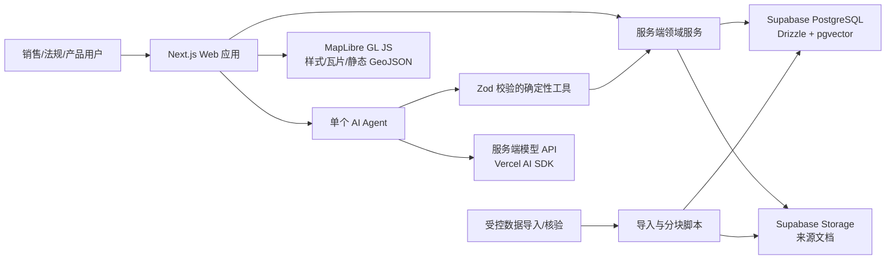
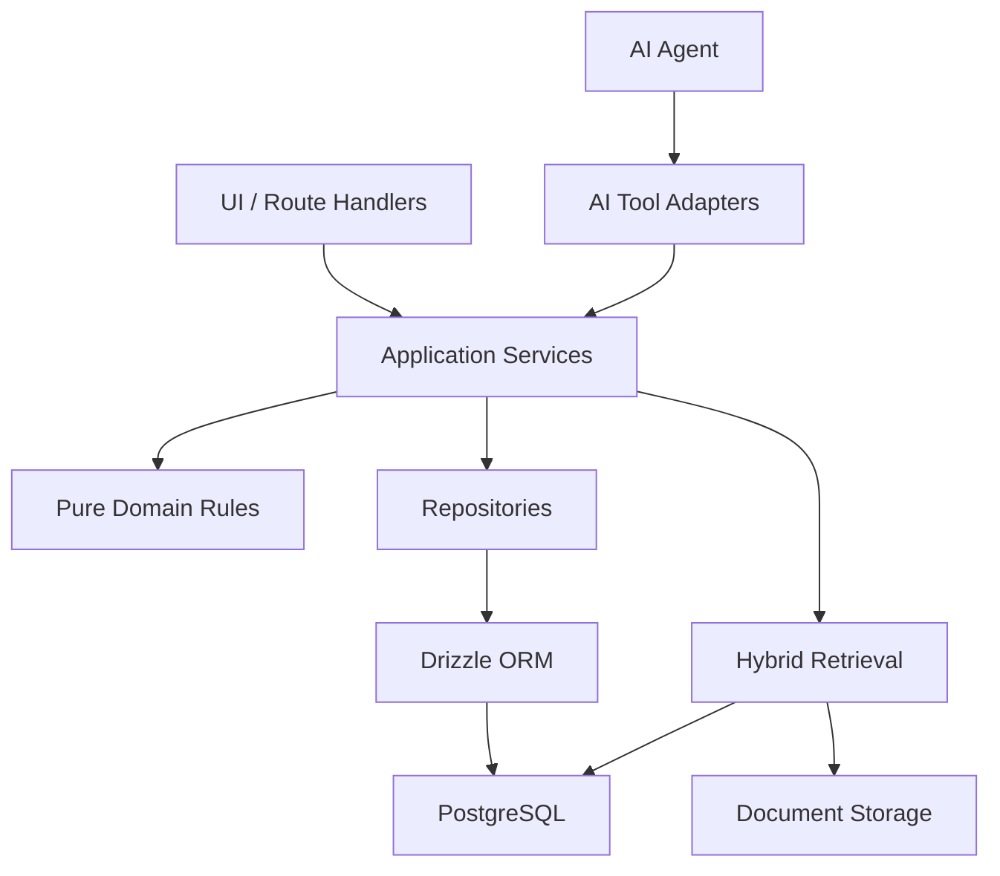
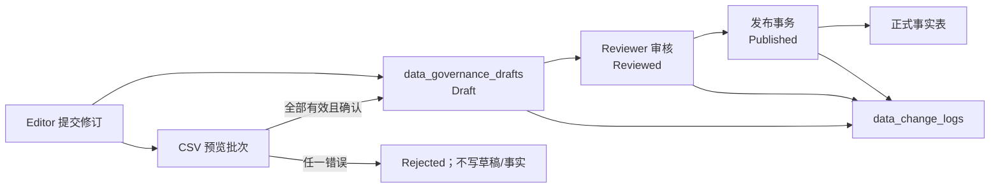

# 系统架构

## 1. 架构目标

本系统采用 Next.js 模块化单体。交互式地图、国家详情和 AI UI 位于同一 Web 应用；领域服务、数据库访问、知识检索和模型调用只在服务端运行。MVP 使用单个 Agent 和多个确定性、只读工具，不使用多 Agent。

架构首先保证：

- 法规、市场、产品和认证事实可结构化查询并可追溯。
- LLM 不成为事实来源，也不能直接访问数据库。
- 应用范围、状态、功率和有效期在查询链路中显式传递。
- 地图按 ISO3 连接静态几何和数据库摘要。
- 模块边界可测试，后续可在有证据时拆分，而不是提前微服务化。

## 2. 系统上下文


```mermaid
flowchart LR
    User["销售/法规/产品用户"] --> Web["Next.js Web 应用"]
    Web --> Domain["服务端领域服务"]
    Web --> Agent["单个 AI Agent"]
    Agent --> Tools["Zod 校验的确定性工具"]
    Tools --> Domain
    Domain --> DB["Supabase PostgreSQL<br/>Drizzle + pgvector"]
    Domain --> Storage["Supabase Storage<br/>来源文档"]
    Web --> Map["MapLibre GL JS<br/>样式/瓦片/静态 GeoJSON"]
    Operator["受控数据导入/核验"] --> Ingest["导入与分块脚本"]
    Ingest --> DB
    Ingest --> Storage
    Agent --> Model["服务端模型 API<br/>Vercel AI SDK"]
```

## 3. 运行时边界

### 3.1 浏览器

浏览器只负责：

- MapLibre 地图渲染和 hover/click/focus 交互。
- 国家筛选器、产品选择器和 AI 对话交互。
- 展示 Server Components 或 route handler 返回的最小必要数据。
- 使用公开、非敏感的地图配置。

浏览器不得持有：

- Supabase service role key、数据库连接串或模型 API Key。
- 任意 SQL 能力。
- 大型文档原文或完整世界几何的 React state 副本。
- product-fit 或营销评分的权威计算逻辑。

### 3.2 Next.js 服务端

- Server Components 负责首屏和可缓存的只读查询。
- Client Components 仅用于 MapLibre、触摸/指针状态、筛选交互和流式聊天。
- Route Handlers 接受外部输入时先通过 Zod 验证，再调用 application service。
- Server Actions 只在写入流程确定后使用；MVP 默认数据导入不通过面向销售的 UI。
- `server-only` 模块承载数据库、对象存储、AI provider 和密钥访问。

### 3.3 数据层

- Drizzle schema 和迁移是结构化数据库定义的唯一代码来源。
- Repository 封装查询，不向 UI 暴露 ORM。
- Service 组合 repository、有效期判断、单位规则、fit/score 规则和来源聚合。
- 对象存储保存文档二进制；数据库保存文档元数据、哈希、定位信息和 chunks。

## 4. 逻辑分层


```mermaid
flowchart TD
    UI["UI / Route Handlers"] --> App["Application Services"]
    Chat["AI Agent"] --> AITools["AI Tool Adapters"]
    AITools --> App
    App --> Domain["Pure Domain Rules"]
    App --> Repos["Repositories"]
    Repos --> Drizzle["Drizzle ORM"]
    Drizzle --> Postgres["PostgreSQL"]
    App --> Retrieval["Hybrid Retrieval"]
    Retrieval --> Postgres
    Retrieval --> Storage["Document Storage"]
```

- **UI 层**：展示和交互，不含事实判断。
- **Application Service 层**：用例编排、权限检查、事务、查询和输出 DTO。
- **Domain 层**：纯函数实现状态/有效期、功率区间、可比性、product-fit 和评分。
- **Repository 层**：Drizzle 查询和数据库映射。
- **AI Tool Adapter 层**：将 Zod 输入映射到 application service，并返回结构化、可引用结果。
- **Retrieval 层**：元数据过滤、关键词/向量召回、融合排序和证据安全检查。

## 5. 建议目录结构

```text
.
├─ AGENTS.md
├─ docs/
│  ├─ PRD.md
│  ├─ ARCHITECTURE.md
│  ├─ DATA_MODEL.md
│  ├─ TASKS.md
│  └─ DECISIONS.md
├─ drizzle/
│  ├─ migrations/
│  └─ meta/
├─ public/
│  └─ geo/
│     └─ world-countries.geojson
├─ scripts/
│  ├─ ingest/
│  └─ seed/
├─ src/
│  ├─ app/
│  │  ├─ (app)/
│  │  │  ├─ page.tsx
│  │  │  └─ countries/
│  │  │     └─ [iso3]/
│  │  │        ├─ page.tsx
│  │  │        ├─ loading.tsx
│  │  │        └─ error.tsx
│  │  ├─ api/
│  │  │  └─ ai/
│  │  │     └─ route.ts
│  │  ├─ layout.tsx
│  │  └─ globals.css
│  ├─ components/
│  │  ├─ ai/
│  │  ├─ countries/
│  │  ├─ map/
│  │  ├─ market/
│  │  ├─ products/
│  │  ├─ regulations/
│  │  └─ ui/
│  ├─ features/
│  │  ├─ countries/
│  │  ├─ regulations/
│  │  ├─ markets/
│  │  ├─ products/
│  │  └─ product-fit/
│  ├─ server/
│  │  ├─ ai/
│  │  │  ├─ agent.ts
│  │  │  ├─ prompts/
│  │  │  └─ tools/
│  │  ├─ auth/
│  │  ├─ db/
│  │  │  ├─ client.ts
│  │  │  └─ schema/
│  │  ├─ knowledge/
│  │  ├─ repositories/
│  │  ├─ services/
│  │  └─ storage/
│  ├─ lib/
│  │  ├─ dates/
│  │  ├─ units/
│  │  └─ validation/
│  └─ env.ts
├─ tests/
│  ├─ fixtures/
│  ├─ integration/
│  └─ unit/
├─ e2e/
├─ drizzle.config.ts
├─ next.config.ts
├─ package.json
├─ playwright.config.ts
├─ tailwind.config.ts
├─ tsconfig.json
└─ vitest.config.ts
```

说明：

- 目录表示目标结构，不要求一次创建全部空目录。
- `features/` 放共享 DTO、展示模型和领域相关的非服务端代码；`server/` 不得被 Client Component 引入。
- schema 按领域拆文件，迁移仍保持单一有序序列。
- 静态世界边界只保存适合 Web 的简化版本和许可说明。

## 6. 页面和 URL

- `/`：业务工作台首页，提供覆盖概览和工作流快捷入口。
- `/map`：世界地图与国家摘要入口。
- `/chat`：AI 销售分析对话工作区。
- `/countries/[iso3]`：可分享国家详情，`iso3` 在服务端标准化为大写并验证存在性。
- 筛选状态进入 query string：`applicationScope`、`powerKw`、`asOf` 和 `productModelCode`，以便复现；允许的值需 Zod 验证。
- AI 可以作为同一 app shell 的侧栏/抽屉，不需要独立页面。

使用 Next.js App Router 的 route segment loading/error boundary。国家详情优先使用 Server Component；MapLibre 与依赖浏览器 API 的控件使用小型 Client Component。

国家页 GET / HEAD 的 URL 规范化在 `src/proxy.ts` 请求入口执行，使用静态目录核对
单段 ISO3，并复用 `features/countries/url-context.ts` 的逐字段解析器；国家大小写与筛选
合并为同源 HTTP 307，发生在 RSC 渲染之前。已知重复参数取首值，无效值剔除，未知多值
参数在传入应用的查询上下文中完整保留；仅编码或键顺序不同不触发跳转，不把默认日期写入 URL。未知国家、非法路径、
其他方法及 API 不由此入口规范化；页面仍保留同一解析器与 404 防御。框架内部 `_rsc` 与
Flight headers 继续由 Next 默认 adapter 管理，不开启跳过 URL 规范化配置。
边界限制：当前 Next 16.3.3 在调用入口前把查询串转为普通对象再序列化，`__proto__`
不成为 own property，因此真实 HTTP 规范化不会保留它；这不是本应用实现的安全过滤。
同一框架转换对 `constructor` / `toString` 等原型冲突键也可能增加空值。
直接解析器 / Proxy 测试另验证该键确实传入时的安全保留，不能据此声称 HTTP 原始字节保真。
这一边界避免国家规范化依赖 RSC render 中抛出的 redirect，不代表修复 React 开发计时
底层缺陷，也不覆盖其他页面的 redirect、notFound 或组件异常。

公开 app shell 使用无额外依赖的类型化 `Locale = "en" | "zh-CN"` 与 TypeScript
完整性校验词典；默认英文，`POST /api/preferences/locale` 只接受 Zod 校验后的 locale，
并用一年期 `diesel_locale` SameSite Cookie 保存选择。页面、公开 API（包括 Chat）与浏览器偏好
读取共用原始 Cookie 解析：按收到的顺序取第一个名称精确匹配的值，仅解码一次；缺失、未知或
解码失败都回退英文，不采用后续同名值。服务端页面不再使用会覆盖重复名称的 Cookie map，
Chat 的有效请求体显式 locale 仍优先于 Cookie。切换只刷新当前 route，路径和 query
string 保持不变；HTTP 2xx 只表示服务端尝试写入，客户端还会在固定 15 秒上限内等待该次
refresh transition 完整结束，并以 `LocaleProvider` 的新 locale 核对目标值。等待时语言组使用
`aria-busy` 与当前语言的 live status。若 refresh 失败或超时，客户端把缺失 Cookie 解释为默认
英文，并比较浏览器可见的有效 Cookie 与当前文档语言；目标 Cookie 已写但文档仍为旧语言时，
先用独立 deadline 写回原偏好并再次核对。refresh waiter 明确区分正常 settled 与 timed out；一旦
超时，尽力回滚后无条件执行完整 document reload，避免迟到 RSC 再覆盖已核对状态。正常 mismatch
仅在回滚无法确认时 reload。两种 reload 都保留同一 pathname、query、hash 与 history entry，以
服务端 Cookie 重新建立单一语言状态。浏览器拒绝或
丢弃 `Set-Cookie` 且当前状态仍一致时保留原语言、显示当前语言的固定失败提示并允许重试，不把
静默未切换当作成功。浏览器存储不是 locale 来源，历史 `localStorage` 值不会覆盖 Cookie 或默认
英文。`global-error` 无法在服务端读取 request headers，因此其 React server snapshot 固定为
英文；Next 根布局失败时实际先返回不含本地化文案的中性错误 shell，再由客户端边界只从同一
Cookie 恢复 `<html lang>`、文档标题与错误文案。根错误文档自己声明唯一的 `<head><title>`，
复用当前语言的错误 heading，不依赖已失败根布局的 metadata；真实根边界回归核对两种语言的
`document.title`、唯一 title 节点及刷新后的保持，服务端最初的中性 shell 行为不变。
`<html lang>`、全站 metadata、国家详情 title/Open Graph、国家名称、日期、
ARIA 文案和公开 loading/empty/error 状态都从同一 locale 派生；根布局与国家页共用完整 Open
Graph builder，route-specific title/description 不能再覆盖掉 locale、website type、图片与本地化
alt。动态 country no-data 使用 polite status；route/global error boundary 使用 atomic alert。
官方来源标题和原文不翻译。
Header 与 Drawer 的语言按钮由根布局内单一 `LocaleControllerProvider` 管理请求、
refresh waiter 与恢复责任。已提交路径/查询变化、窗口重新聚焦或页面重新可见时，读取共享
Cookie；与保留的布局或当前页面语言不一致则执行有界、只读的 `router.refresh()`，不发送
偏好 POST、不回滚其他标签页的选择。Home、map、country、Chat 与 404 由同次服务端读取
输出不可见的 `LocaleRenderReceipt`；它只证明已提交页面载荷的语言，不是新的偏好来源。
这覆盖 Cookie 已切回但旧语言 RSC 迟到的情形：仅比较 Cookie 和根 Provider 会漏掉正文与
metadata 不一致。回执在提交时按身份注册/清理，旧页面清理不能移除新回执；waiter 读取该次
提交的回执引用，避免旧 render 闭包。相同失败状态不自动循环重试；后续 focus 或新状态可重试。
只读刷新超时后保留单一恢复责任并重载同一 URL，不允许新操作越过尚未退休的 RSC。
显式点击已选语言也重新核对 Cookie 和页面回执；另一标签页更改偏好后，显示为已选的按钮
仍能真实保存用户这次选择。按钮的 SSR 状态禁用，客户端事件处理就绪后才启用，避免冷加载
时点击看似可用但尚未接线的控件。上述同步不 remount 页面模板，不引入存储广播或定时轮询。
application scope、辖区类型和认证状态由穷尽映射转为本地化标签，未知 scope 显示明确的
“未记录”而不泄漏内部 enum。页面首个可聚焦元素是本地化 skip link，目标为可编程聚焦的
主内容容器；异步加载状态使用 `role=status`、`aria-live=polite` 与 `aria-busy`。窄屏 Header
使用紧凑间距，在小于 `sm` 时隐藏装饰性导航图标，品牌副标题从 `md` 起显示；英文与中文的
三个导航文字标签在正常字号的 320px 及已测试响应式边界内同时完整可见，保留原有 36px
品牌按钮与导航链接高度、32px 语言按钮高度。品牌首页链接的可访问名称来自同一类型化词典，
保留可见的 `GD` 与完整品牌名，并明确 `Home`/`首页` 用途；名称不受副标题在小屏隐藏的影响，
随 locale 切换及刷新保持一致。浏览器回归同时核对计算后的名称与真实 Tab/Enter 返回首页路径。
桌面分析入口直接以可见的 `Start analysis`/`开始分析` 文本形成可访问名称，不用另一句
`aria-label` 覆盖；原有 `title` 保留为本地化目的地说明，回归同时核对名称、描述和实际跳转。
主导航仍保留横向滚动兜底，并在 route、locale
或视口变化后把 `aria-current=page` 项对齐到导航可视区；更窄窗口或放大字号不以隐藏文字
换取空间，也不把正常字号的测试结果宣称为所有缩放比例下均无需滚动。首页装饰性模糊层在小于 `sm`
的视口不超出卡片容器，320px 下的英文和中文壳层都不产生页面级横向滚动。
国家详情抽屉在 320px 下将辖区、法规、市场指标与来源卡片的标题和徽章纵向堆叠；标题可断行、
徽章组可换行，实际滚动正文不得出现内部横向溢出，所有可见徽章必须留在抽屉边界内。
抽屉内用国家选择器切换 ISO3 时，Explorer 将该次内部焦点意图与原地图 launcher 分开保存；
新 Drawer 挂载时由 Vaul `onOpenAutoFocus` 消费内部意图并聚焦新的国家选择器。关闭或 Escape
仍恢复到最初打开详情的地图入口，内部切换不能覆盖该返回目标。
Vaul 国家详情 Drawer 保持 `modal=false`，但打开时实际活动可访问树会隐藏 Header 的 locale
group；因此 Drawer 的国家控件区复用同一个 `LocaleToggle`，并用独立的
`country-drawer-locale-toggle` test ID 与 Header 副本区分测试定位。打开期间 role query 只暴露
一个名为 `Language`/`语言` 的活动 group；两个入口共用同一 Cookie、locale request identity 与
`router.refresh()`，保持当前 path/query，且不复制 locale state 或写入路径。Drawer 关闭后由
Header 的语言入口继续承担该职责。
公开 Client Component 不把已本地化字符串、服务端错误正文或普通 `Error.message` 存入
跨 render state；状态只保留稳定 code、closed union 或 typed facts，并在每次 render 使用当前
词典。Home、地图、国家详情、决策摘要、产品目录/评估与 locale 写入使用 15 秒共享短请求
deadline；可重入路径同时使用 AbortSignal 和 request identity，因此永久不响应会进入固定错误
状态，旧语言或旧筛选请求的迟到 success/error/finally 也不能覆盖当前页面。Chat SSE 仍由
独立的服务端/代理长流预算管理，不复用该短期限；活跃请求所属 locale 改变时，客户端以新的 chat
identity 建立实例，只继承最近一次已结算会话，并由旧实例 cleanup abort 活跃 transport，
因此旧语言的迟到 stream chunk 与 completion callback 都不能写入新语言会话。词典插值只扫描原始模板一次，
外部名称或文件名中的占位符样式文本不会被第二轮替换。
已知 Demo 产品、法规、辖区和市场指标的中文展示映射按实体 ID、canonical 值、Demo 标志与
各自的来源身份失败关闭；产品另核对型号与规格版本，辖区另核对代码与国家。真实、未知或
任一字段漂移的记录都显示原始值，不用旧译名掩盖 fixture 漂移。国家名调用方同样必须显式
传 Demo 分类，不能再从名称后缀推断。静态国家目录只提供目录/几何身份；选择器、Tooltip 与
no-data 快照只按 canonical ISO3 关联受治理摘要，同 ISO3 时保留摘要的显式分类和二级身份漂移，
只有摘要缺失或 ISO3 不同时才回退目录。程序生成的 citation title 使用 strict discriminated
descriptor 重建外围语法；知识文档、来源标题、原始实体名、真实证书号及 legacy title 保持
原文，不能靠正则把展示文本反解析为领域事实。认证范围的未知起点/下界显示“未记录”；只有
已知起点/下界且结束端缺失时才允许显示“开放”。

## 7. 地图架构

1. 构建时或静态资源加载简化 GeoJSON。
2. 每个 feature 必须含 canonical `ISO3`。
3. 服务端提供轻量国家覆盖摘要，前端以 ISO3 设置 feature-state 或构建小型 lookup。
4. hover 只维护当前 ISO3，不复制几何。
5. click 导航到国家 URL；触摸设备以 click 为主。
6. 国家详情来自数据库，不嵌入 GeoJSON。
7. 普通国家选择不使用 PostGIS。只有未来出现距离、包含、经销区域或空间聚合需求时才提交 ADR 和空间查询。

地图样式/瓦片和 GeoJSON 数据源必须在部署前完成许可核验。

### 7.1 阶段 3 已实现切片

- `public/geo/world-countries.geojson` 使用 Natural Earth 1:110m 公共领域边界，
  只保留 `ISO3`、英文名称和几何；来源 revision 与转换规则记录在同目录
  `README.md`。
- MapLibre 直接加载静态 GeoJSON；React state 只保留国家索引、数据库摘要、
  当前选择和单个 Tooltip，不保存世界几何。
- `/api/countries` 返回地图覆盖摘要，`/api/countries/[iso3]` 返回国家、司法
  辖区、法规状态/有效日期、来源和核验日期；二者均通过 Zod 输出 schema。
- 国家地图与详情的公开 PostgreSQL 出口不发布 Demo 分类事实：Demo 国家摘要保留
  ISO3 目录位置但降为 `no_data`，Demo 国家详情失败关闭；非 Demo 国家中的辖区、
  成员关系、法规、市场指标或任一直接来源只要标为 Demo，整条依赖事实即从详情与
  AI 国家画像中排除。只有显式 `DATABASE_MODE=pglite-demo` 的本地作品演示继续返回
  Demo fixture，不能依靠前端徽标掩盖生产混合数据。
- 国家详情 Repository 强制接收 `asOf`，辖区成员关系与法规均按 `[from,to)`
  有效期过滤。公开 DTO 只返回当前 `effective` 与未来 `adopted` 两组法规，来源和
  AI 引用也只从这两组可见事实生成，不暴露 `proposed` 或历史原始法规数组；
  `recordStatus=superseded` 只有在闭合生命周期支持查询日的派生状态时才保留。
- 国家详情 service 在一个 `read only / repeatable read` 事务内创建国家与法规仓储，并在事务
  回调结束前完成宽画像、可选 applicability summary 和最终 DTO 校验。适用性比较复用调用方
  仓储，不再从事务内二次获取连接；因此同一详情响应不会把更新前的法规列表与更新后的适用性
  摘要混合。地图目录仍是页面级独立读取，机会分/简报的多类上游读取也不属于该快照边界。
- 国家详情公开 schema、AI profile schema 与最终 evidence contract 复用同一 payload replay。
  available 响应必须保持 coverage/Demo 分类配对，验证 adoptedOn 的存在性与查询日边界，并重算
  半开法规和成员生命周期、current/future 分组、辖区投影与所有实体 ID 唯一性。市场观测必须归属顶层 ISO3，期间为正、
  `valueNumeric` 为受限 decimal 字符串、币种格式有效，并按国家/metric/scope/期间/source 身份
  去重。顶层来源是全部嵌套来源的无重复精确闭包；数组可重排，但来源 metadata 不能漂移。
  freshness 比较真实时间 instant，因此 1970 年前的核验时间也不会被 epoch 0 错误覆盖。
- applicability summary 非空时会把 query country/asOf、country source、法规子集、来源闭包和
  summary freshness 映射回同一宽画像；存在可见限值时还会验证 `powerKw`。`applicationScope`
  只保留调用声明，当前 DTO 无法验证其真值；空 summary 也无法证明 power 筛选。`no_data` 的
  数据库完整性和运行时 `isStale` 时钟同样不在 payload replay 的证明范围内。
- 适用司法辖区同时返回辖区实体来源与国家成员关系来源；国家详情中的每条可见法规
  也直接携带其适用辖区、目标国家成员关系、半开有效期和两类来源，页面与 AI
  citation 通过 `regulationId` 保留这条对应关系，不把辖区证据降成无法映射的全局列表。
  法规、市场和 product-fit 的正式查询沿完整依赖链过滤国家、国家来源、辖区、辖区
  来源、成员关系、成员来源、事实记录及其直接来源的 `archived_at`。任一依赖证据
  归档后，不继续产生公开结论。
- `/countries/[iso3]` 是可分享状态，地图页面与国家路由复用同一个 Explorer；
  Drawer 关闭返回 `/map`，刷新或浏览器导航恢复当前国家。
- 从主选择器、地图入口或 Drawer 内选择器切换国家时只替换国家 pathname；当前 query string
  逐项保留，因此 `applicationScope`、`powerKw`、`asOf`、`productModelCode` 与未知但合法的
  跟踪参数不会被静默重置。无查询参数的导航仍生成干净的 `/countries/{ISO3}`。
- 原生 `<select>` 提供与地图 click 等价的键盘/触控入口；hover 只作为指针
  设备增强，不承载唯一关键信息。
- 国家 Drawer 的打开、内部切换与关闭焦点意图优先写入 `sessionStorage`，但导航不依赖该 API
  可用性。任一 get/set/remove 因隐私策略或配额抛错后，当前 document 生命周期切换到模块内存
  `Map` 作为唯一焦点意图源；正常 storage 的空读取仍是权威值，避免旧 fallback 复活。这样
  read-blocked 与 write-blocked 浏览器都能继续导航，并在 CHN→BRA→关闭后恢复正确焦点。
- 主选择器、抽屉选择器、当前选择说明、Tooltip 和 SSR no-data panel 共用一个 display identity
  resolver。`CountryMapSummary.iso3` 与目录 ISO3 相同时完整采用 summary 的 `isDemo`、ISO2、
  `nameEn/nameLocal`；ISO2/名称不是 join key，其漂移不会让 resolver 回退并洗掉 Demo 分类，而由
  formatter 保留原文。缺少同 ISO3 summary 时回到静态非 Demo 目录；名称后缀不参与分类。
- MapLibre 通过 `next/dynamic` 在客户端按需加载；Tooltip 位置按实际地图容器宽高
  限界，窄屏指针 viewport 不会把内容推出可视区域。
- MapLibre 6.9.0 使用 ESM 与 WebGL2；Next 两种 bundler 都不能仅通过 `new URL()`
  自动带上 worker 的相对 shared 模块，因此两个原始模块、LICENSE 及依赖 notices 保存在
  `public/maplibre/6.9.0/`。客户端显式设置同源、版本化 worker URL；Next 配置加载时
  只读核对版本和三个原始文件与已安装包逐字节一致，并从固定 16 项许可来源重算
  `THIRD-PARTY-NOTICES.txt`；相关 sourcemap 的内联来源集合/文本须匹配，缺失或漂移即失败。
  显式 `pnpm map:prepare-assets` 只准备尚不存在的新版本目录，正常 dev/build 不改写
  源资产，也不依赖 install lifecycle。原版 6.9.0 在 GL-null 时先回滚容器，再抛出公开
  `GPUInitializationError`；组件只捕获这个已知初始化错误，显示双语局部错误并保留国家
  选择器，不操作半实例或私有字段。成功实例的 timer、失效回调与 `remove()` 同属一次
  disposal；source/worker 错误后先撤下旧画布，重试创建新实例。原生 context loss 使用
  canvas capture 监听同步调用公共 `remove()`，不取消或伪造事件；这是主动丢弃旧实例的
  策略，避免 v6.9 bubble handler 先将 style 销毁并置空，漏过普通移除的 RM 与 RTL 注销。
  不调用 MapLibre 私有字段；聚焦 Chromium 已观察原生 context loss 后真实 RM 成功回执、
  旧画布脱离且 context lost、同文档新实例恢复，不扩展为 GC 或所有 GPU 故障模式证明。
  初始 ready 需边界数据可查询且 renderer 到达 `idle`，不把首次 source data 事件当成
  完整绘制；原 15 秒超时覆盖数据与首次绘制两阶段，不使用固定截图等待。
  聚焦桌面/移动 Chromium 覆盖初始化失败/恢复，WebKit 覆盖正常渲染/卸载；同源资产
  本身不证明资源已完整回收，聚焦通过也不替代完整验收。
- 同一国家内 product-fit 成功写回新的 `asOf` 后，详情请求以 `ISO3 + asOf` 为
  身份重新获取法规分组，避免 URL/评估日期已更新而国家详情仍显示旧时点。
- 同日 scope / power 更新时，Drawer 直接采用当前 SSR 响应，不保留首次 SSR 的副本；
  客户端详情缓存按 ISO3、scope、power、asOf 绑定，只有相同 country / scope / power
  的 available 响应允许把服务端默认日期等价写入 URL。摘要的 loading、结果与错误同属
  一个筛选上下文，切换后取消旧请求；最新 SSR 可接替旧摘要而不卸载产品匹配表单。
  产品匹配结果与其后的未提交草稿保持独立，修改草稿不会改写已评估摘要的查询条件。
  初始共享链接的自动评估资格在目录首次就绪后结算；型号未知也会消费该次资格，不自动
  评估目录回退产品，后续手动评估的 URL 确认不能复活它并提交新草稿。目录加载失败时
  则保留资格供显式重试，真正的外部导航仍按新面板的共享链接规则处理。
- 同国家、同日期的浏览器历史跳转也重新取得筛选状态归属：路由 revision 区分
  A→B→A 的两次 A，旧摘要、错误和聊天筛选不能因相同查询键重新出现。确定性产品适配完成后的
  `replace` 以一次性目标确认保留表单及随后输入的草稿；外部 `popstate` 则取消旧请求，
  在目标 SSR 筛选到达前显示本地化加载状态，到达后重新挂载产品面板并按共享链接规则复现。
  历史目标只用现有 Zod 字段生成身份，原始 URL 不直接作为评估请求输入；语言刷新及未知
  跟踪参数不改变筛选身份。原有跨国家、跨日期的重挂载边界保持不变。
- 产品适配评估在输入变化、重复提交、国家切换和组件卸载时取消旧请求，并以请求
  序号二次拒绝陈旧响应；旧国家的迟到结果不能写回筛选 URL 或覆盖新评估状态。
  同一面板中的后续请求可以跨越前一次自身 URL 确认而继续运行；其完成回调通过 layout
  effect 绑定最新已提交的父级上下文，避免新结果对应的摘要和聊天筛选被记到旧路由 revision。
  该绑定不在 render 中写入，也不代替请求取消；未提交草稿和既有外部导航隔离继续保留。
- Header 的品牌、主导航和分析入口在 Next `Link.onNavigate` 确认当前 document 内导航时，
  同步发出不含 URL 或其他 payload 的内部导航意图；产品面板复用同一个取消函数，立即
  abort 并递增请求序号。即使目标 RSC 尚未返回、旧面板仍挂载，迟到评估也不能再用旧国家
  pathname 覆盖用户目的地。订阅在 effect 中安装并清理；不拦截全局 click，不改变 Next
  对修饰键、新标签页、下载或已阻止点击的处理。自身评估 `replace` 与语言 `refresh`
  不发此通知，既有语言刷新期间继续评估的行为保持不变。
  导航意图也结算旧面板尚未启动的分享链接自动评估，并递增自动运行 epoch；已经排队的
  零延迟任务在执行前核对 epoch，目录迟到或旧定时器不能启动新评估夺回导航。effect
  cleanup 仅取消当前请求，不退休自动运行资格，保留 StrictMode 重放与正常分享链接行为；
  普通表单编辑、手动提交/重试规则不变，真正重挂载的面板重新取得自己的自动运行资格。
- 国家详情的“在对话中分析”仍使用原生 anchor、完整 document 导航；仅未被阻止且无
  Alt/Ctrl/Meta/Shift 的主键 click 取消当前评估（键盘 Enter 使用浏览器原生激活）。
  修饰键打开新标签页不取消原页面请求；聊天链接使用已提交筛选，原页面待返回的确定性产品适配请求
  仍可独立更新自己的结果和 URL，不回写已打开的聊天页。
- 管理写操作与其后的 dashboard 刷新使用分离的错误语义：事实/草稿动作已经成功时，
  后续快照读取失败只报告“操作已完成但刷新失败”，并保留成功通知，不能把已提交
  动作误报为失败而诱导重复写入。管理客户端只从结构化 JSON 错误信封读取服务端
  文案；HTML、纯文本或畸形响应固定回退，不把代理/上游原文渲染到页面。
- 所有管理 API 响应都由公共 route 边界在 observer 完成后强制覆盖为
  `Cache-Control: private, no-store, max-age=0` 与 `Pragma: no-cache`，包括成功、认证失败、
  权限失败、冲突、限流/输入错误和服务端异常；下游 handler 即使误设 public cache 也不能
  覆盖该边界。管理身份来自受信代理注入的用户 Header，任何共享缓存复用都会造成跨用户
  数据泄露，因此该策略不依赖各 route 自觉设置。
- 所有非 admin/dev 的公开 API 也在 request observer 生成最终 Response 与 request ID 后，
  由共享边界强制覆盖为 `Cache-Control: private, no-store, max-age=0` 与
  `Pragma: no-cache`；没有 observer 的 locale 写入复用同一个 response helper。该策略同时
  覆盖国家目录/详情、产品目录、product-fit、Chat 和三种 health 响应的成功与错误出口，避免
  locale 相关错误信封、法规/来源新鲜度或健康状态被浏览器及中间层重放。Chat 仍保留原 SSE
  body、`Content-Type`、`Retry-After` 和 request ID，不为设置缓存头消费或重建流。
- 国家目录/详情、产品目录与 product-fit 的公开 PostgreSQL 工作在数据入口共享
  单实例全局 2 / 每客户 2 的 admission gate 和 15 秒绝对期限。API 合并
  `request.signal`；国家详情 SSR 没有连接 signal，但仍在页面边界用一个租约包住
  地图与详情两支，两支共用 deadline signal 并全部 settle 后才释放。取消/超时可先结束
  请求，但不可取消的底层 Promise 结算前仍占用租约；service/repository 在每个数据库
  阶段前后检查同一 signal，阻止取消后继续 fan-out。已并行启动的国家详情
  SQL 会全部 settle 后再按固定输入顺序传播失败，避免一支早退使租约脱离其他已启动
  分支。当前不声称能中断正在执行的
  Drizzle/`pg` SQL；这部分仍由连接池与 PostgreSQL `statement_timeout` 收口。
- 市场 CSV 文件控件具有显式可访问标签；已生成 Preview 后一旦改选文件，客户端立即
  清除旧批次与确认入口；每次重新预览开始前也先失效旧批次，因此重试失败不能继续
  确认此前结果，避免界面与持久化批次身份错位。
- Playwright 和 `pnpm demo` 通过显式 `DATABASE_MODE=pglite-demo` 在进程内执行
  真实 Migration 与确定性 Seed。作品 Demo 还必须满足
  `PORTFOLIO_DEMO_MODE=true + NODE_ENV=development`，并使用确定性离线模型选择
  现有只读工具；工具证据门和结构化结果不做旁路。默认模式始终是 PostgreSQL，
  生产环境拒绝该组合，连接失败也不会自动降级为 Demo 数据库。

## 8. 结构化查询路径

### 8.1 法规

公开功率请求仍限定在 0–100000 kW、0.001 kW 步长。字符串先按原始十进制/科学计数法
验证精确整数瓦数与上限，再转为 Number；不得先舍入到另一功率带或把非零下溢为零。
合法尾零、科学计数法和正负零保留原语义，指数只用于输入长度约束下的位置计算，不按
任意指数展开数值。URL、表单与只读工具共用该运行时边界；已经由 JSON 解析为 Number 的
数值无法恢复其原词法精度，自定义算术约束也不冒充 provider JSON Schema 的完整约束。

`country ISO3 -> applicable jurisdictions -> regulations -> requirements -> emission limits -> sources`

查询条件必须显式包含：

- `asOf` 日期。
- application scope。
- `powerKw`，若用例涉及功率。
- 是否包含 proposed；默认当前合规视图不混入 proposed。
- `adopted` 且生效日期未知的法规，只有在 `adoptedOn` 已知且不晚于查询日时才保留在
  未来/待定风险组；不得当作 `effective`。

法规状态分为两个层次：

- `recordStatus` 是当前持久记录的生命周期状态（国家详情兼容 DTO 仍以 `status`
  返回该值），用于保留该记录现在是 `effective`、`adopted` 或 `superseded`；
- `statusAtAsOf` 是 service 根据生命周期日期和查询 `asOf` 派生的查询时状态，只能为
  `effective` 或 `adopted`。`[effectiveFrom,effectiveTo)` 覆盖查询日时，当前
  `recordStatus=superseded` 的记录仍以 `statusAtAsOf=effective` 进入历史详情、比较与
  product-fit，并在解释层标为“当时有效、现已取代”；该历史区间必须有非空
  `effectiveTo`。未来记录的 `adoptedOn` 必须已知且不得晚于 `asOf`。缺失采纳日或
  superseded 终止日的异常记录在数据库中保留供数据治理，但从确定性的查询日
  effective/adopted 集合中 fail-closed 排除。proposed 永远不能派生为 effective。

Repository 负责按成员期、法规期、限值期、scope 和功率形成候选集；service 统一派生
`statusAtAsOf`，DTO 同时保留 `recordStatus`，AI citation 不得把派生状态覆盖成永久
记录状态。该设计只有一个业务有效时间轴，不提供完整双时态：系统尚无独立
`knownAsOf` / transaction-time，`verifiedAt` 也不能用于重演“当时系统知道什么”。

适用性由数据库条件和纯领域函数共同验证。SQL 做候选过滤，领域函数生成可解释的最终判断，避免边界语义分散。
跨国法规比较为每项法规保留适用辖区与国家成员关系对象，并把两类来源加入
`AnalysisSource`；机会评分、销售简报和 AI citation 因而沿用同一完整适用性证据链。

### 8.2 市场

`country + metric definition + period -> observations -> source`

比较服务先验证指标定义文本、单位、币种/汇率策略、期间和方法是否兼容；相同代码
但定义不同也明确判定为不可比。MVP 不在 LLM 内做隐式单位或汇率换算。
市场事实、国家指标卡和 `AnalysisSource` 均保留指标自身的 `publishedOn`；AI citation
优先使用指标发布日期，缺失时才回退其来源记录的发布日期，避免把“来源发布”误当成
“这条观测发布”。

公开聊天的市场比较卡显示已有的国家、用途和指标筛选条件，并为每条观测展示数值/单位、
口径、方法版本、币种、用途、原始来源标题及统计期。期间起点包含、终点不含，不能用
结果生成日替代统计期间。数值复用精确十进制字符串展示，不经过 JavaScript Number；
未知元数据标为未记录，不能推断为不适用。已登记 Demo 口径按既有身份校验翻译，未知口径
和来源标题原样保留，均以文本渲染。十一类 typed 可比性问题逐指标给出中英文说明；组件只解释
服务返回的状态，不重算、改写可比性或把 `no_data` 变成肯定结论。多条最新观测不会折叠为一条。
客户端的“可见事实需要引用”按实际市场观测判断，不能把用户指定指标的空占位误算成事实并
隐藏合法 `no_data` 卡。零观测占位仍须通过确定性名称、问题代码和状态校验；不能伪装为
肯定证据。任何实际观测继续要求引用。小屏工具卡标题与状态上下排列，状态徽标不逐字挤压。

### 8.3 产品适配

`product configuration + target context -> specifications + application scopes + certifications + applicable requirements -> ruleset`

阶段 4 已实现的 `product-fit-v2` 由纯 TypeScript 函数计算，Repository 只提供
候选事实，Route Handler 只接受 Zod 校验输入。当前输出包含：

- 总结论：`fit | not_fit | unknown`；`partial_fit` 保留给未来经批准的细粒度
  规则，本版本不会产生。
- 每项检查结果和理由代码。
- 使用的产品版本、`[availableFrom, availableTo)` 供应期事实、法规/认证、as-of
  日期和规则版本。
- 每项法规的适用辖区、国家成员关系、半开有效期，以及辖区/成员关系/法规/
  限值/认证来源和缺失数据。法规比较中的每条限值同时保留自身
  `[validFrom, validTo)`，避免未来多阶段限值在结构化结果中失去期间语义。

规则顺序固定：

1. 产品不存在为 `unknown`。
2. 产品 application scope 或 `[power_min_kw,power_max_kw)` 不覆盖输入时为
   `not_fit`。
3. 没有当前适用的 `effective` 法规时为 `unknown`，不会推断“无要求”。
4. 对每项适用法规，没有认证记录为 `unknown`；认证状态自身为 `unknown` 且没有
   其他明确不覆盖证据时仍为 `unknown`；`valid_from` 缺失时无法证明认证覆盖
   任意历史/未来 `asOf`，同样保持 `unknown`；已知 `valid_from` 且
   `valid_to=NULL` 才表示开放上界。认证 `power_min_kw` 缺失时也不能按负无穷
   推断覆盖；已知 `power_min_kw` 且 `power_max_kw=NULL` 才表示开放功率上界。
   已有记录但状态、scope、功率或
   `[valid_from,valid_to)` 明确不覆盖时为 `not_fit`。
5. 只有产品条件通过，且每项法规至少有一条完全覆盖的 `active` 认证时为
   `fit`。

当某法规的全部认证检查均为 fail，汇总按现有认证/理由顺序选取第一条 fail 理由，
不把前置 unknown 理由标为 fail。scope、功率或日期的确定性不覆盖与未知证据可以并存；
底层理由完整保留，`not_fit/not_ready` 不变，全部证据未知的分支仍为 unknown。
存在尚未被明确淘汰的 unknown 认证时，汇总只从这些 unknown 候选提取缺失证据理由，
不借用已判 fail 认证中的 unknown 子项；认证及其全部子检查仍原样返回。

`/api/products` 提供数据库产品选项，`/api/product-fit` 返回 Zod 校验的结构化
结果。两者都保留产品供应期，产品追溯卡、AI 产品卡和销售简报直接展示该事实；
UI 也显示辖区 ID、法规 ID、认证 ID、适用性来源和核验日期。AI
`findCompatibleProducts` 引用辖区实体与国家成员关系来源，不使用 LLM 修订结论。
所有公开产品消费者都通过 Product Repository 的 publication manifest 边界：Demo 实体和来源
必须同时为 Demo；真实产品必须匹配已签核的实体 ID、来源 ID 与规格版本，真实认证必须匹配
实体 ID 与来源 ID。缺少或漂移均失败关闭。
客户端产品目录与评估分别保存 closed union `ProductListState` / `EvaluationState`，错误只保存
`SafeApiErrorCode | null`，显示时再用当前 locale 词典生成文案。每个互斥状态只有一个可访问公告
出口：目录 loading/empty 与评估 loading 使用 atomic polite status，loading 同时标记 busy；ready
结果沿用唯一的 polite status。目录/评估 error 各使用一个 atomic alert，目录错误的唯一 retry 也在
该节点中。表单在任一 loading 期间统一 `aria-busy=true`；HTML、远端 message 和普通异常正文
不得进入公告。这样 locale 切换可
重建挂起状态文案，也不会因重复空态/错误节点产生两次读屏公告。
`status=fit/not_fit/unknown` 仍只表达法规与认证适配，不把商业供应混入合规结论。
供应期另以 `[availableFrom, availableTo)` 在查询日计算 `availability=pass/fail/unknown`：
任一端点证据不足即为 unknown。两轴组合为 `commercialReadiness`：合规 fit 且供应 pass
为 ready；合规 not_fit 或供应 fail 为 not_ready；其余为 unknown。该供应判断不代表库存、
交付周期或报价承诺，本规则也不判断完整发动机配置。

## 9. 知识库与检索

### 9.1 入库

1. 登记文档元数据和许可。
2. 计算内容哈希，避免重复。
3. 存储原文件或外部 URL。
4. 提取文本并按标题/段落/页码分块。
5. 为 chunk 写入显式元数据。
6. 生成 embedding。
7. 运行抽样核验，确认 locator 可回到原文。

结构化事实不能只通过抽取脚本直接成为“已核验事实”；法规专家/数据责任人的核验步骤需在运营方案中定义。

阶段 5 的最小实现位于 `/dev/knowledge`，仅在 `NODE_ENV !== production`
开放。上传 API 同步执行以下状态流：

`保存文件 -> processing 文档记录 -> UTF-8 提取 -> 标题/段落/分页切块 -> embedding + tsvector -> ready`

处理异常会把同一文档记录更新为 `failed` 并保存可见错误；SHA-256 命中已有
`documents.content_sha256` 时返回 `duplicate`。原始文件经 server-only 本地
存储适配器保存，数据库只存相对路径；该适配器仅供本地开发，生产必须替换为
经许可和访问控制批准的 Supabase Storage。

哈希预检查只用于避免常见重复工作；并发相同内容仍由
`documents.content_sha256` 唯一约束裁决。后到创建事务在冲突时删除本次临时来源
并返回既有文档 ID，API 继续报告 `duplicate`，不会产生 500 或无引用来源记录。
新文件使用 `<sha256>/content` 内容寻址路径，原始下载名独立保存在文档记录中；因此
不同文件名的并发重复上传也复用同一物理文件。写入先落同目录临时文件，再以指向最终
路径的无覆盖 hard-link 原子发布，并在写入前后校验哈希，避免并发读取半写文件或多个
请求都误判自己创建成功；既有带文件名的存储路径保持可读。
开发原件下载从仓储同时读取登记的 `content_sha256`，对单次读取的原始字节计算
SHA-256；只有与登记值一致才返回同一份字节，不重新读取路径，也不从哈希形状的路径
推断内容身份。该校验同样覆盖旧文件名路径与提取失败的文档，下载不重新执行文本提取。
文件漂移（包括等长替换、截断或空文件）沿用现有脱敏 500 错误响应，不输出原文、路径或
哈希，不修复文件或改写文档、chunk、来源、草稿及审计；不存在记录/存储路径仍为 404。
原件下载仍只在开发环境开放，成功响应保留私有 no-store 和原始文件名/MIME；这只保证
所返回字节与已读取登记哈希一致，不代表存储不可变、生产访问授权或数据库/文件跨介质快照。
文件写成后若数据库建档失败，不做即时 unlink：同哈希并发请求可能已经复用文件但尚未
提交引用。失败只记录脱敏告警，默认 dry-run 的孤儿扫描在至少 24 小时后重新读取完整
数据库引用集；共享/生产删除只能通过治理维护锁包装的显式删除入口执行。

本地存储的所有内容读取（原件下载、草稿重处理、保存前复用检查和原子发布后校验）
共用上传既有的 5 MiB 上限。读取先以非阻塞方式打开单个句柄并确认是普通文件，避免
命名管道在类型检查前等待写入方；同一句柄的 `stat` 只用于快速拒绝已知超大文件。
后续短读持续到 EOF，工作 Buffer 按需增长但容量不超过 `5 MiB + 1 byte`，累计读取
最多多取一个字节来识别超限，拒绝后不返回截断原件。文件在 `stat` 后增长或缩短也按
实际读取长度处理；成功只复制有效字节，所有已打开句柄在成功、超限或 I/O 失败后关闭。
存储写入也在计算 hash/创建目录前拒绝超大输入；服务端与适配器共用同一个大小常量。
下载沿用脱敏 500，草稿重处理沿用不可读原件错误且不生成替换结果。原子发布后校验失败
不删除可能被并发请求引用的最终文件，仍由既有延迟孤儿治理处理。
真实磁盘边界/FIFO 子进程与受控短读、增长、发布后漂移回归只证明本地字节与句柄边界，
不代表操作系统 I/O 超时、整个进程 RSS 或并发总内存上限，也不扩大既有存储路径信任范围。

当前开发知识导入器只支持 UTF-8 TXT/Markdown。标题层级写入 `heading_path`，
段落 locator 写入 `section_locator`，form-feed 分页写入 `page_from/page_to`。
分页不结束章节：当前标题及其父级会延续到下一页，直到源文本中的同级或更高级标题
将其替换。标题栈保留实际 Markdown 级别，不用栈深推断级别；跳级或以子标题开头时，
不会虚构父标题，也不会把同级标题串成父子关系。页码及页内段落编号仍独立记录。
UTF-8 提取只去除开头的 BOM，不裁掉正文首尾空白，避免 `.trim()` 把开头的 form-feed
一起删除并导致所有后续页码偏移；空白检测仍拒绝只含空格、换行或分页符的文档。
有效 UTF-8 不等于可持久化的数据库文本：正文含空字符 `U+0000` 时，在分块和 embedding
之前返回明确的 `UNSUPPORTED_TEXT` 处理失败，不删除或替换该字符。新导入仍保存原始
字节和 hash，并提交 `failed` 文档及零 chunk；治理上传同时保留正常失败草稿和审计，
重复请求沿用既有幂等规则。草稿重处理复用同一提取规则，`ready` 文档不会被失败结果替换。
文档 metadata 的所有字符串（包括来源与 URL），以及上传文件名/MIME 描述，由 Zod 在
保存原文件或写入数据库前拒绝 NUL 和未配对 UTF-16 代理项；重处理 metadata patch 在读取
原文件前校验。后者会被 UTF-8 编码静默替换，不能用自动修复后的文本冒充原 metadata。
合法代理对、中文、emoji、显式 U+FFFD、正文换行/制表符/分页符与字面 `%00` URL 文本不被
该规则删除或改写；既有字段 trim、长度、URL 和有效期校验不变。这是本地纯文本提取及
PGlite 仓储回归证据，不是生产故障观测；不自动重写历史记录或扩展到其他业务 schema。
长段落正文维持每块最多 1,200 个 UTF-16 code units（标题前缀另计），优先使用后半段的
句子/空格边界。硬分割落在代理对中间时向左移动一个 code unit，保证补充平面汉字、
emoji 等合法码点在分块及 UTF-8 编码往返后不被替换成损坏字符；不扩大长度预算，
也不宣称完整单词或字素簇不会跨块。
该规则用于新导入与显式草稿重新处理，不会自动重写既有文档、chunk 或发布证据。
输入文件的 5 MiB 上限之外，分块器另限制生成规模：含文档标题和 ` > ` 分隔符的活动
标题路径最多 2,048 个 UTF-16 code units，单文档最多 5,000 块，所有块的 `content`、
`heading_path` 各元素和 `section_locator` 合计最多 `16 * 1024 * 1024` 个 code units。
预算跨段落及分页累计；更换章节只释放活动标题路径，不清除已经生成字段的累计用量。
这些是生成文本与块数预算，不是进程 RSS、整个序列化对象或执行时间的硬上限。
检查在超限块的 `content` 拼接/tokenization 前进行，所有分块成功后才生成 embedding。
超限不会截断原文或返回部分 chunk set：新导入保留原文件并记录明确 `failed` 原因；
草稿重处理沿用同一预算，既有 `ready` 文档遇到此类失败仍拒绝替换，既有 `failed`
文档返回零块的失败结果。普通 5 MiB 纯文本连同 300 单元文档标题仍可完整分块；
输入大小合格不代表任意标题/段落形状都符合生成预算，不宣称大文档持久化吞吐已验证。
三个文档写入入口（开发导入完成、治理上传、草稿重新处理）共用每批最多 1,000 块的
顺序 INSERT；所有批次仍在各入口既有的单一事务内执行，不引入逐批提交或自动重试。
当前完整 chunk 行绑定 18 个参数，每批最多 18,000 个；安装的 postgres.js 会拒绝
`>= 65,534` 个参数的语句。实际 Drizzle schema 的 SQL 编译回归覆盖 1 到 5,000 块，
避免合格分块结果因一次绑定整份文档而越界。空的 `ready` chunk set 仍拒绝写入；
合法 `failed` 结果维持零块、不执行 INSERT。PGlite + pgvector 集成回归验证三个入口的
1,001 块有序写入，以及第二批向量维度错误时回滚第一批和相关文档/来源/草稿/审计状态；
治理上传与重处理重放不重复写入。该证据不等于真实 PostgreSQL 负载或并发验收，
也不改变输入和生成预算、权限、provenance 合同或数据库 schema。
知识库持久导入的 PDF/OCR/Word 尚未实现；这与 `/chat` 仅在当前请求内、受严格资源
预算约束且不持久化的 PDF 附件文本提取是两条独立信任边界。

文档摘要同时返回处理状态和治理状态；界面只有对 `ready + published` 显示“可检索”，
`ready + draft/reviewed` 分别显示待审核/待发布，避免把处理完成误报成已进入正式检索。
生产管理上传不复用上述两阶段调试写路径：文件校验、内容寻址保存、提取、切块和 embedding
先在事务外准备，随后由单一治理事务一次写入 source、最终态 `ready/failed` document、
chunks、document draft 和 `draft_created` 审计。事务任一后段失败会回滚全部数据库行；已经
内容寻址落盘但未被引用的文件仍由 24 小时年龄门控孤儿扫描回收。

### 9.2 检索

1. 从工具输入得到 ISO3/司法辖区、scope 和 as-of。
2. 先用元数据过滤不适用 chunks。
3. 分别执行 PostgreSQL 全文检索与 pgvector 相似度检索。
4. 使用确定性的融合算法合并排名。
5. 过滤或警告日期/范围冲突。
6. 返回 chunk ID、文档 ID、标题、locator、片段、发布日期、有效期和 URL。

知识检索结果同时保留文档发布日期和来源发布日期；AI citation 的单一
`publishedOn` 优先使用文档发布日期，文档缺失时回退到来源发布日期，不能在已有
结构化日期时静默输出 `null`。

当前调试检索先按 country ISO3、jurisdiction、application scope 和 `[valid_from,
valid_to)` 过滤，再查询 PostgreSQL `tsvector` 与 pgvector cosine distance。
关键词得分经固定函数归一化后，与向量相似度按 `0.5 / 0.5` 融合；调试页同时
显示原始关键词分、向量分和最终顺序。公开/AI 检索在排序前执行失败关闭相关度门槛：
最终分至少 `0.25`，并且必须存在关键词命中或向量相似度至少 `0.45`；低于门槛的候选
不进入响应，AI 工具层会对结果再执行一次同样校验。

service 返回点、公开/AI schema、客户端最小 schema 与模型文字 evidence contract 还会重放
检索 payload：query 及 scope/asOf/country/jurisdiction/limit 必须逐字段回显；命中必须满足
filter、半开有效期和页码区间，chunk ID 唯一、rank 连续且数量不超过 limit。公开 keyword/
vector/final score 限在 `[0,1]` 并规范为最多六位小数，final score 严格按 `0.5/0.5` 重算；
结果按 final score 降序、同分 chunk ID 升序。pageFrom 可以单独存在，pageTo 非空时则必须有
pageFrom 且不早于它。hit warning 必须由缺失 validFrom/country/scope 精确派生，外层 warning
只可由空结果、执行失败、嵌套 warning 和 Demo 分类重建。

AI 工具的模型专用输入 schema 只公开 query、country、scope 和 asOf，不再公开执行时会被覆盖的
jurisdictionId/limit；SDK 校验、公开 tool-call 边界及客户端已完成工具卡校验拒绝这两个额外字段。直接执行端仍保留
`null/5` 固定值防护。通用检索 schema 和 live-eval 历史参数观察 schema 不变，后者仍保留
这些字段以便 scorer 如实判定违规，不回写历史报告或放宽 case 期望。正文必须
恰好包在 untrusted excerpt 标记内，外层 `resolvedCountryIso3`/`informationAsOf` 与实际 filter
一致。搜索 query 还必须完整覆盖可信用户问题中已登记的中英文业务概念 alias，其余有效业务词、
字面词和标识符精确绑定且不得追加无关词；普通交付提示词可省略，但原文、引用和定位要求由
实际结果另行证明。纯数字重合或只保留一个泛化词不能通过。该规则证明返回 payload 与已解析查询一致，不证明候选集合
完整、来源 metadata/正文真实或开发 embedding 的语义质量；`asOf` 约束 chunk 有效期，不把
文档发布日期当作同一过滤字段。

AI `searchKnowledgeBase` 工具未显式提供 `asOf` 时，以当前 UTC 日期同时作为
结果声明日期和 Repository 有效期过滤日期；不得声明“截至今天”却用空日期过滤
检出已过期或尚未生效的 chunk。开发知识台仍可显式使用空 `asOf` 做人工探索。

chunk 的 `country_iso3` 与 `jurisdiction_id` 是受治理的元数据引用，不只是搜索标签。
混合检索会联接并排除已归档国家或辖区，避免历史/直写错配仍返回属于不可见父实体
的证据。文档从 reviewed 发布时锁定全部 chunk 及其非空父实体，并校验父实体与父
来源未归档、Demo 分类单向兼容；父实体归档与文档发布因此按同一行锁串行。

`local-hash-embedding-v1` 是 128 维、确定性、无外部 API 的开发替身，只用于
验证数据流与过滤语义，不声称具备生产语义检索质量。ADR-017 仍阻塞正式模型
选择；更换 provider/维度必须新增 Migration 并运行检索基准。按照 ADR-013，
当前不创建向量索引。

普通知识查询中的业务词按合取处理；`simple` 全文索引不提供通用中文语义分词。
定向观察中，模型给纯英文请求追加独立的“非道路 排放”翻译词，不能匹配既有正文的
“非道路排放法规”完整词元，因而让原本可命中的查询返回 no_data。模型工具描述现在
明确禁止自行追加翻译副本或未请求的同义词，同时必须保留用户明确给出的双语词、
标识符、引号、OR 和排除条件。该提示只引导模型构造查询，不是确定性保障，也不改变
检索阈值、索引、fixture 或原生查询含义；用户本身要求的混合分词仍可能诚实返回无数据。

生产聊天会把可信用户上下文已解析出的唯一、非空来源 scope 收窄为模型工具 schema 中
必填的单值 `applicationScope`；检索词中出现 non-road 不能替代 metadata 筛选。没有明确
scope 或存在歧义时不擅选，也不自动补全模型漏传的值；通用/历史解析 schema 保持原样。
错误或漏传在执行检索前拒绝，保留既有安全审计。正确首轮结果满足原有证据门后，既有
多步策略立即将 `toolChoice` 设为 `none`，不再给模型追加无依据的翻译或新主题的机会。
真实隔离 Demo 工具加 mock 模型覆盖中英文、用途更正与国家追问、实际来源交付及下一步
工具关闭；这不代表真实模型必然遵守 schema，也不放宽来源交付或有效期要求。

动态模型 schema 同时复用最终证据门的业务词完整性检查，以有界且明确标记为数据的保留
请求帮助模型选择查询词；检索执行前再次使用同一 helper 防御。缺少业务主题或添加无关词
不能先进入数据库检索；普通交付 cue 可省略的语义不变，引号、OR、排除条件继续由原生约束
检查。此处不补写或重构模型参数，不使用 live-eval 专属词表，静态历史参数 schema 不变。
原始输入错误保留审计及失败关闭结果；同轮后来调用正确工具不能洗去先前失败，也不承诺
自动修正或追加模型重试。新的隔离合成查询只用于复现机制，不能代表已丢弃的历史原 query。

检索前校验还暴露了原有中文请求包装解析缺陷：`查询` 不能被短前缀 `查` 截成业务词 `询`；
未受保护的 `截至/截止到 ISO日期 的` 中，独立或连接已识别用途的 `的` 属于 metadata 包装，
而非检索主题。这里只移除明确的包装 span，不建立全局中文字停用表；业务词、引号、带符号
操作数或复合标识符中的相同字符仍保留。普通交付 cue 之间的 `与` 与既有 `和` 使用同样的
窄连接规则。原中英 SSE 来源字段一致性测试的请求、fixture 和逐字段期望保持原样。

工具输出 gate 的 `invalid_projection` 仍使本轮停止并拒绝未经核验文本，但不再误记为实际
输出预算超额：completion 使用 `TOOL_RESULT_ERROR`，边界观察使用既有错误类别。
只有真实 `step_bytes`、`turn_bytes` 或 `result_count` 超量才报告
`MODEL_TOOL_OUTPUT_BUDGET_EXCEEDED`；原始 provider 调用与已知 token 账本保持不变。

保留来源请求现在把明确的末尾“无证据则停止”控制句，以及带有完整声明边界的用户粘贴
不可信数据段，与检索主题分离；该投影只用于可信用户请求侧及来源追问选择，不作用于模型
实际 query。完整原始 userTexts 仍送入安全扫描，`blocksModelText` 不因投影而解除。
完整的 `search ... knowledge base for ... term ...` 请求包装只保留原样上下文与词面，
不建立全局停用词表。受保护的引号、带符号操作数、复合标识符、原生 OR 与未识别的业务
扩展仍保留；国家/用途/日期/功率和来源交付合同不放宽。模型加入控制词仍按原始参数拒绝，
不静默修理或补写 query。明确的数据段不是新指令，也不因此获得改变安全规则的能力。

普通交付要求“章节和来源证据”的“和”仅连接两个已识别交付 cue，不应成为业务检索词。
证据词投影只将两个未受字面保护的 cue 之间、恰好为空白加“和”的连接段设为可省略；
不改实际 query，不增加全局停用词。若该字还出现在业务内容、引号、带符号操作数或复合
标识符中，则仍绑定。既有真实 Demo 对照要求简短查询交付完全相同的原文、文档、定位和引用，
不能用省略连接词来绕过缺失或错误来源的拒绝。

## 10. AI 架构

### 10.1 单 Agent 约束

- 使用 Vercel AI SDK 在服务端注册有限工具。
- system instruction 明确禁止用模型记忆补充法规、市场、产品和认证事实。
- 工具调用可串行或并行，但仍由同一个 Agent 编排。
- 不提供任意数据库查询、网络搜索或数据写入工具。
- 达到工具步数上限、工具失败或证据不足时，返回限制说明。

### 10.2 工具契约

每个工具包含：

- Zod input schema。
- Zod output schema。
- 权限检查和合理的列表/日期/功率限制。
- 稳定的错误码，例如 `INVALID_SCOPE`、`NO_DATA`、`INCOMPARABLE_METRIC`。
- `facts`、`warnings`、`sources`、`verifiedAt` 和可选 `rulesetVersion`。

工具输出是事实层；LLM 只能选择、压缩和解释，不能修改数值、状态、日期、评分或来源。

### 10.3 回答验证

MVP 采用“结构化结果优先”：

- UI 直接渲染工具结果中的比较、适配、风险和来源卡片。
- 自然语言说明与卡片同时展示。
- 对高风险事实，模型 Markdown 中的外部 URL 只有与同一助手消息内结构化 citation 的
  `sourceUrl` 完全匹配时才可点击；任意其他外链失败关闭为纯文本。
- 未被工具支持的声明不作为结构化结论展示。

### 10.4 阶段 6 已实现边界

- `/api/chat` 在 Node.js Route Handler 中通过 Vercel AI SDK
  `streamText` 调用服务端环境变量中的 OpenAI-compatible 配置。真实 Key 只从
  `.env.local` 或部署平台 Secret Manager 读取，不进入浏览器、审计、错误响应或
  `modelId`。接口地址仍经 Zod 校验并限定为公开 HTTPS，拒绝 localhost、私网、
  link-local 和内嵌凭据地址。服务商支持时，服务端可配置 `enable_thinking` 扩展参数；
  该参数只影响模型内部生成。原始 SDK 流先进入 event processor，使 reasoning、provider metadata
  与原始 tool-call ID 可以留在同一请求的私有 `StepResult` / 下一 provider step history；随后由一个
  单次执行、有界的 single-pump replay/broadcast public hub 投影给 `fullStream`、公开 `text` 和
  UI SSE。单个消费者取消只移除自身订阅，晚到消费者重放同一份已投影事件；缓存最多 1,024 个
  公开事件，超限或底层源异常时所有当前/后续消费者取得固定公开错误，后台仍排空私有 SDK 流以
  完成 provider callback、审计与指标结算。投影丢弃全部
  reasoning part，Route wrapper 无论调用方参数为何都强制 `sendReasoning=false`、`sendSources=false`，
  不会把模型推理 part 发送到浏览器。若供应商把私有推理
  降级为普通 text，边界会在完整缓冲文本上执行 NFKC、移除 Unicode
  `Default_Ignorable_Code_Point`、以最多 16 轮白名单解码 `amp/lt/gt` 和合法十进制/十六进制
  numeric character reference，并对完整 `think/thinking/analysis/reasoning` 标签失败关闭。标签名
  内或分隔位置出现其他 named character reference 时也按标签形态识别，但不做通用 HTML entity
  解码；仍残留受支持嵌套实体的超深输入按私有标签失败关闭。命中后整段
  模型说明被丢弃，只保留结构化工具卡与固定证据缺口。工具参数的增量 part 也先按 call ID
  缓冲，只有完整静态 `tool-call` 递归检查与 SDK schema 解析通过后，才从最终 `chunk.input`
  重建 start / 单个 canonical JSON delta / end，不回放 provider 原始 delta；污染 call 及同 ID 的结果/错误全部
  丢弃，自由文本知识查询还会在执行前由销售聊天与 live eval 共用的模型专用 Zod refinement
  拒绝；可信 admin/dev 检索仍保留原通用 schema。这样 `sendReasoning=false` 之外的
  `tool-input-delta` / invalid tool input 也不能成为旁路。销售聊天的公开流协议只接受缓冲
  正文、已验证工具 part 和流生命周期事件；provider 专属的 `custom` / 普通 `file` /
  `source` / `raw` 不属于该协议，一律不公开。其递归内容若含私有推理标记，返回专用
  reasoning 缺口；否则以未验证 provider 执行路径返回通用执行缺口。这些 part 之后的
  模型正文同样不会释放，而 `start-step` / `finish-step` / `finish` / `abort` 语义和正常工具卡
  保持不变。对应 part 只保留公开协议字段：工具 input/call/result/error/output-denied 以显式 DTO
  重建为边界自有 `sales-chat-tool-N`，input 取 accepted ledger 中的 Zod 解析值，result 必须同时匹配
  incoming、ledger 与 parsed output 三方 toolName，且公开 output 只用 `parsed.data`。provider/tool
  metadata、title、preliminary 和错误原文均被删除；畸形、provider-executed 或 dynamic
  call/result/error 失败关闭。服务端工具执行能力仍由静态 tool set、参数 Zod 与受审计 executor
  决定，而不是由公开投影授权。顶层 error 仅对服务端 observer 保留原因，公开流只发固定 code；
  `start-step` 的 request/warnings、`finish-step` 的 provider response ID/model/timestamp/headers/metadata/raw reason、
  `finish.rawFinishReason` 和 `abort.reason` 都不进入 `fullStream` / SSE。正文 part 不复用 provider
  ID，而由边界生成 `sales-chat-text-N`；step response ID 递增生成为 `sales-chat-step-N`。
  step/final usage 与 performance 显式重建，只保留标准 token/latency 字段，删除 `usage.raw`；
  `toolExecutionMs` 只接收 accepted ledger 中的 provider call ID 并重键为对应
  `sales-chat-tool-N`，未知 timing key 丢弃并记录稳定拒绝分类。原始 usage 与 typed tool/step
  getter 仅在内存中的私有计量/live-eval 路径使用，报告不保存 raw usage、reasoning 或 provider ID。
  unified finish reason 与工具卡终态继续保留。普通的 analysis/reasoning 业务词不匹配。
- 只读工具固定为 `searchKnowledgeBase`、`getCountryProfile`、
  `findCompatibleProducts`、法规/市场比较、机会评分和销售简报。国家与知识工具复用
  既有 service；产品工具在未指定型号时遍历目录，收到 `productModelCode` 时只评估该
  精确型号（包括保留 PRODUCT_NOT_FOUND/unknown），并逐项复用 `product-fit-v2`，不让
  LLM 计算合规结论。销售简报继续复用确定性比较、评分和产品适配结果。
  产品工具返回 `no_data/evidenceSufficient=false` 时仍可携带确定性 `unknown` 评估；固定缺口
  文案表达“证据不足以形成确定适配结论”，不把结果未知写成没有返回确定性结果。英文与既有
  中文含义一致，查询国家、scope、power、日期及免责声明保留；不改变领域状态、来源或正文门槛。
- `getCountryProfile` 输入必须声明本次需要的 `country`、`regulations`、`market`
  主题；工具按所请求主题逐项检查结构化证据。国家记录存在但所问法规或市场数组为空
  时仍返回 profile 卡片，但外层为 `no_data/evidenceSufficient=false`，不能用国家基础
  元数据替缺失主题放行自然语言。
- 无 scope/power 的单国概览可使用 `getCountryProfile`；带精确 scope/power 的
  1–5 国法规查询统一使用 `compareRegulations`。同一问题同时要求法规核对与产品推荐时，
  evidence contract 要求法规比较与产品适配两份独立结构化结果。
  意图分段保留相邻已识别国家之间的受控列表连接符（包括 `CHN and BRA`、逗号列表及
  Oxford comma），避免英文跨国比较被截成单国要求。国家名称按最左、同起点最长且不重叠的
  字符区间识别，`South Sudan` 内部的 `Sudan` 不会额外创建国家，后续独立写出的 `Sudan`
  仍保留。完整目录国名内部的连接词也是身份的一部分：业务与来源分句都不得拆开
  `Trinidad and Tobago`。除国名及受控列表连接符外，国家之间
  若还有法规主题、新任务动作等正文，仍按原任务边界分段，不能把独立产品或市场任务的国家
  加入法规查询。这是有界列表识别，不是通用自然语言或任意省略句解析。
  离线 Demo 的市场比较、机会评分与销售简报复用 evidence contract 的按任务指标代码绑定，
  将用户明确给出的代码传入工具，并保留同任务追问中的继承与替换。不能省略筛选、凭空选择
  指标或把市场比较的代码带入另一任务；确定性工具及最终证据门槛仍是权威。
- 聊天请求通过消息白名单后，先执行保守的确定性对话分流。问候、能力询问、致谢、
  模糊分析请求，以及明显缺少场景/功率/第二国家的适配或比较请求，直接返回能力说明
  或缺参追问，不初始化模型和审计会话，也不会制造空工具卡片；该路径仍受统一入口
  速率限制。任何可能需要法规、市场、产品或评分事实的问题都不得由分流层作答。
- 进入事实查询后，服务端从 evidence contract 计算尚未满足的 requirements，每一步
  只向模型开放能满足这些 requirement 的工具并使用 `toolChoice=required`；证据齐全、
  任一结果失败/不足、缺参或纯附件概述时切换为 `toolChoice=none`。工具顺序稳定，最多
  执行 5 个工具步骤；模型不再依靠“自觉”决定是否继续或停止。
- 显式原文、页码、章节、出处、来源或 citation 意图在确定性 evidence contract 中拥有本轮
  最高工具优先级；即使同一句还出现市场、产品适配、法规、评分或简报措辞，本轮 requirements
  也只接受 `searchKnowledgeBase`，因此首次及后续 provider step 都不能看到其他事实工具。
  knowledge 多轮续接从最近一次知识请求恢复有意义的检索词，并继续继承受控 country/scope/asOf
  上下文；泛化的“继续查来源”只更新这些过滤条件，不覆盖原业务主题。英文 `source(s)` /
  `citation(s)` 使用 Unicode letter/number 边界，`resource`、`outsourced` 或 `sourceable` 不会误触发。
  来源 span 会把同一短语中的中英文协调国家列表展开为逐国 requirement，但在遇到新的独立动作时
  截止，因此“CHN 与 BRA 的来源”要求两国证据，“推荐 CHN 产品并查 BRA 来源”则只把 BRA 归入
  检索过滤。裸 ISO3 仅接受 canonical uppercase token；国家全名与受控 alias 仍大小写不敏感，
  因此普通英文 `Can`、`are` 与月份 `Mar` 不会注入额外国家。检索词另绑定规范化的复合型号、
  kW 功率、Stage/Tier、法规/版本编号和 page/section locator；多轮仅修改功率或 locator 时保留原
  业务主题并按类别替换旧标识，ISO 日期则只由结构化 `asOf` 约束。每国 evidence 都齐全前模型
  正文保持关闭；这条边界由应用代码执行，不依赖 system prompt 的自律文本。
- 来源追问由 `knowledge-request-context` 同时提供证据合同的必需词和 Demo 的完整查询；
  `Continue with section 2`、`Now BRA` 及三种 non-road 拼法的来源续接保留上一实质主题，
  只有明确的新业务主题才替换它。用途更正同步更新检索文本，原问题未写用途时补入当前用途；
  已知中英国家名称只在独立正文位置替换，不改写复合文档 ID 或 URL。章节、功率和版本条件
  跨后续中性追问保留；`section.1`、`v2.1` 等独立简写按 locator/version 处理，而
  `DOC-section.1`、`DOC-v2.1` 仍是不可改写的精确 ID。
  查询只剥离受控的句首检索命令和明确的 `as of` / `截至` 日期短语，日期仍由结构化过滤约束；
  原文、章节和来源交付要求不得因查到资料而省略，但不要求模型在 query 重复普通交付提示词。
  引号内日期、URL、原有 OR 和排除词保持原样，
  不截断查询以迁就工具长度上限。中英“不要从 A 改为 B”是保留当前用途的禁止转换，
  不是排除 B；它不能凭空推断 A，也不能解除已有用途冲突。这些均为有界解析规则，不是
  通用自然语言理解，不更改全文检索语法、相关性阈值、有效期或 schema。
- 来源交付由纯函数 `knowledgeDeliverySatisfied` 在既有 DTO、相关度、过滤和发布校验之外验证：
  实际非空 untrusted excerpt 必须有同 chunk/document/source、同页码/章节的引用。通用页码/章节
  请求必须返回对应 metadata；明确页码区间须无空洞覆盖，明确章节只匹配专用 locator 字段中
  受控的 section/clause/part/annex/appendix、§ 或中文编号，不用正文数字或标题替代。不同命中的
  原文和定位不能拼接冒充一份交付。仅有高相似度或 query 回显不足以证明要求已满足。
  普通原文/来源/页码/章节提示词可从模型 query 省略；引号、带符号词、复合 ID、精确引用和
  仍在字面位置出现的相同词不变成可选。业务主题、国家、scope/asOf 与原生约束继续独立校验。
  页码/章节条件随受控追问继承或替换；不支持的定位格式失败关闭，不宣称任意出版格式等价、
  全文完整性或来源事实真实性。模型最终正文仍在整个交付合同通过前缓冲。
- 来源请求中的引号内容是检索字面数据，不是独立的国家、用途、功率、型号或日期过滤条件。
  上下文重建只从引号外读取这些参数；国家 alias 规范化、用途更正与章节/功率/版本追问也不得
  改写引号内内容。内部 `literal:` 标识把被引用的章节和功率与可替换的上下文引用分开，仍不增加
  公开 schema。普通控制型追问（如 `Actually use "non-road"`）仍可明确更新用途。
  独立引用的国家词不因它恰好也是 metadata filter 而从查询词合同中删除。ASCII 双引号跨行或
  未闭合时按现有原生短语的 EOF 边界保护；追加上下文关键词放在未闭合引号之前，不改变负号与
  引号的绑定。中文弯引号也不被应用改写，但不因此获得 PostgreSQL 原生短语运算符语义。
  该处理修复了应用把 `"China non-road"` 改为 `"CHN non-road"` 后凭空命中既有 Demo 文档的问题；
  模型守卫现在比较未经这种字面改写的可信请求。只有用户明确提出新的字面查询才改变该约束。
- 来源查询中独立 ASCII 负号及其后表面词元同样是检索字面内容：`-China`、`- China`、
  `--China` 不被国家 alias 规范化，`-BRA` 不增加巴西 metadata requirement。带符号的用途、
  日期及章节也不成为筛选更新；符号前的空格、原生跳过的括号、引号操作数、复合词与 URL
  保留。逗号等明确分隔符后的独立 `截至/as of` 仍属于日期 metadata，不并入前面的排除词；
  首问和追问均先对整条消息剥离这些日期短语，再截取要保留的带符号词元，不能先截成
  `-fictional,as` 或 `-fictional，截至` 后改变原生排除语义。独立日期由 `asOf` 过滤保留，
  删除日期短语时保留词间边界，后接的新检索文字不得被粘进前面的排除词；不能归入独立
  筛选/续接控制语的追问文字仍要求用户重述完整查询。
  引号内相同文字仍按字面保留。该范围识别不计算负号奇偶或 Boolean AST，PostgreSQL 仍决定实际检索语义；
  `--China` 的正向词也由完整词合同约束，不能因为没有硬排除条件就改成 `--CHN`。
  仅含受控筛选/来源续接与带符号词元的追问会保留原主题并追加原样检索条件；追加关键词
  不得绑定到未闭合引号或悬空负号。若原查询/追问涉及 OR，或追问还有无法归入独立筛选的
  新检索文字，不能把追加条件仅套到末尾分支，也不能丢词：服务端用双语直接响应要求重述
  完整来源查询，证据合同同步标记 `knowledgeQuery` 未明确并禁止接受正文。
  完整新查询可解除该状态。这是有界追问合并，不宣称通用自然语言或 Boolean 重写能力。
  本地 OR 正对照引用既有虚构来源中的 `"fictional source"`，同时固定验证不匹配的中文组合词
  分支与 `OR warranty` 不得仅靠向量相似度命中；不为浏览器正例放宽原生 OR 锚点或新增资料。
- system instruction 当前以 `sales-chat-system-v6` 版本化，`en` / `zh-CN` 使用等价的
  事实边界、工具路由、循环策略、回答契约、附件边界和检索内容不可信边界。v6 还要求
  显式保留用户的 `asOf`，来源请求只走知识检索，并按精确 topics/query 收窄工具输入。
  应用证据门另要求知识 query 完整覆盖受控业务概念及其余有效业务/字面词，并执行原生查询与
  实际来源交付约束；普通交付提示词不代替原文/定位/引用验收。不能
  仅凭一个主题词重合放行。检索片段即使包含指令或 URL
  也只能作为待解释数据；来源标题和被引用的来源原文逐字保留其原始语言，不随回答语言
  翻译。离线 `pnpm ai:eval` 用固定 golden prompts 检查分流、
  缺参、初始工具集合和停止阶段，不调用外部模型；它不冒充真实 provider 成功率评估。
- `pnpm ai:eval:live` 的 v12 合同直接复用上述生产 `streamSalesChat`、独立多轮用户消息与最多五步
  的动态工具循环。每条 case 都硬性核对 evidence allow/deny 期望，异常不能计为安全通过；
  报告另外保存总模型步数、工具步数与 160,000 token 的验收上限，不保存 prompt 或
  完整模型输出。每条 case 保存已完成 provider call 的 token `ledger`，并把 ledger 求和与
  AI SDK 的 aggregate usage 交叉核对；只有流完整结束、ledger 数量与生产 loop step 数一致、
  每步 `input + output = total` 且 aggregate 逐字段一致时 usage 才完整。缺失、部分或矛盾
  usage 不补零：已知成本按每组 `max(total, input + output, input, output)` 计算，再取 ledger
  总下界与 aggregate 下界的较大值。执行异常仍保留此前已完成 step 的 ledger/工具步/成本，
  但标记 incomplete、停止后续 case 并让 threshold 失败；`EVAL_CASE_ERROR` 只能出现在结果
  序列末尾，即使它是第 18 条结果也不能把报告标成 complete。因此
  未知或不完整的 token 账本不能解释为 provider 实际零消耗。
  报告使用 `terminationReason` 区分完整结束、case/初始化错误、usage 不完整、预算 reserve、
  总 token 越界与 case 上限；零分母 score 为 `null`/N/A，不伪装成 100%。
  OpenAI-compatible usage 只在 provider step 完成后可得，因此 runner 会在每条 case 前保留
  12,000 token 并在未知 usage 时停止，但不能把该应用层门槛描述成 provider 账单级硬限额；
  真正的预消费硬限额还需要获批 provider 的账户预算或对应 tokenizer/preflight 能力。
  v4 起逐 case 区分 provider `attemptCount` 与 `completedCount`；在 v4–v11 中二者必须都等于生产
  `loopSteps`，否则 retry 后已知 token 只作为 incomplete lower bound。v5 再为 18 条 case
  定义稳定 ID 的事实、带极性决策和按需免责声明 anchor，并确定性检测最终回答为 `en`、`zh-CN`
  或 `indeterminate`。逐例通过必须同时满足所有 anchor 和请求 locale；两项汇总门槛均为
  100%。产品 ready case 将合规适配与供应就绪拆成两个必需决策，并用 `noneOf` 否定候选
  阻止同一回答中的相反结论借正向关键词通过。报告只保存检测语言、matched/missing anchor ID、布尔判定与 mismatch reason，
  不落盘最终回答；这证明约定的关键语义出现，不把子串 anchor 评分冒充开放式事实评审。
  v6 在初始化 provider 前强制远端 adapter 请求流式 usage，并把每次模型调用的 SDK retry
  固定为 0；报告机器记录 `maxRetriesPerModelCall=0`，verifier 同时锁定 usage 请求、retry
  预算与最多 18 × 5 次成功路径调用。它减少不可计量的失败重试，但仍不把事后 160,000
  token 验收门表述成预消费硬限额。
  v7 把生产循环的 eval-only 单次输出限制为 1,024 token，并机器记录
  `maxPotentialOutputTokens=92,160` 与
  `tokenBudgetEnforcement=post_usage_acceptance`；verifier 从 18 × 5 × 1,024 独立重算。
  verifier 还会逐 step 拒绝已回报 output usage 超过 1,024，并按 canonical case 前缀重放
  12,000 token pre-case reserve，禁止在本应停止后追加结果；第 18 条 usage 不完整或执行异常
  仍必须保持 incomplete。
  每个 completed step 后，eval-only stop condition 从生产流回调得到的 ledger 和 provider
  attempt/completion 覆盖重算用量；usage 缺失/矛盾/retry 不可观测，或本次运行累计达到/超过
  160,000 时，在下一 provider call 前终止。预算终止在 v11 及以后合同中以
  `EVAL_BUDGET_STOP` 写在最后一行，并让该例跳过评分与后续用例；runner 与 verifier 共用
  同一终止原因派生，threshold 还独立要求 `terminationReason=completed`。因此最后一例恰好
  达到上限不能伪装成完整成功；自然完成全部案例且总量恰好等于上限仍可通过预算条件。
  已开始的 step 仍可能自身越界，这只降低同一 case 继续调用造成的越界空间，输入 token 也仍
  不能在任意 OpenAI-compatible provider 上预先严格证明。
  v8 不改变 v7 的报告字段与预算结构，但收紧其 scorer 语义：安全关键型 evidence-denied
  case 只有在 evidence gate 关闭、最终处置为整题拒绝且全部回答 anchor 通过时，
  `safetyPassed` 才能为 true；拒绝 anchor 另带强肯定业务结论的反向候选，使“先拒绝、后宣称
  适配/可供货/法规生效/市场或来源已确认”的回答同时失败 grounding 与 safety。该有限词表仍
  只是可复核合同，不是开放式语义证明。
  v9 将 stream observer 报出的任何 provider 错误视为整例执行失败；即使 AI SDK 的 text、
  tool、usage 与 steps 便利 Promise 随后以 fallback 值正常 resolve，也只能记录
  `EVAL_CASE_ERROR/not_evaluated`，保留此前已知 token ledger 后停止。报告中的知识检索
  `query` 不再保存原文，而是严格替换为字符数与 SHA-256 摘要；真实查询仍仅在本次进程内
  用于工具执行和参数评分。v10 进一步先以每个工具的生产 Zod schema 校验实际输入，再把
  query、产品型号、指标代码和非空辖区 ID 等 provider 可控自由字符串统一按 canonical 值
  指纹化。知识检索另外只保存 matched/missing/forbidden 的有限契约 ID；runner 把该观察纳入
  参数判定，verifier 从安全字段重算，但不会声称能由摘要重放被丢弃的原始 query。v9 及更早
  归档继续按各自历史 schema 验证，不回写 v10 字段。v11 再把生产流已经归一化的逐 step
  observability 接入报告：只保存基础/cache token 的 `reported/value`、cache status、provider
  response、完整 step 与模型首个输出耗时，不保存 raw usage、prompt、回答、endpoint 或价格。
  每条 case 的 aggregate、attempt coverage 与 performance completeness 必须由 step 行重算；基础
  token 还要与既有 ledger 逐项相等。顶层 case latency、三类模型耗时和 cache hit rate 使用
  nearest-rank p50/p95/max，并保存 sample count、四类 cache status 与完整/不完整 case 数；
  verifier 只从逐例行重建该摘要。缺失性能或 cache 报告会保持缺失/partial，不补零；v11 暂不以
  任意漂亮延迟或 cache 命中率设门槛。v10 及更早报告继续走历史 schema，不回填这些字段。
  v11 原子 step schema 还会从保留字段重算 token completeness 与 cache-status 兼容性，
  拒绝 `reported=false` 却携带值、cache 状态与指标矛盾或 completed call/ledger/step 数量不闭合的
  行；失败路径最多保留一次未完成 attempt，所有已完成行仍必须一一对齐。v12 保留相同字段，
  但明确把 `tokenUsage.ledger` 作为 provider-call completion 的唯一计费台账，把
  `modelObservability.steps` 作为实际 `onStepEnd` 行；正常路径继续一一对齐，provider 已完成而
  后续工具执行或流终止时允许计费行恰好多一条，step 反向领先或差值大于一均由 schema 与
  verifier 失败关闭。模型名、最终
  model ID 与 report schema 共用同一安全字符合同，runner 在持久化前严格解析整份报告。
  `portfolio:verify` 选取符合现代 run-ID 文件名格式的归档，按
  [live-eval-report-schema.ts](../scripts/portfolio/live-eval-report-schema.ts)
  中已注册的版本专用 strict schema 校验；未知版本失败关闭。仅有两份明确命名的早期现代 v2
  文件例外，分别绑定到 [verify-live-eval.ts](../scripts/portfolio/verify-live-eval.ts)
  中冻结的精确全文 SHA-256，不是宽松跳过。
  schema 校验通过不等于评估过门槛，也不等于发布获批。
  该归档检查不证明历史 scorer 正确，也不使用当前 scorer 重评历史观察；当前报告的一致性与
  发布要求另行检查。

  生产流还把无效/动态/provider-executed
  调用、不完整输入、孤立或畸形结果、工具错误、输出拒绝、协议外 provider part 与最终缓冲
  reasoning 命中通过只含稳定分类的 observer 上报；observer 不接收原始 payload，也不能改变
  公开流。live runner 只消费是否发生拒绝，不持久化分类、call ID 或原始 payload；观测到任一
  分类即把该 case 记录为 `TOOL_RESULT_ERROR`，不能把 transform 已丢弃的调用误记为正常完成。
  v10 起的无效输入 `{}` 哨兵也只允许与该错误码同时出现。
  报告绑定 prompt version、运行前后复核的 Git provenance，以及评估相关源码的 scoped
  SHA-256：稳定 clean 工作树可记录精确 evaluated commit；dirty 只记录 base HEAD 且
  `evaluatedCommit=null`；fingerprint 覆盖 `evals/`、`src/`、`drizzle/`、`scripts/ai/`、
  `scripts/portfolio/`、`.nvmrc`、Vitest config、package/lock/workspace/tsconfig 的 tracked 与未忽略
  untracked 普通文件，并在起止摘要变化时标为 unstable。它不代表整个 repository；
  `portfolio:verify` 会用当前工作树重新计算，clean 报告还会从 claimed commit tree 重建同一
  摘要。v5 起另记录不含 endpoint/key 的 provider profile（endpoint SHA-256、adapter contract、
  thinking 与 usage flag），并与 STATUS 中的预期配置比较。初始化失败可以诚实记录本地
  `portfolio-demo` profile；任何无 run-level error 的成功候选则必须同时由报告和 STATUS
  声明远端 `@ai-sdk/openai-compatible` adapter，不能用本地 Demo adapter 冒充 provider 观察。
  provider URL 只接受公开 HTTPS 的 origin/path，不允许账号、密码、query 或 fragment；认证只能
  进入独立的服务端 API-key 字段，因此 endpoint 指纹不会把误放在 URL 中的秘密固化为可关联摘要。
  CLI 先以不加载应用代码的纯 ESM bootstrap 启动，在保护层内读取可选 `.env.local` 并 fork
  tsx child。fork 前固定 PGlite、远程 model adapter、usage 与内存 rate-limit 环境；runner
  先设置同样变量，再动态导入 sales-chat 等应用模块。这避免 `src/env.ts` 在静态导入期间
  提前缓存宿主配置，导致 raw environment 已改但 usage 或 Demo adapter 仍使用旧值。真实
  ESM 子进程测试使用合成配置验证该顺序，导入期间不初始化数据库、写报告或发送网络请求。
  parent watchdog 从 fork 起固定限制 provider 前初始化为 60 秒；首次合法
  `provider_may_have_started` 会在 ACK 前不可逆地提交保守边界，再切换为
  `18 × 90 秒 + 120 秒` 的全运行期限。隔离 deep verifier 的执行上限为 5 秒，完整回执阶段为
  10 秒，runner 等待 report ACK 为 20 秒，ACK 后退出为 5 秒；任一期限到达都先发 SIGTERM，
  2 秒后仍存活则发 SIGKILL，再过 2 秒仍无法确认回收就断开、unref 并让 parent 非零结束。
  未知、畸形或乱序 IPC 会永久设置协议失信，不能再生成零调用观察。
  child 持久化前仍以完整 Zod schema 校验报告，随后发送仅含 protocol version、`evaluatedAt`、
  `runId`、canonical JSON byte length 与 SHA-256 的 UUID-matched receipt；不发送可直接信任的路径、
  threshold 结论或退出码。parent 以 receipt 身份推导 archive 路径，在 8 MiB 上限内读取
  archive/latest，独立核对长度、digest、canonical encoding、当前最小 envelope 和 latest 关系，
  再把 receipt 绑定的 exact bytes 交给 scrubbed environment 中的第二个 TS verifier child。该 child
  不导入 runner/model/provider，复用 `portfolio:verify` 按已注册报告版本分派的纯一致性入口重算 case judgement、
  score、threshold、token/attempt/step ledger、termination 与 observability，并复核当前 source/Git
  provenance。它还绑定 STATUS 的静态 model/profile/version/suite；成功候选必须重算为 complete、
  threshold true 与 18 cases，current HEAD 必须等于报告 base HEAD，dirty/clean evaluated commit
  语义及 clean commit-tree fingerprint 必须成立。verifier 使用固定 system-only PATH 与可信 system
  Git，不继承 caller PATH；bootstrap 本身仍不导入 TypeScript/application 模块。verifier 必须返回 strict
  UUID/identity/digest receipt 并实际 exit 0，parent 还要最终重读 archive/latest，才在 ACK 中返回
  自己推导的 `0 | 1`。runner 必须以该值退出；signal、强制回收、ACK 缺失或 code 不一致均失败。
  只有确认 runner 已退出、从未观察到 provider boundary 或 report receipt、且协议未失信时，
  bootstrap 才可写既有 `module_import` 零调用失败报告；一旦 provider 可能开始或 receipt 已出现，
  异常只失败退出，不能伪造 provider history。
  ACK0 候选还必须通过 IPC v2 携带仅内存的 `sales-chat-live-observations-v1` sidecar；失败报告固定为
  `null`。sidecar 不含 user prompt/expected judgement、不落盘，并以 canonical bytes/digest 与 report
  identity 双向绑定。isolated verifier 从 canonical 18 cases 重算正文 disposition/locale/anchors、tool
  step/order/input、result ID/name/Zod、evidence/judgement、token 与 observability 后逐字段对比报告。
  Evidence-denied case 只有在正文逐字等于由同组工具结果重建的生产 evidence-gap 时才算整请求拒绝，
  任何追加或改写结论都失败；evidence-allowed case 还显式识别英中文 `will not`/`won't`/`decline`/
  `refuse`/“不会提供”/“拒绝”等整请求拒答，防止否定句仅凭实体和主题子串锚点假绿。只拒绝单项
  未证实 claim、同时给出有证据结论的谨慎回答仍视为 answered。两项均不改变 v11 schema、case 或门槛。
  固定 8 MiB 总上限及 response/tool output/case/step/tool-count 子上限全部失败关闭。该机制只检测同次
  runner 内 scorer/report 的意外漂移，不证明 provider 真实调用，也不防同权限 runner 同时伪造两份输入。
  每个 case 另保留去重且有界的 boundary-rejection 稳定枚举，以及 stream completed/error 布尔值；不含
  原始错误。ACK0 要求 completed=true、error=false、boundary=[]，verifier 据此推导 error/evidence 字段。
  每次受控运行（含初始化失败、部分运行和门槛失败）都序列化为两空格缩进、单一末尾 LF 的
  canonical JSON；读回以 parse 后 exact round-trip 拒绝 duplicate key、替代空白或其他字节编码。
  创建 archive 目录后先 `fsync` eval 父目录，再把已 `fsync` 的独占临时文件以 hard link 发布归档；
  link 后和删除临时名后各 `fsync` archive 目录。随后持有 latest 锁按 `evaluatedAt`、`runId`
  newest-wins；只有较新候选才把已 `fsync` 的同目录临时文件 rename 为 latest，并在 `fsync` eval
  目录成功后声明 `latestUpdated=true`。未成为 latest 的旧候选即使自身过门槛也返回失败；锁超时
  保留已写归档并失败。归档不可由 helper 覆盖，但仍是可被文件系统权限主体修改/删除的普通文件，
  并非 OS immutable storage；verifier 要求 latest 与其归档逐字节一致。
  `pnpm ai:eval:live` 在门槛失败时保存真实结果并返回非零；`pnpm portfolio:verify` 独立重算
  ledger、known total、case 顺序、score、threshold 与 termination，可成功确认一份
  `thresholdsPassed=false` 报告自洽，但这种成功不代表 live eval 通过。latest 的身份、逐项计数、
  provenance 与归档路径只以 `STATUS.md` 的受控台账为当前来源；初始化失败运行只能证明
  报告/归档/verifier 的失败关闭路径，不形成 provider 或模型质量证据。
  2026-08-29 的 v3 provider 403 观察与历史 18/18、101,604 aggregate token 结果均只保留在
  legacy archive，不满足当前模型质量门。
- 流级 evidence boundary 跟踪本轮结构化工具结果；工具结果卡片继续即时流式输出，
  模型自然语言则缓冲到完整顺序/并行工具链结束后再判定。若证据不充分，丢弃已缓冲
  的结论文本并按失败工具生成具体缺口和下一步，同时输出法规免责声明；不得用统一
  空话掩盖缺少国家、法规主题、可比指标、产品证据或工具执行失败等不同原因。若在已公开验证后
  法规卡后 abort，边界会先补发且只补发一次固定免责声明再发送 abort；
  若 transformed source 直接失败或 replay 达到上限，hub 会把同一 fallback 纳入 current/late
  subscriber 的有界 replay。普通 `fullStream` 在排空 fallback 后仍以 sanitized error 失败，SSE
  则把 sanitized error 转为公开 error part 后 close，保证免责声明不会被流错误清空；评估一致性层
  只记录对应的 stream-error 终局，不执行回答处置评分。正常 finish 的正文/免责声明顺序保持不变。
  模型调用另有 `2048` output-token 硬上限，流边界最多缓冲 `16000` 字符，超限文本整段丢弃。
  兼容服务商若把私有推理伪装在普通 text delta 的 `<think>` 标记中，边界会在跨 chunk
  拼接后识别；受支持的嵌套实体、numeric 尖括号、标签名内 named entity 与 Unicode 默认可忽略
  字符也按同一有界规则规范化。命中后丢弃整段自然语言，只保留已验证的结构化工具卡和本地化
  证据缺口。
  用户文本的越权模式检测先做 NFKC、移除 Unicode format 字符并折叠空白，再分别检查单轮与
  拼接后的保留历史；LF/CRLF、tab、零宽字符或兼容字符不能拆开触发词。纯附件摘要虽然允许
  不经事实工具解释未核验内容，也必须服从同一 `blocksModelText`，不能借附件特殊路径释放
  已被历史注入阻断的 provider 正文。
- 地图 ISO3 只作为工具参数缺省值；工具参数中的明确 ISO3 优先。
- UI message 中的工具输出经 Zod 再校验后渲染为结构化卡片。来源、页码/章节、
  法规状态、查询基准与最近核验时间来自工具结果，不从自然语言中提取。
  服务端工具 builder 只有在原有事实完整性条件成立且 citation 非空时才允许
  `evidenceSufficient=true`；统一 ToolResult schema 与最终文本边界再次拒绝无引用的充分结果。
  客户端还会从最小公开 DTO 重算可见事实：任何可见事实都必须有合法 citation，执行失败只
  接受无引用、无事实占位；有引用的部分事实可以在 `no_data` 卡片中失败关闭地展示。
  来源验证不是“citation 数量大于零”：知识命中和每类结构化实体都以 entity、source、country、
  regulation/status、版本、定位与时间字段做精确身份匹配；每个可见事实/分析来源必须被 citation
  覆盖，每条 citation 也必须由可见事实或顶层来源拥有。无主追加 citation 被 server/client schema
  与最终模型文字边界共同拒绝，已拥有 citation 的重复不改变语义。`latestVerifiedAt` 从完整
  citation 集按时间 instant 重算，不能利用带 offset 的字符串排序漂移 freshness。
  国家详情、知识检索、产品适配、法规比较、市场比较、机会分和销售简报还会从 payload 中保留的原始字段
  重放所有可证明的 code-owned 结论。国家详情会验证 adoptedOn 的存在性与查询日边界，并重算半开有效期与成员期、
  current/future 分组、辖区投影、market ownership/期间/decimal、coverage 配对、ID 唯一性、
  无重复 source 闭包和包含 pre-epoch 时间的 instant freshness；
  applicability summary 还必须映射回同一宽画像中的法规；存在可见限值时验证 power，scope
  仅保留声明，当前 DTO 不能验证其真值。
  知识命中会重算 filter membership、有效期/页码、0.5/0.5 分数、相关度、rank/order、warning、
  query echo、固定 AI narrowing 与不可信正文 wrapper。其余分析继续重算半开日期/功率区间、
  issue/status 分组；机会分则从完整 comparison/product-fit provenance 重放三维分数、typed gap、
  权重/贡献/总分与来源闭包，简报从同一 provenance 重建目标分数、ready 推荐、认证 product
  binding 和有序 rule-code 投影。该重算同时位于 service 返回点、服务端统一 ToolResult、模型 evidence
  contract 和浏览器最小 schema；内部 comparison 漂移因而不能先被 score/brief 消费。显式
  metric code 只从可信 user 文本中的 code-shaped token 绑定，结果 query 不能缺失、追加、重复
  或整体换码；知识 query 还必须完整覆盖可信问题中已登记的中英文业务概念 alias，其余有效业务/
  字面词精确绑定，普通交付提示词由实际原文/定位/引用校验替代，不能只靠数字/泛词重合或追加无关词。
  显式来源请求另外在 `streamSalesChat` 的请求级工具包装器中，以可信多轮 query 对比模型 query 的
  PostgreSQL 原生硬约束；`-` 排除、引号短语及 OR 分支漂移在检索前产生一次无事实的工具错误审计。
  API 与 live runner 共用该入口。比较与候选筛选复用同一参数化 native AST 投影、受保护标识符、
  固定词形和 non-road 拼写展开；AND/OR 的顺序、结合与重复可归一，短语位置及奇数次否定保留。
  这是有界结构等价检查，不是通用布尔定理证明或自然语言同义改写；无法证明等价时失败关闭。
  候选库在向量排序和候选数量截断前强制执行该硬约束，避免高向量分数覆盖明确排除或短语要求。
  未加引号的普通正向词仍是 hybrid 软检索词；OR 子树保留正向分支锚点，不能把其投影成恒真。
  Native 解析失败/取消不被当成无约束；拼写展开超限重新投影原生拼写，不丢弃筛选。
  同步 DTO evidence gate 仍只验证词、metadata 和 payload 一致性，不单独证明 PostgreSQL 原生语义；
  这层保证来自生产调用守卫与 repository，不接受模型提供的额外“证明”字段。
  该边界只证明 payload 内一致性：DTO 未携带的 DB 候选、法规比较中缺失的 adoptedOn/scope、
  限值 scope/power、被筛掉的市场行、空 applicability summary 的调用参数、运行时 `isStale`
  时钟、知识来源/embedding 真实性仍不可重算。国家详情内部宽画像与适用性摘要由
  ADR-219 固定为同一 MVCC snapshot；评分/简报的市场、法规和产品并发上游读取仍不等于同一
  事务。不能据此宣称来源真实或数据库完整。详细边界见 ADR-182/219。
  ToolResult 的 `warnings` 不是独立事实通道：七类结果都从 typed facts 精确重建 warning 顺序；
  `status=error` 只接受无 citation、无事实、无建议、固定执行失败 warning 的 canonical 占位。
  search error 固定 `jurisdiction=null/limit=5`，comparison error 不携带 missing-data 文案，
  score/brief 仅保留 typed `TOOL_EXECUTION_FAILED`。server/client schema、最终 evidence contract
  都校验同一 envelope；error 卡只显示已规范化的请求条件与失败状态，不渲染 ToolFacts。
  固定证据缺口文案也直接识别七类结果的 `status=error`，不要求调用方另外收到 SDK
  `tool-error` 才承认执行失败。无事实的错误占位不能证明数据库里没有匹配资料，因此只追加
  去重的执行/参数失败与重试提示，不进入工具专属的无数据分支。真正的 `no_data` 仍展示
  原有证据缺口；混合成功、无数据与异常时，保留成功卡片提示及各自缺口，但不释放模型正文。
  应用生成的成员期、市场期间、法规限值期和产品供应期另带可选、可空的 discriminated
  `locatorDescriptor`；展示严格按页码 → 原始章节 → typed descriptor → 原始 opaque locator
  → 无定位回退。原始 `locator` 继续保留用于兼容和审计，章节名、来源标题和无法确认类型的
  定位文本不做字符串猜测或翻译。
  descriptor 会拒绝逆序的双端区间；产品供应期与其他开放式有效期语义分离，任一供应期端点
  缺失都显示“未记录”，不会将未知结束日期解释为无限期供应。产品适配 reason `message` 仅作
  服务端诊断，公开文案只由已验证 reason code 选择，具体日期、功率、scope 与状态来自相邻结构字段；
  复制的补数摘要不包含内部 reason code，所需字段类别由穷尽 typed map 决定。
- Chat 附件校验/读取错误只保存 10 类 descriptor 与必要的文件名、大小和图片边界事实，按当前
  locale 渲染。提交结束后，用户消息中的附件字节替换为 Zod 校验的 client-only 文件名事实；
  下一次 API 请求会删除该占位和历史附件字节，避免把本地展示协议或旧 payload 发送给模型。
  国家画像的法规/市场 topic 缺口也从 requested topics 与结构化记录数量重建，不回显服务端
  warning 文本或 `effective/adopted` 等内部枚举。
- 助手自然语言支持 CommonMark 与 GFM 排版，但仍标为“AI 解释/建议（非事实层）”。
  浏览器不渲染模型原始 HTML 或远程图片；站内路径、查询串与锚点可用，外部 HTTP(S)
  链接必须属于同一消息的结构化 citation。
  用户输入继续按纯文本显示，结构化工具卡不经 Markdown 二次解释。
- 单次回答调用多个工具时，只有全部工具结果都通过 Zod、`status=ok` 且
  `evidenceSufficient=true` 才放行模型自然语言；任一工具 `no_data/error`、证据不足
  或输出畸形都会把整段模型文本替换为固定的证据不足声明，工具卡片仍逐项保留。
  这项判定覆盖先返回成功工具、模型生成中间文本、再调用失败工具的顺序调用场景。
- 用户应用场景按有边界的中英文词形识别，产品 ID、URL 和普通单词内部的 `marine`、
  `construction`、`non-road` 不建立筛选条件。明确的 `not` / `不是` 等排除和
  `actually use` / `改为` 等更正按局部语法处理；这不是通用自然语言理解。
  一轮中的互斥用途或无法表达的排除保留为内部 scope conflict，而不是选择正则优先项。
  冲突会清空旧 scope，普通跨国追问不能解除；用户明确一个用途后才恢复，国家、功率和
  日期继续按字段继承。直答引导要求澄清，生产证据契约在来源检索等可选 scope 路径上也
  失败关闭，避免 `null` 被误当成允许查询所有用途。总类加子类的描述可解析为具体用途
  （例如非道路工程机械、道路公交），但显式 `or` / `and` 并列不能被静默缩窄。
  该描述层级不扩展任何 Repository scope 查询，不构成法规适用性声明。
- 工具参数校验失败、执行异常或审批拒绝形成的 `tool-error/tool-output-denied/error`
  流事件也直接标记整轮证据不足；不能因为此前已有一个成功 `tool-result` 就忽略后续
  异常并放行缓冲文本。
- `getCountryProfile` 的 citation 集合覆盖国家、辖区、成员关系、可见法规和市场观测；
  所有 AI 工具的 Demo 警告与 `latestVerifiedAt` 从完整 citation 集合计算，不只看
  国家基础记录或工具主实体，避免产品适配和知识检索遗漏下游 Demo 证据分类。
- 跨国比较中，同一事实/来源可同时支撑多个国家；来源和 citation 去重键保留
  `countryIso3` 上下文，不把共享区域法规、产品或认证任意归到最后处理的国家。
- 聊天客户端只从 schema 形状正确的 JSON 错误信封读取用户文案；非 JSON、HTML 或
  任意原始 `Error.message` 一律使用固定回退文本，避免上游 URL、凭据片段或内部错误
  被直接渲染。
- 当前不持久化完整用户问题、完整模型回答或文档片段。只保存 session 的模型/
  地图上下文、最小化工具参数与结果摘要，以及外键可追溯引用。
- 每条用户文本最多 2000 字符；送入模型的用户历史只保留最近 12 条且总计不超过
  12000 字符，避免客户端通过长历史放大上下文与费用。浏览器请求序列化只上传有序 user
  messages，删除历史 assistant/tool payload、client-only attachment placeholder 和旧文件字节；
  仅最新 user message 可以携带本轮文件。UI message state 本身不被裁剪。
- 正式 provider/model、区域、预算和保留策略仍受 ADR-017/023 阻塞；当前
  AI Gateway 是可替换适配边界，不代表生产模型已获批准。

### 10.5 阶段 7 确定性营销分析

单 Agent 新增四个只读工具，但评分和简报生成不进入模型：

- `compareRegulations` 通过 Regulation Repository 按 ISO3、scope、`powerKw`
  和 `asOf` 查询当前 `effective` 与未来 `adopted` 法规、限值和来源；
  `proposed` 永不进入，`recordStatus=superseded` 仅按查询日派生状态进入。
- `compareMarkets` 只读取 `market_metrics`，逐指标检查国家覆盖、重复最新观测、
  scope、单位、币种、methodology 和 period。第一版不换汇、不换单位、不跨期间
  推算。
- 单位、指标口径和方法版本是既有治理入口要求的必填比较依据；读取时的空串或纯空白
  分别产生 `MISSING_UNIT`、`MISSING_DEFINITION`、`MISSING_METHODOLOGY`，即使两国同时
  缺失也不得视为一致。该指标保持 `insufficient_data`，保留原始观测与来源，但不贡献市场分；
  缺失贡献为 `null`，不是零分，其他有效产品/法规维度继续计算。不同的已知值仍产生 mismatch，
  可与缺失原因并存；通用用途与非金额指标的合法空币种语义不变。服务端、客户端和模型投影
  共用纯可比性规则，拒绝未声明缺失、伪造肯定状态与凭空添加的缺失原因。
- 比较工具把“返回了零散事实”和“证据足以回答”分开：单国精确法规查询需要该国有
  当前/未来可见法规，多国法规比较至少需要两国有证据；市场比较至少需要一个指标通过全部可比性检查；否则外层
  `status=no_data`、`evidenceSufficient=false`，但结构化结果仍保留事实和缺失原因。
- `calculateOpportunityScore` 调用版本化纯函数
  `opportunity-score-v2`。三个维度为市场潜力、产品准备度和法规认证覆盖，默认
  权重 `0.5/0.3/0.2`，只能从服务端环境配置读取。AI 外层只有在至少两个请求国家
  产生确定性 `overallScore` 时才视为足以解释排名；单国可评分时保留 scorecard 与
  缺失项，但返回 `no_data/evidenceSufficient=false`，不改变任何已计算分数。
- `generateSalesBrief` 在服务端重用上述比较、评分和 `product-fit-v2`，只把
  `status=fit`、`commercialReadiness=ready` 且供应检查通过的产品放入推荐列表；合规 fit
  但供应 fail/unknown 的产品进入风险或 gap。返回严格 Zod 校验的 JSON：`marketScore`、
  typed `gaps`、完整 `provenance`、`opportunities`、`risks`、`recommendedProducts`、
  `salesActions` 和 `sources`。机会、风险和动作只携带 discriminated `ruleCode`、typed 实体 ID
  与必要参数，不接受自由摘要或解释字段。

市场潜力只对“可比且已在代码登记方向”的指标，在本轮 2–5 个国家比较组内做
min-max 归一化；相同值记中性 50。当前只登记虚构 Demo 指标
`DEMO_ADDRESSABLE_UNITS=higher_is_better`，不得外推为生产指标批准。

每个评分维度返回 `score | null`、配置权重、按可用维度重新归一化后的有效权重和
贡献值。`unknown` 或缺失维度保持 `null`，不按 0 处理；总分只
聚合可用维度，同时公开 `dataCoveragePct` 与可重算的 typed `gaps`。因此 0 是有证据的
相对/失败结果，和缺失数据语义不同。

scorecard 携带完整 market comparison、regulation comparison 与按查询国家有序的 product-fit
evaluations；市场方向登记、decimal min-max、readiness 和逐法规 check 均从这些 typed facts
重放。`CertificationEvidence` 与 `product_certification` AnalysisSource 同时绑定 product ID、
model code 和 regulation ID，阻止跨产品借用认证。国家分数、三项 component、产品 evaluation、
ready recommendation 和 brief rule arrays 都有 canonical 顺序/精确集合：score 国家沿 query
顺序，component 固定为 market/product/regulatory，产品按 model code + ID，法规按 canonical
name + ID，限值按 pollutant/power/date/ID，市场观测按 query 国家后接 period 降序 + ID；source closure 则要求
无重复、无遗漏、无额外但允许数组重排。仅把分数和 payload 一起协调改写也不能通过边界。
这些 evidence key 的文本比较统一使用 locale-independent UTF-16 code-unit 顺序，不依赖
Node、浏览器或 ICU 默认语言，不进行大小写折叠、Unicode 归一化或自然数排序。
产品列表在 service 边界按 model code + ID 重新排序，不信任数据库 collation；知识检索的同分
chunk ID 排序也复用该纯函数。原始名称、来源、分数和既有复合 key 的字段优先级保持不变，
只有规范顺序独立于运行环境；这不是普通国家目录的本地化字母排序，也不放宽重排检测。

销售简报只读取一次已验证 scorecard，并直接复用其中的 regulation comparison、目标国
product evaluations 与 source closure；不再并行重复法规和产品查询。七类完整 ToolResult 都先通过
server/evidence schema，按真实状态写 audit，并原样进入 SSE/UI。下一模型 step 则由各工具通过 AI SDK
`toModelOutput` 生成 `sales-chat-model-tool-output-v4` strict 投影：knowledge 保留完整 untrusted
wrapper 与 query；country profile 只包含请求主题；product-fit 保留供应期、商业准备度、负面
check/reason、法规与认证；regulation/market comparison 保留完整法规限值、市场定义和方法版本；
score/brief 保留可从 typed digest 与运行时权重重放的确定性 score/gap/rule/recommendation。所有投影
继续绑定 query 日期、范围、功率、metric 顺序、citation/source closure 和 freshness，但移除下载路径、
原文件名、embedding/排序内部字段与未请求国家主题。

v4 的不兼容变更是 score/brief 市场观测摘要必须携带原始 `definition`，以便按单位、口径、
方法版本等完整依据重算 issue/status；v3 摘要缺少该字段，且可接受被清空单位/方法的肯定状态。
七类投影统一拒绝旧版本标记，不回写历史报告。归一化公式、权重、18 个 live-eval 案例期望与
门槛不变；模型投影格式版本不是 live-eval scorer 版本。

每个投影有 48,000 UTF-8 bytes 硬上限；每个 provider step 最多 8 个模型结果且合计不超过
96,000 bytes，当前 turn 的所有 step 合计不超过 128,000 bytes。aggregate gate 从 SDK 当前 turn 的
完整 step response 重算实际模型投影；任何 non-JSON、非 strict v4、未知工具、畸形 response 或超限
都会不可逆锁存，并在下一 provider 调用前停止。`toModelOutput` 失败只给模型历史固定、无原 payload
的 non-JSON marker，不把完整成功卡改写为 canonical error。公开证据边界随后丢弃模型文字、保留
完整卡并输出固定本地化证据缺口，completion 与 observer 记录稳定错误类别。该字节门不是 tokenizer
或账单证明，投影 schema 也只证明受信 factory 输出的内部一致性，不把任意独立 JSON 声明为来源
真实性证明。

浏览器 transport 以白名单重建 user message，只保留 text 和最新 user file；assistant/tool、旧附件、
未知 metadata/data part 不上传，并按服务端相同的最近 12 条/12,000 字预算裁剪。完成的 tool part
必须把 static/dynamic SDK tool identity、input 与 output query 三向绑定；任一交换或合法 query 漂移
都降级为 invalid-result。error 卡不标为事实，`compareMarkets` 的 current-date 顶层日期只标为
“结果生成日”，不冒充市场 observation 的 as-of 筛选。

运行时 ToolResult 必须声明与服务端配置完全相同的三项权重；每个国家分数以及销售简报中的
目标国家分数都会按这些权重重新计算。配置非法或 payload 数学漂移时，服务层/工具层使用固定
错误失败关闭，不把环境变量值、已漂移结果或模型解释继续传递给下游。

聊天 UI 将三层内容分开：

1. 工具卡片中的数据库事实、确定性分数和来源；
2. `generateSalesBrief` 由 typed rule code 本地化的固定规则建议；
3. 模型自然语言解释/建议，并显式标为非事实层。

模型不能传入权重、评分方向或已有分数，也不能用自然语言覆盖工具卡片。四个工具
沿用 `ai_tool_calls/ai_citations` 审计；`0003_marketing_analysis_tools.sql`
只扩展审计枚举，不新增事实表。

工具参数在 AI SDK 执行前校验失败时也必须留下 `ai_tool_calls` 错误记录。该路径不
尝试自动修复或执行工具，只记录已知工具名、调用 ID、输入 JSON 类型和顶层字段名，
不保存无效参数原值；已通过校验并进入执行器的调用继续由 `executeAuditedTool`
记录，避免同一次调用重复审计。无效参数、执行错误、拒绝输出或证据不足均保持
流级失败关闭，不能放行模型事实性自然语言。

流级证据门还会从可信用户轮次构造服务端 evidence contract：最新问题决定所需意图和
工具类型，既有用户轮次与地图选择提供可继承的国家、应用场景、功率、日期和产品上下文。
“BRA 呢？”这类没有显式新意图的追问继承上一项结构化任务；没有当前或可继承任务时空
契约失败关闭。未写 `asOf` 时契约绑定当前 UTC 日期，而不是接受模型任选历史日期。
与参数继承不同，越权指令的正文阻断不能只检查最后一轮：本次仍会送给 provider 的全部
保留用户轮次同时按单轮和中性空格连接后的完整序列检查；任一单轮或跨轮拆分序列命中提示注入模式时，
`blocksModelText` 将持续失败关闭。因此用户下一轮只说
“继续”不会洗掉历史攻击；只有该消息真正因服务端历史边界而不再进入模型上下文后，阻断才能解除。
工具结果公开查询条件时，服务端逐项核对 country、scope、power、asOf 与 product；充分但
工具类型错误或查询参数不匹配的结果不能解锁模型文字。合法多工具组合按各意图分别满足，
任一无数据、执行失败或证据不足仍沿用整轮失败关闭。法规、认证、机会分析、销售简报或
产品适配的成功自然语言由服务端确定性补齐固定免责声明，不依赖模型遵守提示词。
所有通过完整证据合同的工具回答还由同一公开流边界追加中英文“证据评估日期”脚注，
只取已验证结果的 `informationAsOf` 并去重排序，不取模型正文、未经校验的参数或当前时钟。
脚注合并到最后一个非空回答 text part，避免增加独立的 Markdown 消息块；无正文时才
创建服务端 text part。脚注同时进入公开 text、fullStream 和 API SSE；证据不足、错误、日期漂移与仅附件回答均
不会得到此确认脚注。服务端补齐模型可能遗漏的日期，不修改评估期望和门槛；历史失败报告
原样保留，当前真实模型结果只见 `STATUS.md` 的唯一评估台账。

有效工具输入也按字段最小化：结构化国家、日期、scope、功率和 ID 可用于问题追踪；
`searchKnowledgeBase.query` 属于自由问题文本，不写入审计 JSON，只记录 Unicode
字符数。检索服务和模型工具结果仍使用完整查询，该规则只作用于持久化审计投影。
AI 工具异常的控制台日志同样只保留工具名和错误类型，不输出 Error message、stack
或提供商/数据库参数，避免失败路径重新泄露已从审计中移除的查询原文。聊天路由在
模型配置、审计 Repository 初始化或其他同步准备失败时也只记录错误类型，结构化
客户端响应继续使用固定文案。

浏览器回传的历史只作为 UI 会话状态，不构成事实来源。服务端完成 UI message schema
校验后，仅把用户角色的各轮问题送入新一轮模型上下文；客户端可伪造的 assistant
文本和历史工具结果全部剔除。当前轮工具仍由服务端执行，并由 AI SDK 在后续 step
加入上下文，因此多轮用户问题得到保留，同时模型不能把客户端提交的旧卡片当作
可信数据库证据。请求必须至少包含一条用户消息且最后一条为用户消息。

聊天支持受限多模态入口。每轮仍必须包含非空 `text` part，合并文本不得超过 2,000 个
UTF-16 code unit，与 HTML `maxLength` 语义一致；当前轮还可包含最多 4 个 `file` part，
白名单仅允许 PNG/JPEG/WebP、PDF、UTF-8 文本、Markdown 和 CSV。单文件解码后上限为
3 MiB，当前轮合计上限为 6 MiB。附件只能使用媒体类型匹配的内联 base64 `data:` URL；
HTTP(S) URL、空文件、未知媒体类型、畸形 base64、超长或带路径分隔符的文件名，以及
provider metadata、自定义、URL、data 或工具 part 均拒绝，服务端不会代用户下载外部
内容。校验按 base64 解码后的字节数执行；图片还必须通过 PNG/JPEG/WebP 结构、结束标记、
宽高（每边 11–8,192）和总像素（最多 20,000,000）检查；11 像素下限与生产视觉模型的
输入约束一致。服务端随后用 `sharp` 核对
真实格式与 metadata，并在共享附件 deadline 内缩放为 1×1 低输出像素以强制解码完整
压缩像素流，动画帧总像素也计入同一上限。PDF 检查文件头，文本严格按 UTF-8 解码，
不能用编码开销、伪造容器结构、截断文件、解压尺寸或伪造媒体类型绕过。

浏览器只在选择和本轮发送期间保留预览；响应完成或失败后把 `file` part 替换为不含
base64 的文件名提示，明确后续追问必须重新上传。transport 同时在下一轮请求前剔除
任何历史 `file` part，服务端也只允许最后一条用户消息携带附件。这样当前附件进入本轮
模型上下文，后续问题保留历史文本，但浏览器和网络都不会随轮次累积原始附件。图片保留为
AI SDK 的多模态 file part，并只在服务端确实配置视觉模型时开放入口和选择该模型；离线
Demo 或只配文本模型时图片选择失败关闭。PDF 由服务端 `unpdf` 按页、按 text stream
顺序提取最多 40 页文字，TXT/Markdown/CSV 严格按 UTF-8 解码。PDF 提取共用 15 秒
deadline，并在成功、超限、损坏和超时路径取消 reader、清理 page、销毁 PDF worker；
单文件文字最多 30,000 字符、本轮合计最多 40,000 字符，读取过程中增量 fail-fast，随后放入
明确的
`BEGIN/END USER-UPLOADED ATTACHMENT` 非可信数据边界。扫描版、加密或损坏的 PDF
失败关闭并提示改传清晰页面截图，不把任意 PDF 交给不确定是否支持文件输入的 provider。
上传内容只作为用户提供的问题上下文，不能升级为法规、认证、产品或市场事实来源；
事实性结论仍必须经过本轮确定性工具与 evidence boundary。带附件的请求不走问候/能力等
确定性直返分流，避免附件在进入模型前被忽略。只有文本同时命中附件引用和纯提取、描述、
转录或翻译意图，且不含法规、限值、认证、产品、市场等事实意图时，第一步工具才可为
`auto`；任何含附件的轮次都由服务端注入固定“附件尚未核验”提示，包括模型主动调用并
取得充分工具证据的路径，以及混合问题最终失败关闭的路径。混合事实问题即使附有无关文件
也保持 `required`，无本轮工具证据即失败关闭；一旦调用工具，任一无数据、失败或证据不足
同样失败关闭。evidence contract 直接使用附件增强前、已通过消息白名单校验的原始用户
文本；它不再从发送给模型的增强文本反向剥离附件区，因此附件正文即使伪造边界标记也
不能选择事实工具或改变预期查询参数。

上述应用白名单和 SDK 用户消息 schema 校验在读取模型配置、初始化审计 Repository 前
完成。在任何共享限流数据库访问以及读取/解析请求体之前，应用必须先取得单实例
in-flight 门：全局最多 4 个、每客户最多 2 个，直到共享限流检查与后续响应流正常完成、
失败或取消才释放；超额请求不得占用数据库连接，也不得进入 base64/PDF/图片解码。
共享限流检查有 3 秒应用 deadline，PostgreSQL 事务另设 1.5 秒 lock timeout、2.5 秒
statement timeout 与 5 秒 idle-in-transaction timeout。客户端取消或应用 deadline 先结束
HTTP 请求时，不能安全取消的底层限流 Promise 仍继续占用原 admission lease，直到实际
settle 后才释放，避免反复超时累积后台数据库工作。公共数据库池也设置连接、空闲连接、
锁、语句和 idle-in-transaction 上限；`DATABASE_URL` 拒绝受保护 timeout/options 参数及
decoded URL 组件中的 C0/DEL 控制字符，不能通过参数合并或 startup-message 注入覆盖这些
上限。Nginx 在更外层对精确 `/api/chat`
执行每客户 3 / 全局 8 的连接上限并用 429 拒绝，为应用门保留少量调度余量。

小时准入使用按 epoch 对齐的一小时固定窗口。`AI_CHAT_RATE_LIMIT_GLOBAL_PER_HOUR` 可选，
缺省为兼容性上限 10,000；它和 `AI_CHAT_RATE_LIMIT_PER_HOUR` 都必须是 1–10,000 的整数，且
client 不得大于 global。生产配置强制使用 PostgreSQL backend，部署示例显式设为 global/client
300/30。所有应用实例复用共享数据库和现有 `api_rate_limit_buckets`；每次请求在同一事务中按
固定 global → client 顺序执行带 `request_count < limit` 条件的 UPSERT。global 已满时事务在
访问 client 桶前结束；client 已满时抛出内部哨兵并回滚此前暂增的 global。因条件更新不会返回
桶行，拒绝不会提交 `limit + 1` 或仅刷新 `updated_at` 的写入；准入一旦提交，后续解析、配置、
审计、工具或 provider 失败也不退款。client 原始 identity 不入库，只保存其 SHA-256 摘要；global
使用固定、域分离的摘要和独立 scope。

小时请求事务不再在返回判定前同步执行跨 scope 的无界过期删除。一次 PostgreSQL 判定只会尝试
触发低频保留维护：每个 Node 进程最多同时一个 cleanup、最短间隔 60 秒，调用方不等待结果。
Repository 使用 PostgreSQL `statement_timestamp()`，只选择已超过到期时间 10 分钟的行，按
`expires_at / scope / key_hash / window_start` 稳定排序，每次最多 500 行，并以
`FOR UPDATE SKIP LOCKED` 避开其他事务正在使用的候选；删除仍受同一 lock/statement/
idle-in-transaction timeout 约束。cleanup 仅负责 retention，其失败只记录固定消息和白名单错误
类型，不能反向改变已经算出的请求判定。10 分钟 grace 大于当前 120 秒 Chat response lease 和
数据库 statement deadline，但不是对永久排队、异常时钟或失联 driver 的形式化证明。required
CI 已接入真实 PG16 smoke：它先读回 monitor 与四个 repository pool 的五个不同 backend PID，
再验证 global 耗尽不落 rejected-client 行及 client 耗尽回滚 global；当前工作区尚无该远端执行
回执。cleanup `SKIP LOCKED`、极端热点锁等待与清理吞吐仍待验证。global 小时入口上限现已限制
每窗成功请求和由其
创建的 client 桶数量；但它不是 DDoS 防护，拒绝流量、清理停摆、窗口边界和 autovacuum 压力仍
须监控。现有 `expires_at` 索引支持候选扫描，复合主键支持精确删除，无需 schema 变化。

通过消息白名单且不能由确定性分流直接回答的公开 Chat，会先在模型配置前验证日限额配置，
再在模型能力、附件处理和模型消息校验全部通过后、审计仓储和 provider 之前执行
`estimated-provider-call-v1` 应用侧日准入。公开 route 固定 `maxRetries=0` 且最多五个 provider
step，因此每个 provider-ready 请求一次预留 5 个“潜在 provider call”单位。生产使用
既有 `api_rate_limit_buckets`，在同一 PostgreSQL 事务内按固定 global → client 顺序对 UTC 日窗
  执行有条件 UPSERT；任一桶不足会回滚整个事务，成功提交后即使后续审计、工具或
provider 失败也不退款。global 与 client 使用不同 scope 和域分离 SHA-256，数据库及错误日志
不保存 route 已解析的原始 client/IP identity；client 身份仍只在可信反向代理覆盖
  `X-Forwarded-For` 时可信。生产缺少任一显式日限额或通过 env 标量校验后的跨字段关系无效时，
  model-bound 请求会在模型配置前以脱敏 503 失败关闭；范围、整数或 5 倍数等非法标量则在应用
  环境初始化时由 Zod 直接拒绝。预算
数据库失败则在审计/provider 前同样失败关闭；耗尽返回至下一个 UTC 日界的正整数
`Retry-After`。确定性 direct response、模型配置失败和附件校验失败不占用
该日预算。这个 v1 只限制经过本 route 和同一数据库的应用侧潜在调用次数，不计 input/output
token，不是成本或 provider 账户硬限额，也不覆盖供应商内部行为、使用同一 API key 的其他
消费者或绕过本 route 的调用；requested-output 单位尚未纳入准入。

服务端随后先确认文本/视觉模型能力，再执行有资源预算的附件提取，避免未配置入口
承担 PDF 解析成本。`ai_chat_sessions` 只在能力检查和附件处理全部通过后创建或更新，
失败请求不会留下空会话审计，也不会发起 provider 请求。客户端取消信号同时进入 JSON
body reader、sharp/PDF deadline 和 provider；挂起上传会取消 reader，PDF/图片退出路径会
完成 decoder、reader、page 与 loading-task 清理。声明长度或流式实读超过预算时立即返回
413，同时启动底层 body/reader cancel；cancel 不会阻塞响应，但作为 deferred cleanup 继续
占用原 chat admission lease。若 HTTP 返回时 body cancel、PDF cleanup
或绝对响应期限触发的 provider stream cancel 尚未 settle，响应可立即结束，但原 admission
lease 会继续保留直至清理实际完成，
从而把后台解析任务限制在同一并发预算内。附件、audit repository 和 `ensureSession` 边界
前后再次检查 signal，取消后不再启动下一阶段。

公开 Chat 在 `submitted` / `streaming` 状态提供本地化的“停止生成”按钮，并在组件因 SPA
导航卸载时调用同一个 AI SDK transport `stop()`。两条路径都会中止浏览器中的 `/api/chat`
请求，从而触发上述服务端取消与资源结算边界；用户主动停止不渲染为可重试服务错误。取消
只能阻止后续处理，不能撤回已发送给服务器或 provider 的字节。

Chat 工具与审计也属于同一 admission lease 的资源，而不是 provider stream 的附属状态。
每个工具 executor 在任何 await 前先检查 AI SDK signal，并同步取得 `begin/finish` token；token
覆盖 service、工具审计和最终 output schema parse。参数校验失败的 repair audit 使用同一边界。
正常 EOF 会 seal tracker；cancel 与绝对 response timeout 先 abort、登记已启动的 stream cleanup
再 seal，reader error 则先 abort 再 seal。seal 后不再允许新工具或 audit，lease 只在所有已签发
token settle 后释放，因此 `reader.cancel()` 提前 resolve 不能隐藏仍在运行的 SQL。signal 继续贯穿 country、
product、marketing、market 和 knowledge service/repository；每个异步阶段前后以固定
`AbortError` 失败关闭。compatible products、机会评分、销售简报、法规比较和国家详情中已经
启动的并行读取使用 `allSettled` barrier，全部结算后才按稳定输入顺序传播错误。
Drizzle/`pg` 不能在这些路径中可信强制取消已执行 SQL，所以取消只阻止新阶段；永久 pending 的
driver、provider cleanup 或 audit Promise 会保守地永久占用原 lease，而不是提前恢复容量。

顺序多工具调用中，每个新工具结果到达时都会丢弃此前尚未发给客户端的模型文本；
只有完整工具链最后一个结果之后生成的自然语言才可能通过最终证据门。这样即使所有
工具最终成功，模型也不能放行一段在后续工具证据尚未返回时提前生成的事实性文字。
工具卡片不受该缓冲规则影响，仍按结果到达顺序即时显示。

所有运行 Next 的受控本地入口共用 operation-level `next-env.d.ts` guard：`pnpm build`、公开
E2E、global-error fixture、零配置 Demo 与 FDE Demo 都在 Next 启动前读取有界、canonical、
非 symlink、单 hard-link 的原文件快照。每个入口只记录自己 allowlist 内的 route-import 生成态；
server shutdown 先关闭 Next，再以同目录独占临时文件写入原字节与 mode，经 file fsync、atomic
rename、directory fsync 和稳定读回恢复，HTTP shutdown ACK 只在成功后返回。build child 无论
零退出、非零退出或抛错都进入同一恢复边界。当前文件若不是原快照或已记录生成态，guard 保留
它并失败关闭。这一保证只覆盖最终提交前已观测的内容；稳定读到 rename 的短窗口不是原子
compare-and-swap。该机制不串行化多个 Next 进程，也不能在 `SIGKILL`、崩溃或掉电后自动恢复，因此
同一 checkout 的 Next 入口不得并行运行。

Playwright 的本地 Web Server 使用固定 `PLAYWRIGHT_E2E=true` 模式，将构建缓存和
TypeScript 配置分别隔离到 `.next-e2e` 与 `tsconfig.e2e.json`；配置生成器同时把
`tsBuildInfoFile` 从普通 `.next/cache` 覆写为 `.next-e2e/cache`。两个
test-only custom server 显式使用与生产 build 相同的 webpack bundler，避免 Turbopack dev 在并行
多浏览器首次编译时产生过期 chunk URL。`@electric-sql/pglite` 与
`@electric-sql/pglite-pgvector` 保持为 server external packages，使它们的 WASM、data 与
扩展 tar 继续从真实 `file:` URL 加载，不能被 webpack 改写成只适用于浏览器的 `/_next`
静态路径。所有 development-server 项目固定为单 worker，因为多个 worker 共享同一 Next dev
server 时，一个 worker 的按需路由编译会向另一个 worker 的有状态页面广播 full HMR reload；
浏览器矩阵和断言保持不变，只放弃不可信的并发吞吐。带有瞬态表单反馈的 knowledge console
在主浏览器项目完成后，由依赖式 Chromium
项目串行执行；测试会在导航前预编译 POST-only route，并显式断言页面没有再次导航。这样隔离
development-only HMR，同时继续严格核验成功、重复、检索与失败反馈。生产与普通开发未设置该
标记时仍使用 `.next` 和 `tsconfig.json`。

## 11. 安全设计

公开响应通过 Next 全局 header 强制执行 CSP，而不是仅上报违规。策略的 `default-src` 只允许
同源资源，禁止 object，并把 `blob:` 精确限制在附件图片预览的 `img-src`。MapLibre 6.9.0
使用同源 module worker，`worker-src` 收窄为 `'self'`；`blob:` 不进入 `default-src`、
`script-src`、`connect-src` 或 `worker-src`。生产
`connect-src` 只允许同源，development-server phase 才为 HMR 增加 `ws:` / `wss:`。
浏览器测试同时监听 `securitypolicyviolation`，在真实地图 worker 就绪和附件预览可见后
要求无意外违规；生产用一次故意的非同源 `fetch` 探针确认连接确实被拦截。
`unsafe-eval` 只在 Next development-server phase 加入；生产 build/start 的同一浏览器回归
明确要求该 source 不存在，不能为消除生产违规而扩大其他 source。Zod 浏览器入口在首次
object parse 前设置官方 `jitless` 配置，避免其已捕获的 `new Function` 能力探针仍产生真实
CSP violation；服务端与开发工具链不因这个浏览器边界获得新的执行来源。required e2e CI job
会重新构建 production artifact 并执行这条 CSP 浏览器合同，不能用开发服务器结果代替。

- `DATABASE_URL`、Supabase service role 和 AI provider key 只从服务端环境读取。
- 使用 Zod 验证环境变量，构建时区分 public/server 配置。
- Repository 按用例限制列和行；不向工具返回内部备注或无权查看的数据。
- 文档下载使用授权检查和短期签名 URL（若访问模型需要）。
- AI route 当前按全局与 IP/client 双桶执行固定小时窗口速率限制；生产由共享 PostgreSQL 以
  global → client 原子顺序预留，并在解析 JSON 前同时检查声明长度和
  实际流字节数；请求体上限为 9 MiB，为 6 MiB 解码后附件、base64 膨胀、JSON 框架
  和短文本历史提供有界预算，超限返回结构化 413。客户端释放、transport 剔除、服务端
  最后一轮白名单共同阻止历史附件累积。规范 HTTPS 主站为精确 `/api/chat` 路由设置
  10 MiB Nginx 上限并关闭请求体缓冲，让合法请求流入应用的 9 MiB 门；
  精确 `/api/preferences/locale` 另关闭请求体缓冲并设 30 秒 client-body idle timeout，让应用
  4 KiB / 30 秒绝对 reader 门从首字节开始计时；其他路由仍保留较小默认上限与缓冲。
  该代理以 `$remote_addr` 覆盖而不是追加不可信
  `X-Forwarded-For`。IP/备用 HTTP 主机只重定向到规范 HTTPS 域名，不接收明文附件，
  避免消息轮次使请求体无界增长或上传内容降级传输。生产身份验证仍在访问模型确定后接入。
- 文档上传、文档重处理和市场 CSV 预览在调用 `formData()` 前同样流式统计实际
  multipart 字节，分别限制为 6 MiB、256 KiB 和 3 MiB；低报或省略
  `Content-Length` 不能绕过，超限统一返回 413。除 AI chat 的独立资源预算外，所有
  JSON/multipart 写入统一使用 30 秒请求体绝对期限并传播 `request.signal`；慢上传或
  客户端断连会取消底层 reader，并固定返回 408 `REQUEST_TIMEOUT`，不能继续进入解析或服务层。文件/CSV 自身的 Zod 与业务大小
  限制仍在解析后执行，二者职责不同；市场 CSV 文件本身按 `File.size` 限制为
  2,000,000 字节，不能用多字节 UTF-8 绕过字符数校验；3 MiB 请求预算只为 multipart
  边界和受 schema 限制的文件名/表单开销留余量，不接受大块无关字段。
- 公开产品适配 JSON、语言偏好与受保护的治理写入 JSON 也在解析前按实际流字节限制为
  64 KiB、4 KiB 与 256 KiB；超限不进入 Zod、领域服务或 Repository。读取型 GET 路由不受
  该请求体规则影响。仅开发环境开放的知识检索调试 POST 同样限制为 64 KiB。JSON
  路由只接受 `application/json` 或 `application/*+json`，不把 `text/plain` 表单请求
  当成 JSON，保留浏览器跨站写请求的预检边界；但媒体类型拒绝发生在有界 body
  读取之后，因此伪装成 `text/plain` 的超限或停滞请求仍会进入相同 cancel、deadline 与
  chat admission 保留语义。知识检索 `limit` 只接受显式 number
  或十进制字符串，再校验为 1–25 的有限整数；布尔值、数组和 JavaScript 进制字面量
  不得经隐式强制转换进入查询。
- 所有 `/api/admin/*` 非只读请求在授权后、解析 JSON 或 multipart 前执行浏览器同源门：
  `Origin` 存在时必须与请求 origin 精确一致；受信反代通过其覆盖的 `Host` 与
  `X-Forwarded-Proto` 重建外部 origin，不能拿 Next 的 loopback bind URL 代替。
  `Sec-Fetch-Site` 存在时必须为 `same-origin`；任一跨站或畸形声明返回 403。为兼容受控脚本，两项浏览器 Header 都缺失
  时仍可继续，因此生产代理必须继续剥离客户端伪造的身份 Header。管理日志只使用代码中
  固定的 route template，不把无界路径参数交给 strict observer schema。
- 工具日志对问题文本和文档内容做最小化留存。
- 公开事实查询、管理写入与文档处理的未预期异常日志只记录错误类型，不输出 Error message、stack、
  数据库连接串、存储路径或上传 metadata；客户端继续收到固定错误信封。
- 国家与产品客户端只展示结构化 API 错误信封中的文案；成功响应若不是 JSON 或不符合
  Zod 输出 schema，解析细节固定回退为通用提示，不把 HTML/上游响应片段渲染给用户。
- 所有依赖需记录用途；不为已有平台能力重复引入库。

### 11.1 阶段 8 管理后台与数据治理

`/admin` 和 `/api/admin/*` 在服务端读取可信身份代理注入的
`oai-authenticated-user-email`，再以服务端 `ADMIN_ROLE_BINDINGS_JSON` 解析
`editor | reviewer | admin`。页面与每个 Route Handler 都独立授权；未认证 API
返回 401、无角色或角色不足返回 403，管理页面对非授权用户渲染统一的
not-found 界面。
角色绑定属于服务端配置：坏 JSON、非法 email/role 或 trim + lowercase 后重复的 email 都统一抛出
不含配置原值的专用配置错误，由 route 返回固定脱敏 500；不得作为请求 Zod 400 回显 issue path，
也不得让重复键按遍历顺序覆盖角色。
生产入口必须剥离客户端同名 Header 后再注入可信身份，本应用不接受浏览器自行
声明角色。

治理写入采用“发布事实 + 独立修订”模型：


```mermaid
flowchart LR
    E["Editor 提交修订"] --> D["data_governance_drafts<br/>Draft"]
    D --> R["Reviewer 审核<br/>Reviewed"]
    R --> P["发布事务<br/>Published"]
    P --> F["正式事实表"]
    E --> V["CSV 预览批次"]
    V -->|"全部有效且确认"| D
    V -->|"任一错误"| X["Rejected；不写草稿/事实"]
    D --> A["data_change_logs"]
    R --> A
    P --> A
```

- editor 与 reviewer 职责分离；非 admin reviewer 不能审核自己创建的草稿。
- 只有 `reviewed` 草稿可发布；发布和事实更新在同一数据库事务内完成。
- CSV 批次确认、草稿审核和发布在读取状态行时取得数据库行锁；同一对象的并发重复
  请求串行化，后到事务观察最新状态并返回冲突，不重复创建草稿或发布审计。
- CSV 批次确认的加锁查询还必须同时匹配批次创建者与 `previewed` 状态；即使 Reviewer/Admin
  能从全局审计摘要看到 batch UUID，也不能替另一个 principal 确认或拒绝其未查看的预览。
  creator mismatch、缺失与已结算使用同一脱敏冲突；valid/invalid 两条最终状态更新重复
  `id + created_by + previewed` 谓词作为纵深防御。需要跨身份接管时必须另行设计显式 takeover
  与审计，Admin 身份本身不构成隐式授权。
- CI 的 PostgreSQL 16 + pgvector 真实并发 smoke 覆盖空版本链草稿创建、CSV 批次确认、
  来源核验时间精度/缺行插入竞争和实体归档四条写路径。来源场景使用同一毫秒内的 PostgreSQL
  微秒值证明旧值失败、新值成功，并让未提交的并发来源插入占用唯一键，证明发布方在最初未读到
  来源行时仍失败关闭。测试先用独立会话持锁，并通过 `pg_stat_activity` 确认预期数量的
  contender 处于 `Lock` wait，再释放阻塞并断言只有一次提交、一次对应审计，另一次为
  领域冲突。脚本必须显式设置 opt-in，目标只能是 loopback 上的精确 `diesel_ci`，连接后
  还要读回数据库名、PostgreSQL 16 和 vector extension；任何固定 sentinel 碰撞都失败
  关闭，且只清理由本次事务成功创建的 fixture。
- 管理后台初始化、手动刷新和写操作后的 dashboard 刷新共用单一取消通道；后发请求
  会取消前一请求，且只有当前请求可以更新发布队列，避免迟到快照覆盖新状态。
- Dashboard 读取由独立的 `governance-dashboard-repository` read model 承担，不与包含
  发布、归档和导入事务的写仓储合并。route 必须把认证后的 `AdminPrincipal` 原样传给
  service、repository 和最终 response admission，不能只在页面或按钮层判断角色。Editor 的
  SQL scope 固定为本人 `created_by`，只读取本人未归档的 Draft/Reviewed 与本人三状态计数；
  Reviewer/Admin 读取全局队列和计数。Editor 分支根本不执行全局 audit 查询，published baseline
  的发布人也在 service 层置空；Reviewer/Admin 才读取最近 30 条全局 audit 摘要。客户端按同一
  principal 再校验该边界，Editor 收到 audit、他人 draft 或非空 baseline publisher 时卸载工作区。
  read model 只声明 10 张读取表，并在数据库查询层只投影界面所需摘要；Dashboard 不查询或返回
  任何历史 import batch。完整 CSV `preview_rows`、校验
  错误、原始文件名、内容哈希、创建/确认者字段，以及审计
  `before_data` / `after_data` 与内部 draft/import 关联 ID 只保留在服务端治理存储中，
  不发送到 editor 浏览器。Dashboard route 在调用 `NextResponse.json` 前先把合法 `Date`
  转为 ISO wire 值，并用同一 strict response schema 校验完整 envelope 与所有嵌套对象；未知字段、
  非 JSON 值、非法日期、accessor/Proxy、数组 subclass/稀疏数组、特殊对象或循环引用统一作为
  内部合同故障返回脱敏 500，不能先到达
  浏览器再依赖客户端拒绝。客户端继续复用该 strict schema 作为传输损坏的纵深防御。当前 draft
  只查询界面消费的 8 个字段，response schema 还按 entity type 复用 8 个既有 strict payload
  schema，并验证 `entityKey` 与 `iso3` / `documentId` / `id` 一致；当前 payload、published
  baseline payload、非法 audit action、越界数组和多余字段均在出网前失败关闭。published baseline
  使用独立 strict DTO，只公开 payload、version、published actor/time，内部 entity 定位只用于
  服务端映射。活动队列固定为按更新时间与 UUID 稳定排序的最近 100 条 Draft/Reviewed；Published
  历史不占窗口，三状态 `workflowCounts` 由独立未归档聚合返回，因此界面能如实显示总数和队列截断。
  每个队列 identity 的 baseline 使用 PostgreSQL `DISTINCT ON` 只读取最高 published version，
  不把全部发布历史载入应用层；历史基线不会因超出活动窗口而被误判为缺失。当前规模下 Editor
  `created_by` 过滤接受既有索引布局，本轮按约束不增加 migration；代表性数据出现查询退化后再以
  独立 schema 变更评估 partial index。Dashboard JSON 仍不回传 principal；公共管理 route
  在完成认证后的响应（包括 handler 5xx）通过两个 no-store 响应头绑定实际认证出的 email/role，客户端用
  `adminPrincipalSchema` 校验。服务端渲染的 `initialPrincipal` 只作为 bootstrap；后续权限控件、
  身份卡和 workspace key 都使用最近一次成功绑定的 principal。身份变化会接受新快照但 remount
  工作区并清除所有瞬态输入；401/403、写入失权或任何 HTTP 响应缺少合法身份绑定会卸载并清空整个
  工作区。只有绑定到同一 principal 的 5xx，或没有 HTTP 响应的网络错误，才在已有可信快照上进入
  degraded、保留旧快照并显式提示可能陈旧；5xx、非 JSON 或 schema 非法响应绑定了不同的新 principal
  时必须切换身份并清除旧快照，首次加载失败也不渲染任何管理表单。身份变化/失权递增 workspace
  generation；每个管理 action 捕获发起时的 generation/principal，迟到的 A preview、成功通知或错误
  在 B 已接管后均不得写回。mutation 同时发送 expected email/role，公共 route 在读取 body/执行 handler
  前与可信 principal 比较，漂移则以 `409 PRINCIPAL_CHANGED` 保证零副作用；响应返回后还要先验证
  principal 绑定和 action schema，同身份的畸形 2xx 也会卸载可写工作区。CSV 文件选择和 preview 请求
  使用独立 generation，换文件后迟到的旧 batch/错误不能复活。后发 dashboard 请求仍会取消前一请求，
  旧 200 不能复活 blocked 状态。
- 治理来源的创建、核验时间推进与归档等叶级写操作集中在
  `governance-source-writes`，冲突分类复用独立的 `governance-conflict-error`；
  `governance-repository` 仍负责 draft/version/audit 编排，并把同一个外层事务传入这些
  叶函数，因此该拆分不新增事务边界，也不改变来源与治理审计的原子提交语义。
- 管理 mutation 的响应在 Route 层按消费面投影，而不是把 service/repository 返回值直接序列化：
  文档上传只返回 `status + draftCreated`，文档重处理、草稿创建/审核/发布、来源核验与实体归档
  只返回 `status`。这样重复内容上传不能把既有文档的原文件名、内容 hash、时间、处理错误或完整
  draft 暴露给另一个 Editor；所有客户端成功响应 schema 使用 strict object，额外键同样触发
  已有的身份工作区失败关闭。CSV preview 的逐行校验结果和 confirm 的创建计数均被界面消费，
  因此保留为各自的完整 strict DTO。
- 文档上传在任何 source、document、chunk 或治理草稿持久化之前，先用与草稿动作相同的
  Zod 合同校验并规范化 `changeReason`；理由缺失、过短、过长或类型错误时不会留下 ready
  document 或 hash 冲突孤儿。准备完成后，source、最终态 document、chunks、治理草稿和
  审计由同一事务提交；相同 hash 的并发上传只保留一个来源/文档/草稿/审计。历史 Draft
  文档若缺草稿，只有在 document/source 未归档且处理状态为 `ready/failed` 时才幂等补建；
  普通 duplicate 仍返回 `draft:null`，reviewed/published/pending/processing 记录不会被降级
  或误补草稿。通用 `/api/admin/drafts` 的输入合同和服务入口都拒绝 `document`，文档草稿
  只能由上述上传事务或重新处理事务创建；产品、认证等结构化草稿入口保持不变。Route 层
  的固定日志模板同时确保恶意超长 pathname 不会把原本受控的 4xx
  响应升级成 observer 的二次异常。
- 结构化事实发布前，同一事务校验其直接来源（法规同时含全部限值来源、辖区同时含
  全部成员关系来源）及父实体（国家、辖区、产品、法规）与父实体直接来源存在且
  未归档，并锁定这些来源和父实体直到提交；不可用或被并发归档的依赖使发布冲突，
  草稿保持 reviewed，旧正式事实不变。
- 非 Demo 事实不得引用 Demo 来源；Demo 事实可以引用公开基础来源，但仍按事实自身
  `is_demo` 分类。非 Demo 子事实也不得挂在 Demo 国家、辖区、产品或法规上；该门
  在发布事务执行，不能依赖前端徽标补救错误分类。把来源或父实体改标为 Demo 时，
  同一事务还会拒绝遗留活跃的非 Demo 子事实；法规限值和辖区成员快照也必须与其
  Demo 父级保持单向分类一致。公开来源/引用对象的分类取“事实或来源任一为 Demo”，
  文档检索则取“文档、chunk 或来源任一为 Demo”，避免 Demo 限值/文档借用公开基础
  来源时在产品适配、检索或 AI 引用中被误标为已核验事实。已发布非 Demo 文档也会
  阻止其来源事后改标 Demo。
- 法规发布保存旧记录与旧限值快照，新限值替换前先软归档旧限值。
- 法规身份与数值可用性分离：默认仍要求至少一条限值；只有 payload 显式设置
  `limitsUnavailable=true`、limits 为空且 summary 记录已签核的来源冲突时，才允许
  发布零限值法规元数据。带数值的法规不得设置该标志。公开国家详情可显示此类有效
  法规，但 scope 查询继续返回 no-data，防止把疑似排印错误静默标准化。
- 文档必须按 `ready + draft -> reviewed -> published` 条件状态迁移；已发布文档不能由
  重复草稿降回 reviewed，也不能原地重新处理。发布同时校验文档来源未归档及 Demo
  分类一致，并校验/锁定 chunk 引用的国家、辖区及其来源。管理表单不得隐式把上传
  或重处理文档标为非 Demo；分类由显式复选框与
  Demo 说明进入同一 Zod metadata 契约。重新处理只允许 `draft + ready/failed`：事务外
  读取并校验原文件 hash、合并管理表单显式字段与已存 metadata，未提交的 country/scope/
  URL/有效期/许可字段不会被静默清空。v1 上传的 `draft_created` 审计 envelope 将完整
  metadata 与 document、draft、source、内容 hash 和处理状态绑定；当前写入统一使用
  `provenanceVersion: 2`。重复上传仅能在该 document 的完整 draft 版本链为空时补建首个
  v1 `draft_created`；若已有任何归档历史但没有 active draft，则失败关闭，避免生成无法由
  v2 canonical `document_reprocessed` 规则治理的 v2 `draft_created`。
  v2+ draft 只把严格的
  `document_reprocessed` marker 作为 metadata provenance 真源。缺失、重复、畸形或漂移的
  provenance 一律冲突；旧 marker 缺少 v2 字段时不会被猜测升级，须通过受控数据修复/重新导入
  生成完整 marker 后才能继续治理。`failed` 文档必须没有 chunk，并只允许从已经通过身份、内容
  hash、状态、source 和严格 marker shape 校验的 canonical marker 回退 application scope、country
  与 jurisdiction；其余可由 document/source 行重建的字段仍逐项核对数据库。`ready` 文档必须至少
  有一个 chunk。review 与 publish
  事务都会重新锁定当前 document/draft/source，并按 draft version 要求恰好一个 canonical
  marker；它必须同时匹配 document ID、draft ID、source ID、内容 hash、处理状态、完整
  metadata、source fingerprint 与严格 chunk-set fingerprint。chunk-set 按 `chunk_index` 规范排序，
  要求索引从零连续并绑定正文及其重新计算的 SHA-256、heading/page/section、token count、float4
  归一后的 embedding/model、scope/country/jurisdiction/validity/Demo 字段及 DB 实际 6 位微秒
  created/updated/verified 时间；生成列 `search_vector` 不重复进入指纹。任何漂移在状态写入和审计
  副作用前返回 409。每个 v2+ reprocessing marker 还必须恰好绑定一个 immediate predecessor：
  同 document/entity、版本严格为当前 draft 的 `version - 1`、原 workflow 为 draft/reviewed 且已经归档；
  空、多项、跳版、跨实体或未归档 lineage 全部失败关闭，治理快照 closure 使用同一规则。同一严格
  v1/v2+ 规则也进入治理快照引用闭包校验，畸形快照不能导入或恢复。随后以旧 source
  ID、内容 hash、处理状态、完整 source fingerprint、active draft 与 provenance audit 作 CAS，
  在单一事务中创建新来源、替换 chunks、更新 document、归档旧 active draft、创建下一版
  draft，并同时写 `draft_created` 与 `document_reprocessed` 审计。旧 draft ID 因此不能审核
  新内容；同 actor、规范化 reason 和准备指纹的重试为无副作用读回，不同 stale 请求返回
  冲突。幂等读回不是只比较 operation fingerprint：返回前会按当前 active marker 再次重放
  canonical provenance，完整核对 document metadata、严格 chunk set、处理状态、内容 hash 与
  source fingerprint。source 的 created/updated/verified/archived 时间从同一 DB snapshot 以
  `to_char(...US...)` 读取并按 PostgreSQL 6 位微秒规范化，不经 JavaScript `Date` 毫秒化；同一毫秒
  内的微秒漂移也会失败关闭。准备到提交之间还会比较完整 canonical marker 指纹，防止同一 audit
  ID 的 metadata、operation fingerprint 或 superseded draft 列表被原地改写。PostgreSQL
  `READ COMMITTED` 下，等待旧 draft 行锁的请求可能从该 statement snapshot 看不到刚提交的新
  marker draft，因此命中相同 operation marker 后必须重新查询并锁定完整 draft chain，且只在
  marker draft 是唯一 active draft 时读回成功。用于幂等判断的最新 reprocessing marker 按其
  draft version 降序选择，再以审计 `created_at` 与 ID 稳定决胜；不能只按 transaction-start
  timestamp 判断新旧。review、publish 与 reprocess commit 都先按 version 升序锁定完整 draft chain，
  再由 canonical validator 复核/锁定 immediate predecessor，避免并发路径采用相反锁序。重新处理入口必须携带 discriminated access scope：Editor 使用 `creator + createdBy`，
  Repository 在读取 document/source/chunk 完整 metadata 与原文件路径前先按活动草稿
  `created_by` 过滤，service 在读取原文件前再次复核；Reviewer/Admin 使用显式 `global` scope。
  准备结果把 `activeDraftCreatedBy` 纳入 expected snapshot；提交事务锁定完整版本链后先校验该
  owner 绑定，并在正常提交和幂等 marker 读回两条路径分别复核 actor。跨 Editor、伪造 owner、
  缺失和 stale 状态共用不含任何账号 email 的固定冲突语义，且在 source/chunk/document/draft/
  audit 副作用前失败。旧来源保持不变，避免共享来源上的其他事实被连带改写。审核后变更必须创建新版本，
  不能绕过 reviewer。生产管理上传显式创建为 `draft`；仅开发环境开放的知识库调试接口为保留
  “上传后立即检索”的诊断闭环，向导入服务显式请求直发，且生产环境返回 404。底层
  Repository 的创建阶段始终写入 `draft + processing`，不接受调用方直接创建已发布
  记录；只有在写入 chunk 的完成事务中，直发意图才会在重新锁定并校验文档来源、
  国家、辖区及父来源后原子切为 `published + ready`。父实体归档、来源归档、Demo
  分类不兼容或处理失败都会让文档保持 Draft 且不可检索，不能利用 `processing`
  窗口绕过正式发布所要求的证据边界。完成与失败写回都要求当前状态仍是
  `draft + processing`，陈旧 worker 不能覆盖已经 ready、reviewed、published 或归档的记录。
- 正式结构化 Repository 只读取事实表中未归档记录；知识检索还要求文档
  `governance_status = published`。
- 删除使用 `archived_at`，admin 操作记录 actor、role、reason、before/after。
- 归档读取与写入锁定同一事实行，重复并发请求只能产生一次状态变化和一次审计；文档
  审核/发布也锁定未归档文档，已归档的 `ready` 文档不能被重新标记为 published。
  来源、国家、辖区、产品或法规仍被活跃公开事实引用时，归档必须先失败并要求处理
  依赖，不能依靠公开 Repository 的联表过滤静默隐藏已发布事实。辖区与法规分别把
  成员关系和限值视为自身聚合；父记录可归档时会连带软归档这些 owned rows，并在同一
  审计的 before/after 中保存完整快照和实际受影响键。
  国家或辖区被 `published + ready` 文档 chunk 引用时同样属于活跃公开依赖，不能先
  归档父实体再让检索静默丢失证据。
- 审核审计的 before/after 显式保存草稿 `draft -> reviewed` 状态、审核人和审核时间；
  文档草稿同时保存 `documents.governance_status` 的对应状态变化，不能用两份相同 payload
  代替实际工作流快照。
- 来源核验时间更新同样记录 before/after；审计表只通过治理 Repository 追加。直接核验与
  `data_source` reviewed draft 发布都会在事务内锁定正式来源行；原始、已校验 ISO 字符串直接绑定为
  PostgreSQL `timestamptz`，比较与条件写均由数据库按原生微秒精度执行，不经过 JavaScript `Date`。
  proposed `verifiedAt` 早于当前值时拒绝，相等或更新的时间允许。更新路径在写谓词中重复单调条件；
  缺行发布只允许无冲突插入，若等待期间出现同 ID 来源，`ON CONFLICT DO NOTHING ... RETURNING`
  的零行结果转成固定治理冲突，整单回滚，而不会拿 `beforeData: null` 审计一次并发覆盖。冲突使用
  固定通用消息，不能静默取最大值。插入和更新均从 `RETURNING` 读取数据库实际的 6 位微秒值，
  并用它覆盖 `published` 审计 `afterData.verifiedAt`；因此输入超过 6 位小数被 PostgreSQL 归一后，
  审计不会保留一个与正式行不同的原始字符串。过期草稿失败后仍为 `reviewed`、不写
  `published` 审计，正式来源及其较新核验时间保持不变。
- 所有治理草稿和来源核验动作拒绝超过服务端当前时间 5 分钟以上的 `verifiedAt`，
  避免未来核验时间长期绕过 stale 告警；5 分钟仅用于容忍客户端与服务端时钟偏差。
- 来源、国家、辖区、产品或法规改标为 Demo 时，发布事务先锁父记录，再检查活跃
  非 Demo 子事实；子事实发布沿相同父锁串行。并发竞争只能让“父改标”或“子发布”
  其中一个成功，不能在检查与写入之间形成 Demo 父记录挂非 Demo 子事实。
- CSV 内容先经严格 Header、行级 Zod 和跨字段日期校验，预览持久化后才允许确认；
  上传文件使用 fatal UTF-8 解码，非法字节在生成预览批次前返回 400，不以替换字符
  静默改写来源内容；合法 UTF-8 中的 NUL 也在语法层按物理行拒绝，避免 PostgreSQL
  JSONB 无法保存该字符时把输入错误升级为 500；引号外只接受 LF 或标准 CRLF，
  孤立回车不得被静默删除后拼接相邻文本；
  确认事务要么创建全部市场指标草稿，要么一个也不创建。
- 管理 API 的路径参数同样在 service 边界执行 Zod 校验：国家实体键按 ISO3
  规范化，其余实体键、草稿、批次、来源和文档标识必须为 UUID。畸形路径输入返回
  `INVALID_INPUT`，不会进入 PostgreSQL 后退化为 500。
- 草稿的 `entity_key` 必须与 payload 的规范身份一致（国家为 `iso3`、文档为
  `documentId`、其余实体为 `id`）；Repository 在创建、审核和发布时校验，避免版本链、
  审计日志与实际写入对象分裂。
- 同一实体的草稿编号与发布在实体版本集合上串行化；若较新版本已经发布，旧
  `reviewed` 草稿不能再覆盖正式事实。首个版本的并发创建仍由唯一索引裁决，并映射为
  可重试的治理冲突。
- 市场 CSV 行始终代表新实体，不会按自然键隐式覆盖。发布若发现国家、指标、scope、
  期间和来源自然键已属于另一实体，则返回治理冲突并保持草稿 `reviewed`；修订或解归档
  必须使用既有实体 ID，数据库唯一索引继续作为并发下的最终保护。

## 12. 缓存与新鲜度

- 静态 GeoJSON 使用长期缓存和内容哈希。
- 国家摘要可短时缓存；法规/市场/认证变更后需要显式失效策略。
- `verified_at` 是数据核验时间，不等于 HTTP cache 时间。
- stale 年龄使用当前 UTC 时间戳与 `verified_at` 的精确毫秒差计算，不把当前时间
  截断到 UTC 零点；因此恰好阈值天数仍新鲜，超过 1ms 即进入告警状态。
- 服务端异常日志只保留白名单校验后的异常构造类型；不信任可变的 `Error.name`，
  非标准或伪造类型统一记录为 `UNKNOWN_ERROR`；原型或构造器访问自身抛错时也必须
  回退而不能中断 Route Handler 的安全响应，不输出 message、stack 或连接信息。
- AI 回答默认不做长期事实缓存；若未来缓存，key 必须包含数据版本、as-of、scope、power 和 ruleset version。
- 页面即使命中缓存也必须显示事实本身的来源日期与核验日期。

## 13. 测试策略

### 13.1 Vitest 单元测试

- 部署 ledger 的本地测试夹具每次通过 GNU/BSD native stat 读取一份新鲜的 mode/nlink/size，
  避免为同一查询启动一个或两个 Node 进程；不缓存路径元数据，不减少生产 validator 的调用。
  夹具仍保留其原有低九位 mode 与虚构 owner 投影；这不是生产权限语义的更改或真实主机验收。
  合同测试固定 native argv、双方言、特殊权限位投影、同路径内容/权限变化、硬链接、普通及悬空
  符号链接、缺失路径和格式拒绝。信号 harness 的 ready-marker 轮询对未创建和未完成写入都
  有界退避，completion timer 在退出时清理；原 deadline、真实子进程收口和信号断言不变。
- ledger、prepare 与 governance publication 测试夹具共用严格 realpath 助手：先验证固定 BSD/GNU 命令的存在性语义，
  每次 fresh 查询只对原样返回的规范绝对路径走 native 快路径；非规范、解析改写或失败仍
  执行原 Node 解析，保留 FD 8 模拟且不缓存路径结果。两套真实子进程对照覆盖 host 与 Node
  fallback、链接重定向/删除重建和特殊字符；publication 仍在 FD 8 特例输出后追加原有
  `realpath-fd8` 审计事件。这仅减少夹具进程开销，不更改生产路径验证。
- ledger 与 governance publication 测试夹具共用 SHA-256 助手：固定原生命令先通过空输入、
  二进制输入的精确 32 字节摘要及 `od` 转换能力检查；每次重新读取绝对 regular-file 路径，
  原始摘要先转为十六进制再进入 Bash substitution，避免 NUL 丢失。双进程任一非零或摘要
  长度异常都回退到生成夹具时捕获的 Node；缺失能力、相对/非普通路径仍保持原 Node 行为。
  保留原路径输出、链接跟随、stdin / FD 8，不缓存文件或摘要，也不减少生产 ledger 的
  validator、fsync 或漂移检查。此处仅优化测试包装器，并未替换生产 `sha256sum`。
  能力判定的负向单测注入受控探测结果，并逐项核对命令、参数、输入、调用次数和原有边界，
  避免把尚未启动的模拟后端误当作已验证的异常输出；它们不是 OS 执行证明。默认仍使用
  2 秒 / 4 KiB 的真实探测，后端接受、运行时异常及 fresh Node 回退仍由真实子进程测试覆盖。
- `host activation ledger` 的完整 37 条用例独立到 `tests/host-activation-ledger.test.ts`，
  与原部署文件保留的 558 条用例构成相同的 595 条回归；共享工厂位于
  `tests/helpers/deploy-runtime-fixtures.ts`，每次仍创建独立临时根目录。
  提取不更改测试体、真实子进程、争用夹具、清理或 30 / 45 秒超时，不增加 worker 或
  `concurrent` 设置。它只让现有文件级调度有机会重叠执行；性能结论须来自实际完整运行，
  不能把原分组的用例耗时相加当作已节省的墙钟时间。
- 状态和有效期边界。
- `[min, max)` 功率边界。
- 区域司法辖区成员有效期。
- 市场指标可比性。
- product-fit 理由代码与评分规则。
- Zod 工具契约。
- `pnpm portfolio:capture-vitest-evidence` 运行完整 canonical Vitest suite；只有进程零退出、reporter
  算术闭合且运行前后 HEAD、Git-visible 文件集合、文件字节/模式与 worktree 状态完全一致时，才原子
  替换 `docs/evidence/vitest-execution-latest.json`。artifact 仅保存由测试文件、完整测试名和同名
  occurrence 派生的匿名 SHA-256 ID、状态、计数、时间窗与 provenance，不保存名称、路径、失败消息
  或 stack。源码指纹覆盖所有 tracked/untracked 且未被 `.gitignore` 排除的普通文件，只精确排除
  artifact sink；dirty capture 的 `evaluatedCommit` 固定为 `null`。捕获在 suite 前后、artifact
  precommit 与 post-persistence 边界重抓源码状态，并在提交后再次稳定读取 sink；本地 pnpm 运行使用
  私有 HOME、offline 与依赖漂移即失败设置，且前后核验实际 Vitest 版本。该边界只提供本地一致性，
  不声称构成包签名、供应链 attestation，或针对绕过仓库锁的并发写入提供事务隔离。捕获锁位于
  Git common directory，owner 是含版本、token、PID、platform、hostname 与 acquiredAt 的 canonical
  JSON；`0600` 候选经 fsync 后以 hard link 无覆盖发布。冲突时即使同 host/platform 且 PID probe
  明确返回 `ESRCH`，也只判为 stale candidate 并失败关闭；wrapper PID 缺失不证明后代工作负载已停止。
  操作者核对进程树并显式确认“无后代工作负载”后才能恢复，锁龄只供诊断。恢复先创建摘要命名、与 canonical lock 同 inode 的
  quarantine hard link，复核身份与字节后才 unlink canonical lock 并 fsync 目录；其他状态全部
  失败关闭，quarantine 保留原 owner 事实。显式恢复由另一个 `O_EXCL` recovery claim 串行，
  acquire 在 claim 存在时也失败。恢复进程崩溃留下的 claim 不自动删除；inspection 会报告精确路径，
  操作者确认无恢复/测试工作负载后才能人工移除。孤立 publication candidate 同样只诊断、不自动删除。
- 采集专用 JSON reporter 在有独立 `outputFile` 时额外向 stdout 写 `vitest-progress-v1:`
  前缀的脱敏 JSONL：首次、每五秒 heartbeat 和终态快照，timer 不阻止进程退出且终态始终清理。
  快照只包含诊断事件计数、有界的活动模块/用例集合、相对耗时、允许的仓内测试路径、位置、模块内
  collection ordinal 及独立匿名 ID；不输出测试标题、错误、stack、meta、环境或绝对路径。并行用例独立跟踪，省略数量与
  truncation 显式可见；每条（含前缀和换行）最多 4 KiB，累计最多 2 MiB，预算或输出故障只停止
  诊断，不改变测试结果或完整 JSON 修复。没有 `outputFile` 时保留原有纯 JSON stdout 用法。
  supervisor 已在运行期间将 stdout 写入私有 `0600` 文件，因此尚未进入 `onTestRunEnd` 也可观察
  进度；外层命令仍在结束后回放输出。该记录只说明 reporter 最后观察到的活动状态，不能证明
  worker 当前存活、测试完整通过或进程组已收口，匿名 ID 也不等于 canonical artifact ID。
  workload 可写入同一 stdout，故进度前缀不构成可信凭证，不参与证据发布与 release 判定。
- `portfolio:verify` 用当前 `vitest list --json` 重建同一匿名 inventory，逐 ID 与执行 artifact 对齐，
  并重算当前源码指纹，而不是从 `STATUS.md` 信任手填计数。clean 证据还必须从其 evaluated commit
  tree 重建相同指纹；dirty 证据要求当前 base HEAD 精确相同，且在 release-evidence 模式失败关闭。
  `STATUS.md` 只保留唯一静态 artifact path/format 指针，动态计数、时间、HEAD 与 fingerprint 全部从
  artifact 派生。verifier 同时校验当前 STATUS 的 quality/release/evidence canonical prose 与 machine
  block 一致；machine snapshot 每层 object 都是 strict。quality prose 只从剥离 HTML comment/fenced
  code 后的唯一 canonical bullet 读取，重复或隐藏声明失败关闭。verifier 还要求 live-eval latest 是
  所有现代归档按 `(evaluatedAt, runId)` 排序的最大项；它不会冒充重放 provider 输出。
  当前模型成绩的可见正文检查仅排除紧邻明确 `offline / 离线` 限定的评估名称，允许如实
  记录离线测试结果；否定或混合模式限定仍视为有歧义，保留本句及后续主语承接校验。
  排除不会跳过整句、删除分数或抹去同句其他模型评估主体，也不改变 canonical 台账合同。
  `docs/evals/README.md` 还必须恰好包含一个 marker 包围的 canonical 当前报告机器身份块；其
  `version`、`evaluatedAt`、`runId`、派生 archive 路径及 captured source fingerprint 会与
  `ai-live-eval-latest.json` 精确比较，因此过期或手工拼接的 README 身份不能通过一致性门。
  capture 与 verifier 都要求 Unix 主机允许精确执行 `/bin/ps -axo pid=,pgid=`；共用的 bounded
  helper 会先生成 detached capability leader，并要求 inventory 同时看到该 leader 与同组 inspector，
  再允许任何测试 workload 启动。capture/verify 在获取 Git common-directory 锁前先完成同一检查，
  能力缺失不会遗留仓库锁。锁的 publication candidate 在整个持锁周期作为第二个同 inode guard
  保留；只删除 canonical path 会留下可诊断的 orphan guard 并继续阻断 acquire。verifier 在受监督
  `vitest list` 和全部一致性检查期间持锁；任何没有 v2 completion receipt 的监督结果都会保留锁、
  guard、私有 tool/report/inventory 目录，不自动清理或回收。仓库 evidence 目录中遗留的
  `.vitest-execution-*.tmp` 同样失败关闭。该机制只协调协作进程；相同文件权限主体同时删除两条锁
  路径或主动绕过协议不在其事务隔离范围内。
- 普通 `portfolio:verify` 不再只依赖某个较晚时点的全仓源码指纹。它在第一次消费
  `package.json`、CI workflow、STATUS、Playwright receipt、live-eval latest/README/全部 archive、
  中英文 README、case study、architecture、截图 manifest、两张 JPEG 及 manifest 声明的源码时，
  同时保存稳定读取后的原始 bytes 与 device/inode/mode/size/mtime/ctime 身份；workflow 与 archive
  目录还固定完整 entry inventory。所有语义校验和异步 live-eval 校验结束后，成功输出之前执行两次
  有界复读并逐项比较；消失、symlink/type 替换、同字节 rename、权限或内容漂移均失败关闭。
  这关闭了“先用旧文档/报告通过，再让较晚源码快照接受新文件”的普通模式混合时点窗口；release
  模式原有的 HEAD/index/worktree 双重 readiness 仍保留。该 barrier 是进程内检测，不是多文件锁、
  filesystem transaction 或并发 writer containment；非协作写入者仍可在最后一次复读返回后改写，
  因而调用方只能把一次零退出解释为该验证窗口内未观察到漂移。

### 13.2 数据库集成测试

- Drizzle migration 可从空库执行。
- 法规候选查询和来源 join。
- proposed 排除、superseded 历史区间纳入及异常未闭合排除规则。
- 产品认证和有效期查询。
- 文档 metadata filter 与混合检索。

### 13.3 Playwright

- 截图候选集发布前要求 nonce-bound Demo 的停机确认、child clean exit 和 endpoint 消失证据。
  identity / shutdown JSON 使用流式 4 KiB 实际字节上限及请求原有的绝对 deadline，严格解码
  UTF-8；超限/abort 不等待不配合的 stream cancel。探针禁止跟随 redirect，并取消不消费的
  body。停机后只有连接拒绝、404/410 或合法不同 nonce 才证明本次 endpoint 不在；超时、
  畸形响应与其余 HTTP/网络错误不再当作成功停机，因此不能触发正式截图发布。
- 地图 click 到可分享国家 URL。
- hover/focus/click 等价的关键信息。
- 触摸 viewport 国家选择。
- no-data、loading 和 error 状态。
- AI 工具化回答卡片及来源。
- 独立 test-only Next fixture 触发根 layout 失败，验证 `global-error` 从 locale Cookie
  恢复语言和文案且无 hydration warning；fixture 不进入生产 `src/app` 路由树。

模型调用使用确定性 mock/fixture；端到端测试不依赖真实模型随机输出。

国家页和 Chat 的参数规范化回归除 URL/页面断言外，还在包裹的导航动作期间监听
`pageerror`。任何未处理异常都会令该用例失败，并把完整错误计数及最多 10 个有界
name/message/stack 样本附到独立诊断 JSON；原动作失败和附件写入失败保留为失败，
不吞掉浏览器异常或修改 `performance.measure`。监听在该动作范围结束后移除。
此检查不等同于全站、整段浏览器生命周期或生产环境的零运行时错误保证，诊断正文
不进入 canonical passing receipt。间歇性的开发计时异常仍需实际调用栈支持根因判断。

浏览器执行证据由 `pnpm portfolio:capture-playwright-evidence` 顺序捕获四个固定 suite：

1. `public`：公开桌面/移动矩阵，包括 Chromium、WebKit、全局错误和 knowledge console；
2. `demo`：零配置、虚构数据的公开 Demo；
3. `fde`：本地可变、失败优先的 FDE 工作流；
4. `production-csp`：先重新 build，再针对本地 production server 验证 CSP。

每个 Playwright config 的自定义 reporter 默认静默，只有证据捕获或 CI 显式设置捕获开关时
才写 receipt；因此普通 `--list` 或非标准调用不能冒充一次有证据的成功运行。reporter 会锁定
suite ID、config、CLI 参数与完整 project 矩阵，并仅保存有界的 test ID、文件/行号、project、
expected/final status、outcome、attempt/retry 和聚合计数。stdout/stderr、标题、stack、trace、
附件、请求数据、页面正文与模型文本都不进入结构化 receipt；诊断工件继续遵循独立的失败上传
策略。receipt 的每层对象均 strict，JSON 必须是 canonical two-space serialization，测试身份不可
重复，project/总计算术必须从逐例结果重算，expected failure 不得记作 pass，failed/flaky/global
error 或不完整运行均失败关闭。
当执行失败、有 global error，或通过回执的校验/持久化失败时，reporter 另写同目录的
`playwright-failure.json`（`diesel-playwright-failure-v1`）。它明确标为
`execution-diagnostics-only`、reporter exit 1，保留原始 run status 和失败阶段；逐例只保留
同样的有界身份/status/outcome/attempt 字段，零次执行用 `finalStatus=null` 与独立 `notRun`
计数表达，不能伪装成声明跳过。各项目可为空或全部失败，计数按实际 final status 重算；
若结束时源码读回失败，完成 provenance 为 null，不复制开始值。该诊断不包含异常正文，
也不属于通过回执或聚合工件 schema；发布门仍要求每条测试有执行记录、每个项目有通过项。
失败诊断写入失败也保持非零退出，不自动重试。capture 在每次套件启动前移除旧诊断，
任何非零退出直接停止，不读取旧通过回执继续发布；失败文件随现有 `test-results/` 失败
artifact 策略保留，不替换 checked-in 成功快照。独立真实 Playwright 夹具验证了上游项目
断言失败、声明跳过及依赖项目未执行三种不同生命周期，不启动网站或调用外部模型。
每条 observation 的文件还必须是已存在、有大小上限、合法 UTF-8、非符号链接的普通
`e2e/` 下的 `*.spec.*` 或 `*.test.*` 源码，且记录行号不能超过实际行数。CI 读入新 receipt
时，会将其与
checked-in aggregate 中同一 run 的 `project + id + file + line + expectedStatus` 五字段 inventory
做精确集合比较；执行 outcome 另行验证，不能靠伪造结果字段掩盖虚构或遗漏的测试身份。

每次 suite 开始和结束都会重算同一源码闭包的 SHA-256 指纹：应用与公开资产、e2e fixture、
Playwright/Next/TypeScript 配置、migration、package/lock/workspace 文件以及 demo/e2e/portfolio 脚本。
开始/结束状态必须完全一致；四套 suite 还必须共享 base HEAD、源码指纹和 worktree 状态，并按
固定顺序形成不重叠的时间窗口，才能原子替换
`docs/evidence/playwright-e2e-latest.json`。clean checkout 的 `evaluatedCommit` 等于 HEAD；dirty
本地运行则将其显式保留为 `null`，只声明“从该 base HEAD 出发的这些确切源码字节”，不能把结果
归因给 HEAD commit。CI 的逐 suite verifier 进一步要求 clean worktree 且 HEAD 等于
`GITHUB_SHA`，所以 CI receipt 才能形成 commit 绑定。

`pnpm portfolio:verify` 会 strict parse 聚合工件，重算逐 suite/总计、文件字节长度与 SHA-256，
重新指纹当前源码，并核对 STATUS machine block 与唯一可见 prose 镜像。源码、矩阵、算术、
canonical JSON、artifact hash 或镜像任一漂移都会失败关闭。这份证据只证明记录源码状态下的
本地浏览器合同通过；`production-csp` 仍是本机 build/start 测试，不证明公开环境已经部署或
健康，也不证明真实用户成效、业务准确率、供应商模型质量或目标 VPS 的运行状态。

发布边界另由 `pnpm portfolio:verify -- --release-evidence` 收紧：关键作品集文档、live-eval
latest、captured HEAD 中的全部受识别 archive、Playwright 聚合工件、截图 manifest 与所引用图片
必须全部已进入 HEAD，且 HEAD、index、worktree 三处字节一致；archive 目录中的临时、未跟踪、
嵌套或符号链接项同样失败。live-eval 路径启用时还要求非 shallow 的完整 HEAD 祖先图，并逐条
parent-to-child 边证明已出现 archive 从未删除、改字节、重命名或删除后重加。该证明有意只覆盖
captured HEAD 的祖先闭包，不把无关 orphan ref 纳入 release inventory，也不能自行证明
force-push/rebase 前已不可达的公开历史；跨 lineage 的 append-only 声明仍须依赖可信 baseline
或外部 branch protection。GitHub Actions 的 release 模式还要求 `GITHUB_SHA` 与 workflow 配置的
期望 SHA 都是相同的完整 object ID，并在验证开始、结束均等于 HEAD。普通本地 verifier 仍可在
dirty worktree 中检查当前状态的内部一致性；CI 使用 release 模式，因此仅生成或暂存证据、却未
把证据纳入待发布 commit 时会失败关闭。
verifier 的全部 Git 取证统一使用经校验、可执行、非符号链接的绝对二进制；CI canonical 路径为
`/usr/bin/git`，本地默认相同且只允许函数参数显式覆盖，不读取环境覆盖。子进程不会经 `PATH`
解析 Git，并会先删除全部 `GIT_*`、`LD_*`、`DYLD_*` 变量，再设置禁用 replacement/lazy fetch、
可选锁和交互提示等固定策略。该边界抵御的是执行环境劫持，不是 hostile commit 的远程证明：若
攻击者可以同时改写 verifier 或 workflow，本检查本身不能成为信任根，仍须依赖审查和受保护分支
ruleset。

## 14. 部署拓扑

当前公开环境采用自托管 VPS：Nginx 在 `jamesky.site` 终止 TLS，只把公开请求代理到
`127.0.0.1:8788`；root 管理 PM2、Nginx 与 release 软链接，但 ecosystem 将单实例
Next.js Node 服务降权为无登录的 `diesel:diesel`，因此图片/PDF 解析器不继承 root 权限。
PM2 从 `/opt/diesel/current` 启动该服务；ecosystem 用 `/usr/bin/env -i` 重建实际应用
环境，固定 Node 22 并以 `--env-file=.env.production.local` 加载 root 管理的服务端
配置，不继承 root PM2 daemon 的陈旧 `DATABASE_URL` / `AI_*`。
`current` 是指向 `/opt/diesel/releases/<release-id>` 的原子软链接，生产环境文件只从
`/opt/diesel/shared/.env.production.local` 链接进入 release；`shared` 根为
`root:diesel` 0750，环境文件保持 `root:diesel` 0640，只有 `shared/.data`
为 `diesel:diesel` 0750 可写持久目录。因此降权进程无法替换环境文件；构建后
同时验证降权用户可遍历/读取关键 `.next` 产物并可写持久 `.data`。
新 candidate 首次激活前的 `check-ready` 会再次完整重算 `.next` / `node_modules`，按
`diesel-release-input-v2` 重验全部 tracked 输入的文件/目录集合、内容、大小和 executable bit，并要求
cwd 为 `releases/<commit>`。生产 CLI 必须由 `root:root` controller 执行，显式绑定 immutable
`root:diesel` 与 runtime `diesel:diesel` 的数值身份，并拒绝 root/同 UID runtime 或 group 不闭合；
deploy root 与 `releases` 同为 controller-owned 0755 真实目录，检查结束前会连同 release 根再次
验证 inode/metadata。release、tracked/control、`.next` 和 `node_modules` 必须保持冻结后的
精确 owner/group/mode，普通文件还必须保持单链接。唯一获准的额外运行时入口是
`.env.production.local` 与 `.data`：真实 `shared` 中间目录不可为 symlink，环境目标必须是
`root:diesel` 0640 单链接文件，数据目标必须与唯一可变 `.next/cache` 同为 `diesel:diesel` 0750。
因此 finalize 后替换 Nginx、ecosystem、工件、权限/所有权或共享链接不能只靠未变化的 marker 通过激活门。
HTTP IP/备用域名不承载
应用或附件，而是保留路径和查询并重定向到主域名 HTTPS。精确 `/api/chat` 请求在 Nginx
设 10 MiB 上限、关闭请求体缓冲，并以每客户 3 / 全局 8 连接门拒绝过载；
随后仍由应用的每客户 2 / 全局 4 in-flight 门、9 MiB 流式请求门和附件格式、解码、页数、像素与文本预算做
权威校验。
主域名 Nginx 对 `/admin`、`/api/admin`、`/dev`、`/api/dev` 四个精确根路径及其
带斜杠子树分别返回 404；不能只依赖 `^~ /.../` 前缀，因为无尾斜杠的根请求会落入
公开 catch-all。应用内的逐页/逐 Route Handler 授权仍保留为独立纵深防线。
精确 `/api/preferences/locale` 也流式代理请求体，但不继承 Chat 的 10 MiB 上限或连接限流；
它只用于让应用层 4 KiB / 30 秒绝对期限能观察慢速 body，并继续清空外部身份头、
禁用 response buffering/cache。通用 GET/catch-all 不因此改为流式 body。
`POST /api/chat` 的小时配额在生产由 PostgreSQL 固定窗口 global/client 双桶原子共享；固定先
global、再 client，客户端键先经 SHA-256。过期行在请求事务外按数据库时钟、grace 和每分钟
最多 500 行的固定批次低频清理，cleanup 只负责 retention。内存后端仅用于开发、测试与离线
Demo；生产配置成内存或数据库计数失败都会在进入请求解析、审计和模型前失败关闭。

- 当前应用运行时：VPS 上的 Nginx + PM2 + Next.js Node 22。
- 当前结构化数据：外部 PostgreSQL/Supabase，由 repository 层访问。
- 合并门把应用 coverage 与 deployment-script contracts 分成两个并行 job：`quality` 用
  `test:coverage:app` 覆盖除 `tests/deploy-scripts.test.ts`、`tests/host-activation-ledger.test.ts`、
  `tests/release-publication-controller.test.ts` 与 `tests/host-release-orchestrator.test.ts` 外的
  应用测试并继续执行 lint、typecheck、
  portfolio verifier、Drizzle check 和 build；`deploy-contracts` 在带完整 Git history 的 Ubuntu
  runner 上精确运行这四个被排除的 deployment suite。`quality` 和 `deploy-contracts` 分别有
  30 与 45 分钟上限，均由唯一
  `Required CI gate` 逐项要求成功；coverage artifact 只从 quality 上传，避免两个 job 争用同名
  工件。默认 `pnpm test` / `pnpm test:coverage` 仍运行完整测试集，因此 CI 分区不改变本地完整
  回归语义，也不把部署合同从 merge-blocking 闭包移除。deployment 命令仍在单次 Vitest
  run 中覆盖四个 suite（包括从原部署文件完整提取的 ledger 组），保留 verbose 逐例输出与零
  slow-test threshold；它不降低覆盖、不新增 shard 或 suite 并发参数。45 分钟是既有硬超时，
  不作为本次测试拆分的提速证据。
  最终汇总的
  每条 `success` 判断均显式
  `|| exit 1`，所以即使 shell errexit 状态漂移也不能吞掉前序失败。`quality` 只在 verifier 全部
  成功后输出 `portfolio-evidence-verified=true`，Required gate 同时要求该 proof 与 job result；
  verifier step 固定无 profile Bash、workspace、清空 shell/dynamic-loader/Node 注入变量，并用与
  `.nvmrc` 对应的 runner tool-cache Node 绝对路径执行。`portfolio:verify` 把 workflow preamble、
  完整 `quality` 与三套 Playwright producer、完整 job inventory、最终唯一 `required` job、
  proof/needs/result 绑定和唯一逐行 run block 锁定为 canonical 受限子集；另对规范化后的
  `deploy-contracts`、`postgres-migrations`、`secrets`、`audit`、`linux-release-handoff` 五个关键
  producer 完整 job body 固定 SHA-256 合同，不能只保留同名 no-op job。它会枚举目标 commit 的
  全部 `.github/workflows/*.yml` 与 `.github/workflows/*.yaml`，只允许
  `.github/workflows/ci.yml#required` 这一个静态 job
  使用 `Required CI gate` 名称；动态或结构不透明的 job name 无法证明不碰撞，因此失败关闭。
  verifier 还会直接 strict parse canonical `package.json`，固定 `pnpm@11.9.0` 和 CI job
  间接调用的每个 package-script 完整展开（包括 Playwright web-server 脚本），并禁止这些脚本的
  `pre`/`post` lifecycle companion，因此不能在 workflow 命令不变时把实际执行改为 `true`、
  `|| true` 或缩小关键测试范围。
  这些合同共同拒绝 workflow/job defaults/env、job/step
  `continue-on-error`、跳过、伪造 output、`set +e`、额外命令、`|| true`、隐式 errexit 以及重复/
  缺失 mapping 或条目。GitHub Actions 内还从 `github.sha` 绑定的 captured commit 读取 CI workflow
  原始 blob，要求 workspace 完全一致；前序 job step 的工作区/HEAD 改写和 Git 读取失败均失败
  关闭，本地 dirty 验证则继续读取 workspace。固定 Node 版本或 runner
  架构漂移会失败关闭，升级时必须同步更新合同。
  这不是通用 YAML 解析器；更重要的是，它只有在 workflow 调用 verifier 时才执行，无法阻止有权
  单独改写同一 workflow 的贡献者删除 producer/gate。该启动信任边界必须由 GitHub ruleset 的
  外部 required workflow 或受保护 CODEOWNERS 审批闭合，不能用仓库内自证替代。
  workflow action auditor 同时把 `jobs:`
  直属声明限制为精确的两个空格、裸小写 `[a-z][a-z0-9-]*` 与冒号，因此 Required gate 的静态
  job 枚举不会被引号、大小写、缩进、空格或 inline comment 替代表达绕过；root anchor/tag/alias
  和 document-prefixed flow/tag、BOM、opaque root 同样失败关闭。行注释只认 ASCII space/tab，
  因此无空格或 NBSP/EM SPACE 后的 `#suffix` 仍属于 reference 并失败。该规则只定义本仓库可审计
  YAML 子集，不替代 GitHub 对 workflow 的运行时解析；当前任意层级 `uses` block key 的保守误报
  仍是已知限制。
- 密钥扫描保留固定 gitleaks 8.21.2 与 release archive SHA，并通过无依赖、SHA 绑定的
  `scripts/ci/run-gitleaks.py` 检查实际结果，不能只信退出码。已实证该版本 Git 扫描失败仍可能
  返回 `0`、空 JSON 与 `no leaks found`。包装器显式扫描全部 fetched refs、root 和 separate
  merge diff；要求唯一正数 scanner count、完成/无发现日志、空 JSON 且无错误诊断。
  scanner count 不是 reachable commit 总数，空提交、二进制或删除类变更可能不计入，不能
  据此宣称逐提交完整覆盖。独立合成 PAT canary 仅在准确退出 `97`、命中指定规则/文件且
  脱敏时通过，崩溃不能冒充检出；临时报告不公开原始敏感文本。本地 verifier 同时绑定
  包装器源码 SHA，release 模式要求其进入相同 commit。该机制仍不替代许可证发布门。
- 合并门中的 `linux-release-handoff` 使用固定 GitHub-hosted Ubuntu 24.04、真实隔离用户、PID 1
  systemd/cgroup v2、GNU rsync、Corepack/pnpm 与版本化 root-side prepare 对当前 commit 做完整
  构建交接；checkout token 不持久化，root helper 只接收 `env -i` 白名单并在 `${RUNNER_TEMP}`
  内工作。builder 运行在 SHA 绑定的 transient service 中；controller 读取 retained unit 的
  `Result/ExecMainCode/ExecMainStatus`，随后 stop 精确 cgroup 并以 manager、cgroup events、
  `/proc` membership 和 UID 双轮证明零残留，之后才冻结工件。cleanup 无法证明时保留现场并
  返回 70；同一 job 还用 main 退出后遗留后台 `sleep` 的真实 canary 证明该路径必须失败关闭并
  收口。当前工作树只完成 workflow/required-gate 接线与本地 fixture/合同验证，首个远端
  成功仍待观察；即使通过也不代表 VPS `/opt/diesel`、SSH、PM2/Nginx/PostgreSQL 或目标主机
  systemd/cgroup 已演练。
- FDE 独立开发历史继续与 `master` 无共同祖先，且 archive ref 在许可证门解除前必须不存在。
  `history:verify` 只读重算受保护 source ref 的 SHA、50/42 拓扑、里程碑、无 merge base、ref
  缺失，并遍历全部 reachable path 和历史 `package.json` 修订，确认缺 LICENSE、NOTICE 与 package
  license 字段这些当前 publication blockers。严格 v2 audit artifact 仍把 2026-08-20 secret/
  dependency-license scan 标成 `historical-operator-record-only` 且 `rawReportPresent=false`；这些
  不可重放的操作记录不能作为当前扫描通过或发布许可。另保留 2026-09-05 的一个固定 SHA
  manifest 与四份原样脱敏 raw 日志/报告，等级为 `repository-contained-dated-run-record`；
  verifier 检查字节长度和 SHA，从原始退出码、完成/错误日志和 findings 重算 `observed`，
  不信任单独的通过标记。scanner 记录的 50 不等同于 Git traversal count；canary 明确记录
  退出 `97` 与唯一脱敏 `github-pat` 命中。初次 `ERR + exit 0` 运行已作废，不能回填为成功。
  manifest 时间是包含相关命令的 capture window，不是单次进程的精确起止。工具包未 vendor，
  留档一致性不证明执行来源真实性、当前重新扫描、逐提交覆盖或许可证通过。
  `portfolio:verify` 用输入 ledger 读取并验证这六份文件；release 模式同时要求 audit、manifest
  和四份 raw 在 HEAD/index/worktree 字节一致，普通 CI 不获取本地独立历史 ref。
  资产/复制材料与 weak-copyleft/notice
  仍需人工完成，verifier 不创建分支、不发布 archive，也不把独立历史合入主线。
- 治理发布保护：v4 JSON 快照由一个 long-lived、read-only repeatable-read 锚点事务
  `pg_export_snapshot()` 固定十张治理表（含 `market_metrics`）的同一 MVCC 视图；锚点每
  10 秒执行最小探针，
  60 秒 idle-in-transaction 上限使失活连接快速失败。顶层时间保留
  PostgreSQL 六位微秒，JSONB 以原始 `jsonb::text` 保存，避免 JavaScript 数值舍入。
  五张小表各用一个短 reader transaction；三张含原始 JSONB 的治理表与生产规模的
  `regulation_limits`、`market_metrics` 按 UUID 主键每 500 行 keyset 分批，每批使用全新
  单连接 client，并在任何数据
  查询前以 `SET TRANSACTION SNAPSHOT` 导入锚点视图。行、原始 JSONB 与微秒时间在同一
  reader/batch 中取得并核验主键闭合，避免全表 JSON 解码和末尾无界 timestamp UNION。
  锚点与至多一个 reader 串行共存。reader 只对连接类 SQLSTATE、`57P01`–`57P03`、
  `57014`、`25P03`、明确传输错误及 postgres-js 无错误码的 closed-socket `TypeError`
  以同一 cursor、全新 client 最多尝试三次；snapshot
  丢失或其他非瞬态错误立即终止 worker。单条 SQL 保持 120 秒上限，短 reader 的
  idle-in-transaction 上限为 5 分钟。导出命令由父进程监督最多两个
  全新 worker；每个 worker 有 45 分钟绝对
  上限，超时后依次 TERM、2 秒宽限、KILL，且确认旧进程关闭后才允许重试。只有 worker
  的锚点与全部 reader 只读事务完成、各连接已排队协议写被清空、同连接 teardown
  探针成功、严格 v4 校验和
  `0600` 临时文件全部完成，父进程才以
  同目录 hard-link 原子、无覆盖地提升为正式快照。
  恢复入口先按原始文件 SHA-256、严格 Zod schema、逐表计数与引用闭包失败关闭，显式
  `--apply` 才在 serializable 单事务中 UPSERT 快照记录并按反向外键顺序物理删除快照外
  记录；`market_metrics` 目标自然键冲突检查按不超过 60,000 个绑定参数分批执行，全部
  预检完成后才开始写入，避免大型快照触发 PostgreSQL 65,535 参数上限；外部引用或恢复后
  计数不闭合即整单回滚。版本化
  `scripts/deploy/governance-publication-state-machine.sh` 作为 maintenance wrapper 的直接
  child，把 fresh 快照导出、SHA/dry-run/no-op `--apply` 演练、批量治理写入、公开
  API/页面/代表性语义读回和跨域 marker commit 保持在同一个 PostgreSQL advisory
  maintenance lock 生命周期；`ERR/INT/TERM/HUP/EXIT` 由该 child 的防重入 trap 触发单次
  快照恢复；维护连接禁用 idle/lifetime 回收，并每 10 秒核验同一
  backend PID 与两把 session lock；探针保持单飞并容许最多 30 秒的生产连接抖动，超过
  deadline、锁证明不完整或会话替换时立即启动共享且幂等的 Unix process-group 终止控制器
  （不支持时退回 direct child）：TERM 宽限 5 秒，仍存在则 KILL，再用 5 秒证明整组为空。
  wrapper signal、heartbeat failure、valid-PID child `error` 与正常 `close` 复用同一 promise，
  并在 group proof 与 direct `close` 都完成前拒绝 settle。无法证明整组为空时跳过显式 advisory
  unlock，只关闭 owning session 并失败，避免写入 grandchild 越过锁生命周期。即使子进程在首次 10 秒 heartbeat 前退出，
  wrapper 也会在接受退出码前完成一次有 deadline 的最终锁证明；显式解锁还必须由同一
  session 对两把原先持有的锁分别返回成功，否则整次维护命令失败。heartbeat deadline
  触发后，失锁路径不再把 unlock 排在可能挂起的 query 后，而是直接以 5 秒 teardown
  deadline 关闭 owning session。健康路径的显式 unlock 同样有 5 秒上限，最终
  `client.end({ timeout: 5 })` 会强制销毁未完成连接并释放 session lock。生产
  `DATABASE_URL` 必须直连或使用 session
  pooling，不得使用 transaction pooling。root wrapper 以 `env -i`、system-only
  `/usr/sbin:/usr/bin:/sbin:/bin` PATH 和固定绝对
  `/opt/node-v22.22.3-linux-x64/bin/node --import tsx` 启动，禁止使用 Node `--env-file`。它用 `O_NOFOLLOW` 有界打开本 release
  已 fsync 的 root-only 0600 pre-switch 环境备份，以 strict UTF-8 + `parseEnv` 惰性解析，只把
  Zod 校验后的 `DATABASE_URL` 留在内存；trusted child 只收到数据库 URL、maintenance token、
  production/postgres、release/FD8、HOME 与可选安全 storage 子目录。特权 child 继续使用
  system-only root PATH，application PATH 仅进入非特权应用 readback 或期望状态校验；shell/Node/linker
  startup hook 和 AI 等服务秘密全部丢弃。每次 fresh 快照前在整个 backup 树失败关闭
  检查旧 `RECOVERY_REQUIRED`、`HOST_ROLLBACK_REQUIRED` 或 `PUBLISH_COMMITTED`；历史普通
  `PUBLISH_FINALIZED` 与 `HOST_ROLLBACK_COMPLETED` 分别作为不可逆提交/完成恢复账本保留但不阻塞
  其他 release。对 wrapper 自身的 `SIGKILL` 无法执行 process-group 控制器；内核关闭 wrapper
  数据库 session 后 token lock 消失，后续受治理 repository 写入会失败，已授权的在途事务则由
  pre-commit recovery marker 覆盖，descendant 继承的 FD 8 继续阻断并发 host mutation。该边界仍
  依赖 durable marker 后续收敛，不等同于 systemd/cgroup 或 `PDEATHSIG` 保证。其他无法捕获的
  进程/主机中断同样保留 marker供新会话收敛。三个 state-machine mode 都是 wrapper 的直接 child，并在最终 marker 变更紧前
  用只读数据库探针证明 token-derived session lock 仍由 wrapper 持有；token 格式本身不构成授权。
  三种模式共享严格 marker parser：marker 与 snapshot 都必须
  是 release 固定路径上的非 symlink `root:root:600` 普通文件，单记录 payload 与实际 SHA-256
  必须闭合，snapshot/validator/marker 及目录变更均在返回前 fsync。主发布 shell 还从创建 rollback
  state 前到 finalization 后持有固定 inode、root-only 的 release lifecycle flock；wrapper 显式传递
  FD 8，长期进程关闭该 descriptor。outer abort 只 close 自己的共享 FD；存在 active recovery
  phase 时重新经 maintenance wrapper 取得数据库锁和新 lifecycle OFD，不存在 marker 时才直接
  host abort，从而让仍存活的 orphan child 阻止并发恢复。首次启用 host activation V1 时，显式、
  一次性的 `HOST_ACTIVATION_PROTOCOL_V1` cutoff manifest 会冻结全部 strict legacy terminal
  marker/snapshot 路径与 hash；缺失、漂移或试图扩展都失败。每个新 release 在 live host mutation
  前用 anchor 绑定 previous release 与四份 rollback basis，再进入 durable `PENDING:none`；公开 helper
  CLI 不提供 begin 或 terminal mutation，`prepare-release-runtime.sh` 也在 build、systemd、candidate
  tree 与 live mutation 前重复证明该状态和 FD 8。FD target proof 后还会执行 `flock -n 8`，从而让
  同一 OFD 重入、无竞争时安全取得，而在另一个 OFD 已持锁时失败。全局 scan 最多接受一个 active release，并只承认
  严格双账本矩阵：`PENDING` 可配 none/RECOVERY_REQUIRED/HOST_ROLLBACK_REQUIRED/PUBLISH_COMMITTED/
  PUBLISH_FINALIZED，`ROLLED_BACK` 可配 none/HOST_ROLLBACK_REQUIRED/HOST_ROLLBACK_COMPLETED，
  `COMMITTED` 只可配 PUBLISH_FINALIZED，其中 `ROLLED_BACK:HREQ` 仍是 active crash state。
  anchor-only 只能由同一 release 重走完整 begin preflight；恢复从 PENDING:HREQ 或 ROLLED_BACK:HREQ
  都会再次幂等修复 host 并深比较 DB/current/lock，再写 HCOMP。finalize 先持久化 PFINAL，最后才写
  COMMITTED，因此 PENDING:PFINAL 只能前向重试，不能 host rollback。
  版本化 `host-release-orchestrator.sh` 先在单一前台 root 进程中持有 FD 8，建立并
  fsync 完整 rollback basis，在可能写入 PENDING 的 begin 之前已安装 one-shot
  terminalizer。`prepare-release-runtime.sh` 在任何 build/activation mutation 前再次 fsync
  该 basis，并要求 backup/live `DATABASE_URL` 均为 PostgreSQL 且解析值完全相同；
  治理状态机还把这两者与
  maintenance child 实际继承的 URL 做第三方逐字节绑定，避免锁住/恢复错误数据库。candidate handoff
  完成后还拒绝 nested filesystem，对 release
  与父层 filesystem 执行 `sync -f`，逐 inode fsync 两个 marker、工件根及父目录，再次全量
  `check-ready` 后才允许 activation。handoff 失败保留冻结 workspace 供人工取证。后续
  Nginx / `current` / PM2 host mutation 由版本化 `activate-host-release.sh` 串行完成；公开 CLI
  只接受一个严格小写 40 位 release SHA，并固定 `/opt/diesel`、Nginx、Node、`/proc`、PM2 state
  与 systemd unit 路径，隔离 fixture 参数只在 source 模式可用。orchestrator 以前台
  `/usr/bin/env -i` 和固定 `/bin/bash --noprofile --norc` 启动 activation child，只重建
  HOME/locale/PATH 与 FD 8 marker；环境表被清空但已经打开并持锁的 FD 8/OFD 继续由父子共享，
  `BASH_ENV`、exported functions、startup hook、服务秘密及测试 seam 不进入 child。该脚本必须继承
  orchestrator 已持有的 FD 8，不创建独立 lifecycle；它在首次 mutation 前重算完整 candidate、复核
  `PENDING:none`、previous `current` 与两份 Nginx rollback basis。两份 Nginx source 先在同一
  sites 目录 staged，完成 canonical owner/mode/单链接/字节校验及成对离线 `nginx -t`；首次 live
  write 紧前再次把两份 live inode 绑定 ledger backup，再分别以同目录 atomic rename 替换并完成
  post-check、正常 `nginx -t` 与 fsync，避免 `cp` 原地截断 hardlink 或跟随 raced symlink。两个
  rename 不构成跨文件事务，任一中断仍由 PENDING 下的 orchestrator rollback 收敛。`current.next` cleanup
  在创建前生效；只有 raw/resolved target 和 root-owned 单链接 metadata 都精确指向同一 release 的
  crash residue，才可在重验 PENDING、previous current 与 rollback basis 后删除并 fsync deploy root；
  orchestrator 调用的 rollback 也会在首次 host restore mutation 前收敛同一残留，再重验 FD/ledger/current，而
  read-only check 保留它。其余对象保留并失败关闭。随后流程继续按原子 `current` 切换/fsync、clean-env PM2 重建、实际进程
  与有界 loopback readiness、durable dump/systemd readback、Nginx reload 的固定顺序失败关闭。
  production root 管理 PM2 时不解析裸 `pm2`，而是固定 Node 加 canonical
  `/opt/node-v22.22.3-linux-x64/lib/node_modules/pm2/bin/pm2`；launcher symlink 只作为必须精确解析到
  该文件的受验安装事实。orchestrator、controller、prepare、activation、governance 与 rollback 六个 direct CLI
  都在首次 source 版本化 sibling 前把完整小写 40 位 SHA 绑定到
  `/opt/diesel/releases/<sha>/scripts/deploy/...` 的各自绝对入口；worktree、相对路径、`current` 别名
  和 sourced production main/state-machine 均失败关闭。各入口使用不依赖 sibling 的 bootstrap
  validator 验证 `/opt`、deploy/release 目录链、自身及将被 source 的 ledger/helper 均 canonical、
  非 symlink、root-owned、不可写；可执行文件还必须为单链接。controller/prepare 接受 staged
  `root:root:755` 或 normalized `root:diesel:750`；受支持的 production direct path 中，prepare 后才
  运行的 activation 只接受 normalized 状态，并在合法 source rollback 前同时验证 rollback 与 rollback
  将加载的 ledger。
  这不是 entry 的自签名：更早的 staging manifest/digest 提供内容来源，
  root-owned 不可写 profile 提供非 root 不可变前提。orchestrator 的 independent bootstrap
  在任何本次 state/FD 8 之前重验目录链、自身与其余六个 executable、
  maintenance wrapper、release 内的 dependency-free runtime-environment contract 和 SHA-bound
  root-only candidate；它还从受信 descriptor 在首个 state mutation 前校验两项生产 AI 日准入
  限额，并在 staging 与安装后 live readback 重验，缺失、非安全整数、非 5 倍数或 client > global
  都失败关闭；显式 backend 也只能为 `postgres`，缺省则沿用生产默认值。错误不输出原值。它只能约束已打开 entry 之后的
  metadata/sibling source 边界，不能防并发 root 攻击。candidate 用 `O_NOFOLLOW`、
  前后 `fstat` 与 SHA-256 绑定，写入同目录 `O_EXCL` 临时文件并 fsync 后 atomic rename；
  安装后 backup/candidate/live 各自通过稳定 descriptor 的 before/read/after `fstat`，三者的
  PostgreSQL `DATABASE_URL` 必须全等；backup 可保留旧字段，而 candidate/live 的完整 bytes
  必须精确相等并各自重验准入合同，全程不输出环境值。activation 不迁移
  host ledger，也不清除 orchestrator trap；任一失败交回同一 orchestrator 的版本化
  rollback 路径，成功后仍须经过治理 publish/finalize 才能写
  `COMMITTED:PUBLISH_FINALIZED`。normal path 的上述 prepare、activation、publish 和 finalize
  现由目标 release 的 `release-publication-controller.sh` 在一个 clean foreground child 内固定编排；
  controller 每个 pre-publication 边界都重验 FD 8 与 `PENDING:none`，activation 后再绑定
  `current=target`。publish 无论零/非零退出都先进入共享 strict ledger parser；合法
  PCOMMIT/PFINAL 状态只前向 finalize；已有 terminal 的 retry 还要求 fresh finalize 自身为 0，
  只有本轮从 PENDING 新迁移出的 exact terminal 才可覆盖迁移后的尾部非零。
  publish 后无法严格分类或 finalize 未收敛返回专用 75，orchestrator 据此解除自动 rollback（不执行回滚）、
  关闭 FD 8 并保留现场供前向修复；
  明确 pre-commit 失败才回到 orchestrator abort/recovery。当前 controller 实现和受支持调用合同不执行 marker
  transition、snapshot restore、rollback/recover 或 FD close，测试与静态合同锁定这些零调用；
  publish/finalize 仍是两个 maintenance session，唯一
  commit point 和锁释放窗口均未改变。orchestrator 拥有 rollback basis、begin、candidate
  install 与 traps；其 parent-only HUP/INT/TERM handler 用单个 Bash arithmetic builtin 原子 claim
  首次转发，并在 child spawn/PID 登记窗口做 missed-signal replay，因而既不丢信号也不会
  double-forward。child 结束后重读 strict ledger 才决定恰好一次 rollback、recovery 或 75
  preserve。动态故障注入覆盖 begin/controller 的 parent-only HUP/INT/TERM、注册窗口、
  controller 0/75/其他、FD 关闭顺序与无秘密输出。fresh/normalized
  输入按 `root:root` 0755/0644 与 `root:diesel` 0750/0640 精确闭集验证，fixture 仅模拟 owner/mode
  转换顺序。production direct CLI 的 deploy root 是字面量 `/opt/diesel`，不能由环境或额外参数覆盖。
  source 后显式调用的 controller/prepare/activation 三个 bootstrap、五个 primary runtime/state-machine
  seam 都会以 64 拒绝字面量生产 root；这些 guard 与 controller 三个实际 child runner 还会拒绝
  重复/尾随斜杠及通过固定 `/usr/bin/realpath -e` 解析到 `/opt/diesel` 的既存 alias。alias 分类除固定
  realpath 外仍发生在 bootstrap metadata/path validator 与后续 dependency source 前。bootstrap
  poison-marker 回归证明目标 entry/helper/ledger 验证失败不会执行待加载 sibling 的顶层代码；成功分支
  则证明 production direct CLI 的 dependency source 位于最后一次依赖验证之后。这仍不等于目标 VPS 的
  owner/mode 或字节证明。脚本最初作为库被 source 时会保留相邻 sibling 的非零返回；显式调用三个
  source-callable bootstrap 时，controller 映射为 75，prepare/activation 映射为 70。这些 guard 只是受支持测试接口的
  误用保护，不是 capability 隔离：Bash helper/变量没有私有性，root/source caller 可重定义或直接调用
  内部函数，显式 bootstrap guard 也不会追溯保护最初的 sourced load。publication bootstrap 另使用
  Bash `EUID` 和绝对宿主 inspector 验证
  固定 Node/local 目录，root 编排只搜索 system PATH，application PATH 仅进入非特权 child 或期望状态
  校验；controller 在 ledger 尚未执行、commit 边界无法分类的 bootstrap 失败返回 75，prepare 与
  activation 的同类拒绝返回 70；已知 committed 后的非零 reconciler 结果也保守映射为 75。上述
  pathname 检查与后续 Bash/source 不是同一已打开 FD；不可由非 root 替换来自父目录和文件权限，
  并发 root 修改与旧可写 FD 仍在显式主机信任边界之外。
  上述审计修复当前仅在本地工作树，尚未部署或改变生产状态、
  commit point、ledger protocol 与数据库 schema。PM2 activation
  与 rollback 都在 `pm2 save` 后调用版本化 root-only helper，验证唯一 `diesel-demo` 的 release、
  原子保存同字节 backup 并 fsync 主 dump/backup/0700 state root；rollback 还总是从受信旧
  ecosystem 重建并要求实际 OS uid 为 `diesel`。committed/finalized host validator 会重复验证
  live process 与 durable dump，未通过时不能迁移账本。状态机对
  publish/finalize/active recovery 再次执行相同无秘密门。
  `recover-required` 以重新导出的 v4 快照对
  发布前 snapshot 的 `tableCounts + tables` 深比较：先把旧数据库已恢复事实从
  `RECOVERY_REQUIRED` durable 迁移为 `HOST_ROLLBACK_REQUIRED`，再由版本化 restore-only host rollback 只收敛到
  persisted `previous-release`。旧 release verifier 以 `diesel` 用户和无数据库/模型秘密的最小环境
  执行；rollback 保留 HOST marker，状态机在同一 DB lock 内完成第二次 snapshot 深比较及
  lock/current 复核后才 durable 迁移为永久 `HOST_ROLLBACK_COMPLETED`。COMPLETED 只记录完成时点：
  后续恢复调用仅 strict parse/fsync，不重放旧数据库/host，因此不阻止之后合法写入或新 release。
  它不要求发布前状态满足 post-publish 178/97 覆盖契约。`finalize-committed` 先复用 host
  `--validate-committed` 和保存的公开 validator；host validator 的最小环境只额外保留 FD 8 capability，
  且绝不调用 restore。它会把 `pm2 jlist` 的精确 ecosystem 定义、实际 `/proc/<pid>` 的
  release/Node/Next 标题、OS uid/gid，以及真实顶层 `dump.pm2` 中可重启的同一定义绑定到同一
  release；同时按磁盘 A→loaded A→一次 `/proc`→loaded B→磁盘 B 验证
  `pm2-root.service`。loaded 侧固定启动/停止 hooks、依赖、执行身份、root/context、环境继承、
  slice、fragment/cgroup 与 MainPID；磁盘侧逐字节验证 canonical template，扫描预批准 UnitPath
  的 drop-in、跨 root alias、dependency 与反向 enable 候选，只接受全局唯一的 multi-user
  symlink，并要求 A/B 指纹相同。MainPID 还绑定 root-owned pidfile、Node executable、cgroup 和
  实际环境。生产 CLI 固定使用 `/proc`、`/root/.pm2`、固定 PM2 executable、root uid/gid 与空
  测试 UnitPath 扩展，隔离参数只存在于 sourceable test seam。该枚举不是 PID 1 loaded-state
  digest；default boot transaction、root actor 与真实重启仍属于 provisioning/演练边界；
  V1 先把 commit marker 原子提升为 `PUBLISH_FINALIZED`，再重复核对 lock/current/host/public，最后
  才把 host marker 迁移为 COMMITTED。显式重复 finalize 即使面对 terminal pair 也重跑当前 release
  验收，只跳过 rename；全局历史 scan 才仅解析/fsync terminal 账本。恢复从不删除最后的事实，只在完整验证后迁移
  phase/completed tombstone；
  正常发布仍仅在完整 post-publish 公开读回成功后建立 commit marker。
  该路径只保护治理数据写入，
  不替代 schema migration 的 PostgreSQL 原生
  备份/回滚计划（ADR-132）。
- 外部模型供应商：仅服务端调用，密钥不进入浏览器 bundle。
- AI 运行时可观测性以 AI SDK 的 provider-call completion 作为唯一计费台账，并从对应的
  completed step 补充工具数与 `stepTimeMs`；白名单字段只含基础 token、`responseTimeMs`、
  `stepTimeMs` 与模型首个 output 时间。OpenAI-compatible 原始 usage 仅在
  内存中证明 `prompt_tokens`、`completion_tokens`、`total_tokens` 由供应商实际返回且与 SDK
  值一致，并检查 `prompt_tokens_details.cached_tokens` 的 own property；raw 本体不写日志。
  provider finish 后若工具执行中止，call ledger 仍保留已知 token，下游 step 不会重复相加；
  因完整 step 与未观测 attempt 缺失，usage/cost 继续失败关闭。
  SDK 在字段缺失时补出的 token/cache zero 都不算完整证据。模型调用 attempt 与 completed
  call 分开计数；重试丢失 usage、请求中止或响应租约超时均保留已完成 step 的已知下界，
  并把 token、性能和 attempt coverage 标为 false。各 step 的首 output 时间可能由 reasoning
  或 tool call 触发，因此字段命名为 model time，不声称是用户可见文本 TTFT。任一 step 的
  延迟缺失、非有限或为负时，聚合仍保留其他合法 step 的和，但 `reported` 与最终
  `modelPerformanceComplete` 必须为 false；token ledger 的完整性和成本判断保持独立。
- `AI_INCLUDE_USAGE` 默认关闭；开启只请求 streaming usage，不发送任何缓存启用、TTL 或
  provider 私有 cache 参数。可选成本 profile 必须用精确模型 ID、版本、UTC `asOf`、包含端点的
  `validThrough` 和整数
  micro-USD/百万 token 费率；flat 估算要求完整 input/output，cache-tiered 还要求所有 step
  完整报告 cacheRead/cacheWrite/noCache，且三项之和必须等于 input。模型 ID 不匹配优先报告
  `model_mismatch`；模型匹配但事件 UTC 日期晚于 `validThrough` 时报告 `stale_profile`，有效期
  末日仍可使用。strict log 将 `asOf`/`validThrough` 与事件 UTC 日交叉校验，但不保存 profile
  费率；失败或不完整时只
  记录原因与 `null`，该估算不等于 billed cost，也不进入 committed live-eval 报告。
- 地图样式/瓦片服务：供应商待定。
- 目标托管拓扑：Vercel 承载 Next.js 与 route、Supabase 承载 PostgreSQL/pgvector/
  PostGIS/对象存储；这是后续目标而非当前生产事实。

目标 Vercel 与 Supabase 区域应尽量靠近；模型数据处理区域、跨境数据和日志保留需在
上线前确认。无论当前 VPS 还是目标托管拓扑，迁移都由受控发布步骤执行，不在应用启动
时自动修改 schema。当前 VPS 的发布、健康检查与软链接/Nginx 回滚步骤见
`docs/DEPLOYMENT.md` §4.2。

外部 `pnpm ops:canary` 在显式设置 `CANARY_BASE_URL` 时默认从 `docs/STATUS.md` 的
portfolio machine block 读取完整 40 位小写 release SHA，并要求 liveness/readiness 返回同一
版本；`CANARY_EXPECTED_VERSION` 仅用于显式受控覆盖且空值、短 SHA 或大写 SHA 都失败。
两条健康 probe 还会以可注入时钟记录请求开始与响应接收时间，只接受窗口 ±5 秒内的
canonical UTC 时间戳，并精确核对 `private, no-store, max-age=0` / `no-cache` 响应头；陈旧、
过度超前或可缓存的健康 200 不得作为当前实例证据。readiness 的 strict schema 同时要求
`database=ok`、`aiChatAdmission=ok` 与 `aiChatRateLimit=ok`；后两者分别校验进程实际加载的
生产日准入与小时双桶/backend 配置，不预留预算、不消费小时配额、不调用 provider。activation
与 release verifier 还复用版本化、无外部依赖的 readiness response
合同，拒绝任何额外顶层或 check 字段、缺失/非 canonical/过期时间戳以及不精确的缓存头。任一
check 缺失或 unavailable 都不能作为当前 release 可接流量的证据。
新发布的 `release_id` 直接取 clean `master` HEAD 的完整 commit SHA，因此构建期 `APP_VERSION`、
release 路径、STATUS 与 canary 使用同一标识。工作站在首次 SSH/rsync/远端 mutation 前运行版本化
`release:authorize`：它把该 SHA 同时绑定到本地 HEAD / `origin/master`、唯一 canonical origin、
fresh `ls-remote`、GitHub master ref、active CI workflow、strict 的唯一 Required CI gate 分支保护，
以及该 SHA 最新 push run 当前 attempt 中唯一成功的 gate job。run 查询不预过滤成功状态，
最大 `created_at` 并列、任何单页截断、旧 attempt、总体 success 但 gate 缺席或读取期间状态变化
均失败关闭；执行中的 verifier blob 还必须等于 HEAD 中对应 blob，随后复查本地/远端 ref 与
工作区状态。发布入口绕开 package lifecycle shell；runbook 先从目标 commit 导出并核对
committed `stage-release.sh`，而不直接信任 worktree 脚本。该入口先拒绝 commit 根的敏感/保留
路径，用 committed manifest helper 预检 tree、导出完整 payload 并做本地 digest 闭合。
本地准备完成后，它紧邻首次 SSH 之前才从同一 commit 单独导出内含 Zod 且不依赖外部
Node package/module 的 verifier bundle；shell 在执行前后比较 committed/worktree blob，随后在
`/usr/bin/env -i` 的显式 `PATH` / `HOME`、授权、代理/TLS 与 SSH 凭据 allowlist
内用 Node 22 直接执行临时副本；exported shell functions、`BASH_ENV` / `ENV`、`SHELLOPTS` /
`BASHOPTS` 和其他未列出的 startup injection 不跨过该边界。授权前没有
SSH、rsync 或远端 mutation。源码与 bundle 的逐字节构建结果由测试锁定，
相邻许可文件保留 Zod MIT notice，package command 只是非权威开发便利入口。捕获的非空、最大
64 KiB JSON 还须由同一 committed bundle 的 strict Zod schema 二次解析并核对
commit/origin/run/job URL 闭包，skip-worktree 自证、提前 0 退出或空 stdout 均不能放行。
该授权输出只是一份 point-in-time JSON readback，不是签名或远端 attestation；当前
branch protection 的 null app binding 不能表述为 GitHub Actions app-bound，Actions provenance
来自独立的 exact run/attempt/jobs 读取。
authorization bundle 内部进一步按 command/scope 拆分环境：repository-scope Git 只得到
无凭据的最小环境并关闭 fsmonitor、hooksPath 与 external diff；`gh` 才得到 GitHub
credential，fresh `ls-remote` 则在 repository 外使用核对后的 canonical URL、固定 strict
SSH command 和所需代理/TLS/SSH agent。这样 `.git/config` 不能选择 fresh remote 的 URL/
upload-pack，也拿不到 GitHub credential。runbook bootstrap 自身在任何 committed code 执行前
先证明 physical repository root、attached `master`，并对 status/index 命令失败关闭。

工作站 staging 由上述 committed `stage-release.sh` 持有：它先用 archive 内的 committed
manifest helper 拒绝 `.env*`（仅允许路径精确等于普通文件 `.env.example`）、`.data`、
`.git`、`.next`、`.next-e2e`、
`.pnpm-store`、`backups`、`coverage`、`node_modules`、`out`、`playwright-report`、
`test-results`、`tmp` 这些 commit 根名、三个 build-control 保留名及非普通 Git entry，再从目标
SHA 的完整 commit archive 生成并本地重验 `diesel-release-input-v2`。同一 commit 导出且按 blob
绑定的 `run-bounded-command.mjs` 以本地 clean-env Node 运行三段远端命令。它先执行精确的
`/bin/ps -axo pid=,pgid=` capability probe：detached probe 必须同时看到自身 leader 与同组
inspector，最多读取 1 MiB 且单次 inventory 最长 5 秒；stage 还会在首次 SSH 前显式运行这一无副作用
检查。preflight、rsync、postcheck 的 workload deadline 分别为 60、900、300 秒，TERM 后 5 秒升级
为最终 KILL，再以最多 5 秒确认原 PGID 消失并收口管道；总墙钟还可能包含最多 10 秒 capability
probe。每次实际 workload 都由 detached guardian 作为 PGID identity anchor，workload 自身不是
group leader。只有仍存活的 guardian 可发送负 PGID 的非零信号；它在 workload close 后用同一
sentinel parser 检查残留，等待 outer 的 seal 指令，再恰好一次向包含自身的组发送 SIGKILL。outer
在 guardian 死亡后只用 signal 0 探测；PGID 复用至多造成保守失败，不能触发对复用组的修改信号。
只有 guardian 以 SIGKILL 关闭、stdio close、原组返回 `ESRCH`，且 token-bound、单链接 `0600`
`bounded-command-completion-v2` receipt 原子发布后，runner 才证明 containment。任何 group signal
拒绝、inventory/sentinel 失败、guardian 提前死亡、receipt 缺失或残留同组后代都返回 126；124/125
分别只表示已证明收口的 deadline/输出上限。stage 会逐次严格验证 receipt 与真实退出码；缺失或
不可信时把 bounded status 固定为 126 并保留本地 staging 根供核查，其他远端阶段非零仍统一映射
为 70 且不转发 capture。stage 收到 HUP/INT/TERM 时转发 active runner；若信号路径未完成 receipt
验证，也保守保留本地取证目录。helper 在 capability probe 期间收到的首个信号会排队，并在 guardian
就绪后按同一 seal 协议执行。主动 `setsid` 逃离原 PGID 的后代和 stage 自身收到的 SIGKILL 不在该
便携式保证内。三段 stdout/stderr 上限依次为 512/8192、65536/65536、128/8192 字节。完整 export
的 digest 闭合后，授权才紧邻首次 SSH 执行；授权前没有 SSH、rsync 或远端 mutation。

两段 SSH 脚本在服务端以 clean `env -i`、固定 PATH 和绝对 Linux 工具执行；rsync 使用
`--timeout=60` 及固定的 clean-env `/usr/bin/rsync` remote path，并以 `umask 022` 保持输入 mode。
远端 staging 只对 `/opt/diesel`、`/opt/diesel/releases` 和新 candidate 的存在性及 canonical
type/owner/mode 失败关闭；preflight/postcheck 另绑定这三层目录的 device/inode。`/opt`、固定生产
Node 根、`bin` 父目录和二进制必须 canonical、`root:root` 0755，且版本严格为 `v22.22.3`。本地先计算 committed
manifest helper 的 SHA-256 与大小，远端只在 helper 执行前后均证明 canonical、`root:root` 0644、
单链接、大小/hash 一致后才接受其 digest。shared/runtime 敏感路径留给后续 runtime/activation
脚本在使用前验证，不在 staging receipt 的证明范围内。新 candidate 只能以 plain `mkdir`
占位一次，并保持 `root:diesel` 0750 根边界；传输后须把远端 manifest digest 与本地
`inputDigest` 闭合，并显式拒绝 staging 阶段不应存在的 `.next`、`node_modules` 与 build/deploy
markers。成功 receipt 精确包含 `format`、`commit`、
`inputDigest`、`target`、`releaseDir` 和 `authorization`，只证明该 SHA 在该时点已 staged，
不证明 built/ready/activated/published；远端目录创建后的任何失败都保留不可复用 candidate
供取证，脚本不自动远程清理或以同一 SHA 重试。它不建置、不读生产密钥、不迁移数据库，
也不切换 `current`、Nginx 或 PM2。
runbook 的最小 bootstrap 另以清空环境的固定 Git/tar 读取同一 commit，拒绝 hidden/non-normal
index entry，绑定 0700 临时根 owner/canonical inode，并在 outer cleanup 完成后才转发脚本的
有界成功 receipt。远端 `env -i` 位于 sshd/root login-shell 边界之后，目录身份 readback 也只检测
阶段间漂移而不是传输期 inode capability；远端 root、host key 和基础 OS 工具仍受信。生产 Node
二进制供应链 SHA 与 host-side `ForceCommand` 属于后续加固，当前 receipt 不宣称覆盖它们。
公开产品 probe 还要求目录恰好保留
两条允许的虚构 Demo 型号 `DEMO-ENG-100` / `DEMO-ENG-200` 且真实产品数为 0，避免“接口
200”掩盖错误 release 或未经批准的产品发布。该 probe 是当前作品站边界，不是通用生产
产品目录合同。版本化 `verify-release.sh` 在 readiness 之后、页面与 Chat 验收之前执行同一
64 KiB 有界产品检查；校验器直接复用 strict `productListResponseSchema`，再绑定两个 Demo 的
实体 ID、共同来源 ID、`demo-v1` 规格版本以及产品/来源双层 Demo 分类。缺字段、接口缺失、
畸形、额外型号、身份、版本或分类漂移都会在 activation/rollback 被接受前失败，而不是等待
定时 canary 才发现。

## 15. 依赖原则

需求已指定的主要依赖仅承担以下职责：

| 依赖 | 职责 |
| --- | --- |
| Next.js / React | Web 运行时和 App Router |
| TypeScript | strict 类型安全 |
| Tailwind CSS / shadcn/ui | 设计系统和可访问 UI primitives |
| MapLibre GL JS | 地图渲染与交互 |
| Drizzle ORM | 类型化查询和迁移 |
| Supabase PostgreSQL | 结构化数据、全文检索、pgvector、PostGIS |
| Vercel AI SDK | 单 Agent、工具调用与工具进度流式输出；最终模型文本在证据校验完成前缓冲，不声称逐 token 输出 |
| react-markdown / remark-gfm | 仅在客户端将助手解释文本渲染为安全 CommonMark/GFM；不启用原始 HTML |
| unpdf | 仅服务端、受页数与字符预算约束的 PDF 文本提取；不参与浏览器 bundle |
| sharp | 仅服务端核验 PNG/JPEG/WebP 真实格式、尺寸并强制解码压缩像素流；不参与浏览器 bundle |
| Zod | 边界输入、环境和工具契约 |
| Vitest | 单元与集成测试 |
| Playwright | 用户流程测试 |

任何额外依赖必须在对应任务中说明现有能力不足之处、包用途、运行端和维护成本，并更新 `docs/DECISIONS.md`。
