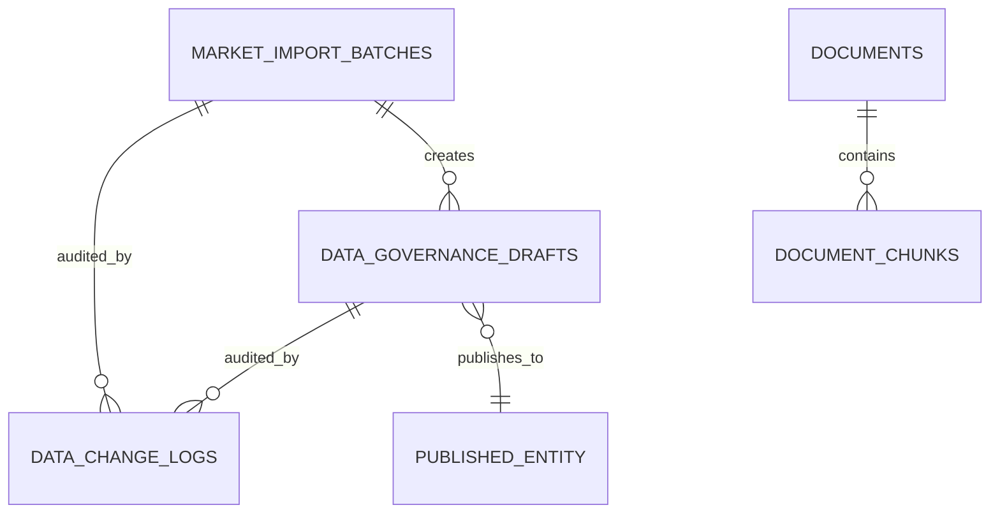
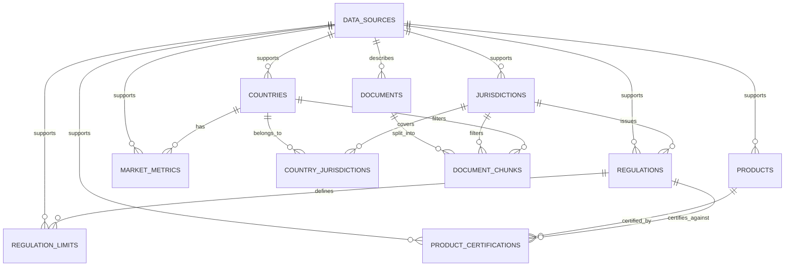

# 数据模型

## 1. 建模原则

1. ISO 3166-1 alpha-3 是国家主键和地图连接键。
2. 法规、限值、日期、市场值、产品参数和认证是结构化事实。
3. 原始文件、解释性文本和长篇内容是文档；chunks 只用于检索，不能替代结构化事实。
4. 业务有效期与系统记录/核验时间分开。
5. 法规状态显式枚举，不由日期或文本猜测。
6. 应用范围使用受控词表，不使用自由文本作为筛选键。
7. 功率内部标准化为 kW，使用 `[min, max)`；保留原值、原单位和换算说明。
8. 所有关键事实必须能连接来源，并记录最近核验时间。
9. 外键、状态、日期和常用筛选组合需要索引。
10. schema 的任何变化都通过新的 Drizzle migration 完成。

### 1.1 阶段 2 已实现物理模型

当前代码和 Migration 实现以下 11 张表：

| 表 | 当前职责 |
| --- | --- |
| `countries` | ISO3 主业务键、国家基础信息、覆盖状态和来源 |
| `jurisdictions` | 国家、区域或国际法规发布主体 |
| `country_jurisdictions` | 国家与司法辖区的带有效期关系 |
| `regulations` | 法规名称、显式状态、发布日期和有效期 |
| `regulation_limits` | 应用范围、功率半开区间、污染物限值和有效期 |
| `products` | 产品型号、应用范围、功率区间和版本化参数 |
| `product_certifications` | 产品对法规的认证覆盖和有效期 |
| `market_metrics` | 带定义、期间、单位、方法和来源的市场观察值 |
| `data_sources` | 来源元数据和最近核验时间 |
| `documents` | 来源文档元数据、许可、哈希与有效期 |
| `document_chunks` | 可追溯的文档片段及检索过滤元数据 |

本阶段遵循明确的实体清单，将长期目标中的 `regulation_requirements + emission_limits` 折叠为 `regulation_limits`，将产品系列/配置折叠为 `products`，将指标定义/观察值折叠为 `market_metrics`。这些折叠不代表最终真实数据模型；未来拆分必须新增 Migration。

所有 Seed 记录均为虚构 demo，使用稳定 ID、`is_demo = true`、`DEMO ONLY` 名称与 `.invalid` URL。它们只用于 Migration 和 Repository 测试，不是实际法规、认证或市场数据。

阶段 4 没有新增物理表或 Migration。现有 `products`、
`product_certifications`、`regulations`、`regulation_limits` 与
`data_sources` 已能承载第一版规则。Seed 仅增加一条未来 `adopted` 法规和限值，
用于验证“未来已通过法规”视图；它同样是显式虚构 Demo，不能作为真实法规引用。
来源分类采用双向约束：`is_demo` 当且仅当 `source_type = 'demo'`，且 Demo 来源
必须有 `demo_notice`。应用层 Zod 与数据库 CHECK 同时执行，避免直写或 API 输入用
两套字段表达相互矛盾的分类。

### 1.2 阶段 8 治理物理模型

Migration `0004_admin_data_governance.sql` 新增三张表，并为可发布/可删除实体增加
`archived_at`；文档另增加显式治理状态：

| 表/字段 | 约束与职责 |
| --- | --- |
| `data_governance_drafts` | `entity_type + entity_key + version` 唯一；保存 Zod 校验后的完整候选 payload、变更原因、创建/审核/发布人和时间，以及 `draft \| reviewed \| published` |
| `market_import_batches` | 保存文件 hash、逐行预览、校验错误、统计与 `previewed \| committed \| rejected`；确认后只创建市场草稿 |
| `data_change_logs` | 追加记录实体、动作、操作者邮箱/角色、原因、draft/batch 关联和 before/after JSON 快照 |
| `documents.governance_status` | `draft \| reviewed \| published`；正式检索还要求 `processing_status = ready` |
| `documents.reviewed_at` / `governance_published_at` | 文档审核与治理发布时间，不替代原始文档发布日期 |
| `*.archived_at` | 软归档标记；正式 Repository 必须过滤非 NULL 记录 |

治理实体包括 `country`、`regulation`、`product`、`product_certification`、
`market_metric`、`data_source`、`document` 和 `jurisdiction`。`data_change_action` 当前受控值为
`draft_created`、`reviewed`、`published`、`archived`、`import_previewed`、
`import_committed`、`document_reprocessed`、`source_verified`。

结构化草稿不直接复制到正式事实查询；只有发布事务才 upsert 基础表。法规版本
发布时，旧 `regulation_limits` 使用 `archived_at` 保留，再插入本版本限值，
因此修改记录同时具有旧法规/限值快照和新 payload。现有历史文档在 Migration
中一次性回填为 `published`，避免升级后意外消失；此兼容回填不代表内容已获得
新的人工审核。

软归档保持证据依赖闭合：活跃来源、国家、辖区、产品或法规若仍有公开事实依赖，
归档事务返回冲突，要求先归档或修订依赖。辖区成员关系和法规限值分别属于父实体
聚合，可随父实体在同一事务内软归档，并进入同一 before/after 审计快照。发布事务
锁定其来源和父实体，防止校验后、提交前发生并发归档。

## 2. 受控枚举与代码表

建议在 PostgreSQL enum 与代码表之间谨慎选择。需要经常扩展、带显示名或排序的概念优先代码表；稳定状态可使用 enum。

### 2.1 稳定枚举

- `regulation_status`: `proposed | adopted | effective | superseded`
- `jurisdiction_type`: `country | regional | international`
- `fit_status`（长期目标）: `fit | partial_fit | not_fit | unknown`；当前
  `product-fit-v2` 的合规轴只产生 `fit | not_fit | unknown`，并另行输出供应检查与
  `commercialReadiness=ready | not_ready | unknown`
- `certification_status`: `pending | active | expired | withdrawn | unknown`
- `document_type`: `regulation_text | government_notice | product_manual | industry_report | certificate | other`
- `source_role`: `primary | amendment | implementation_guidance | supporting | methodology`

### 2.2 代码表

`application_scopes` 枚举值（`application_scope`，随 Migration 演进）：

- `on-road`
- `non-road`
- `marine`
- `generator-set`
- `agriculture`
- `construction`
- `on-road-truck`（Migration `0005_on_road_truck_bus_scopes`，ADR-039）
- `on-road-bus`（同上）

求职作品的业务主线对应的规范标识为：

- `on-road-truck`：卡车动力
- `on-road-bus`：客车动力
- `construction`：工程机械动力
- `agriculture`：农业装备动力

`on-road`/`non-road` 保留为法规父级或旧数据兼容值，新的产品、认证和筛选器
不得用通用 `on-road` 代替已经明确的卡车/客车场景。

`pollutants` 包含代码、名称和说明，例如 NOx、PM、HC、CO、PN；实际首批集合由法规样例决定。

`units` 包含代码、量纲、显示符号和允许的确定性换算规则。法规限值的法律口径（例如按功、里程或测试循环）不能只靠通用单位库推断。

## 3. 阶段 2 实体关系概览

以下章节同时保留长期目标模型说明。与当前物理表不一致的细分实体属于后续候选设计，不表示已经实现。

## 4. 国家与司法辖区

### 4.1 `countries`

| 字段 | 类型/约束 | 说明 |
| --- | --- | --- |
| `iso3` | `char(3)` PK | canonical join key，大写 |
| `iso2` | `char(2)` UNIQUE NOT NULL | 展示/外部映射 |
| `name_en` | text NOT NULL | 英文名称 |
| `name_local` | text NULL | 本地名称 |
| `region_code` | text NULL | 受控区域代码 |
| `subregion_code` | text NULL | 受控子区域代码 |
| `default_currency_code` | text NULL | 仅基础信息，不代替指标单位 |
| `data_coverage_status` | text NOT NULL + CHECK | 词表 `none/demo/planned/no_data/covered`（ADR-040/042） |
| `is_demo` | boolean NOT NULL + CHECK | 当且仅当 `data_coverage_status = 'demo'` 时为 true |
| `verified_at` | timestamptz NULL | 国家资料最近核验时间 |
| `created_at/updated_at` | timestamptz NOT NULL | 系统时间 |

不要把完整地图 geometry 存入该表用于常规渲染。

### 4.2 `jurisdictions`

表示法规发布主体，而不假定每项法规只属于一个国家。

| 字段 | 类型/约束 | 说明 |
| --- | --- | --- |
| `id` | uuid PK | |
| `code` | text UNIQUE NOT NULL | 稳定内部代码 |
| `name` | text NOT NULL | |
| `type` | `jurisdiction_type` NOT NULL | |
| `country_iso3` | FK nullable + CHECK | `country` 类型时必须指向国家；`regional` / `international` 类型必须为 NULL |
| `website_url` | text NULL | |
| `created_at/updated_at` | timestamptz NOT NULL | |

### 4.3 `country_jurisdictions`

| 字段 | 类型/约束 | 说明 |
| --- | --- | --- |
| `jurisdiction_id` | FK | 联合主键之一 |
| `country_iso3` | FK | 联合主键之一 |
| `valid_from` | date NOT NULL | 联合主键之一；成员关系起始 |
| `valid_to` | date NULL | 上界不包含，NULL 表示开放 |
| `source_document_id` | FK NULL | 成员关系证据 |
| `verified_at` | timestamptz NOT NULL | |

Migration `0011` 以 `(country_iso3, jurisdiction_id, valid_from)` 为联合主键，允许同一
国家退出辖区后重新加入；真实 PostgreSQL 还使用 `btree_gist` 与半开 `daterange` partial
exclusion constraint，禁止未归档有效期重叠。迁移先检查已有重复起始日和任意重叠（包括
嵌套区间），存在脏数据即失败关闭，不猜测应保留哪段。PGlite 不支持 `btree_gist`，因此
测试环境由 repository 在事务行锁后执行同一全区间重叠校验；生产约束仍以数据库为准。

## 5. 法规与要求

### 5.1 `regulations`

| 字段 | 类型/约束 | 说明 |
| --- | --- | --- |
| `id` | uuid PK | |
| `jurisdiction_id` | FK NOT NULL | 发布主体 |
| `canonical_name` | text NOT NULL | 官方/规范名称 |
| `citation_code` | text NULL | 官方编号 |
| `status` | `regulation_status` NOT NULL | 显式状态 |
| `proposed_on` | date NULL | |
| `adopted_on` | date NULL | |
| `effective_from` | date NULL | 业务有效期下界 |
| `effective_to` | date NULL | 上界不包含 |
| `superseded_by_id` | self FK NULL | 后继法规 |
| `summary` | text NULL | 简短、经审核说明；不替代原文 |
| `verified_at` | timestamptz NOT NULL | 最近核验 |
| `created_at/updated_at` | timestamptz NOT NULL | |

约束示例：

- `effective_to IS NULL OR effective_to > effective_from`
- `superseded_by_id <> id`
- 日期与状态一致性由 schema check 加领域校验共同保证；历史数据可能使简单 check 不足。

### 5.2 `regulation_requirements`

表示一项法规在某个应用范围、功率和日期条件下的要求组。

| 字段 | 类型/约束 | 说明 |
| --- | --- | --- |
| `id` | uuid PK | |
| `regulation_id` | FK NOT NULL | |
| `application_scope_code` | FK NOT NULL | |
| `engine_type_code` | text NOT NULL | 首批词表待定，例如 CI |
| `power_min_kw` | numeric NULL | 包含下界 |
| `power_max_kw` | numeric NULL | 不包含上界 |
| `effective_from` | date NOT NULL | 要求自身有效期 |
| `effective_to` | date NULL | |
| `test_cycle_code` | text NULL | 法定测试循环 |
| `stage_label` | text NULL | 例如阶段/等级显示名 |
| `requirement_summary` | text NULL | 解释，不承载唯一事实 |
| `conditions` | jsonb NOT NULL DEFAULT `{}` | 罕见附加条件；核心筛选字段不得只放这里 |
| `verified_at` | timestamptz NOT NULL | |
| `created_at/updated_at` | timestamptz NOT NULL | |

功率 NULL 边界表示无界。`regulation_limits` 使用 `numeric(12,3)`；法规限值事实
`limit_value` 使用 `numeric(18,6)` 并在管理输入、fixture、repository 与读回中保持精确
字符串，不经过 JavaScript Number。

### 5.3 `emission_limits`

| 字段 | 类型/约束 | 说明 |
| --- | --- | --- |
| `id` | uuid PK | |
| `requirement_id` | FK NOT NULL | |
| `pollutant_code` | FK NOT NULL | |
| `limit_value` | numeric NOT NULL | 精确 decimal，不使用 float |
| `unit_code` | FK NOT NULL | |
| `measurement_basis` | text NULL | 测量/归一化口径 |
| `averaging_period` | text NULL | 若法规需要 |
| `original_value` | numeric NULL | 原文值 |
| `original_unit_text` | text NULL | 原文单位 |
| `conversion_rule_version` | text NULL | 发生换算时必填 |
| `notes` | text NULL | |
| `verified_at` | timestamptz NOT NULL | |

同一 requirement/pollutant/measurement basis 的唯一性需根据首批法规样例确定，避免错误压扁多种测试条件。

### 5.4 来源关系

- `regulation_sources(regulation_id, document_id, source_role, locator, is_primary)`
- `requirement_sources(requirement_id, document_id, source_role, locator)`
- `limit_sources(limit_id, document_id, source_role, locator)`

`locator` 保存可读定位，如条款、页码或附表编号。关键事实至少有一个来源关系；导入流程应拒绝无来源的“已核验”记录。

## 6. 市场指标

### 6.1 `market_metric_definitions`

| 字段 | 类型/约束 | 说明 |
| --- | --- | --- |
| `id` | uuid PK | |
| `code` | text UNIQUE NOT NULL | 稳定指标代码 |
| `name` | text NOT NULL | |
| `description` | text NOT NULL | 完整口径 |
| `value_kind` | text NOT NULL | count/currency/ratio/index 等 |
| `default_unit_code` | FK NOT NULL | |
| `frequency` | text NOT NULL | annual/quarterly 等 |
| `higher_is_better` | boolean NULL | 仅供确定性评分 |
| `methodology_version` | text NOT NULL | |

### 6.2 `market_observations`

| 字段 | 类型/约束 | 说明 |
| --- | --- | --- |
| `id` | uuid PK | |
| `country_iso3` | FK NOT NULL | |
| `metric_definition_id` | FK NOT NULL | |
| `application_scope_code` | FK NULL | 可按场景细分 |
| `period_start/period_end` | date NOT NULL | 统计期间，end 为不包含上界 |
| `value_numeric` | numeric(24,6) NOT NULL | 精确字符串传输，不经过 JavaScript Number |
| `unit_code` | FK NOT NULL | |
| `currency_code` | text NULL | 金额类必填 |
| `price_basis_date` | date NULL | 不变价/换算时使用 |
| `source_document_id` | FK NOT NULL | |
| `published_on` | date NULL | |
| `methodology_note` | text NULL | |
| `confidence_code` | text NULL | 受控词表待定 |
| `verified_at` | timestamptz NOT NULL | |

唯一性至少考虑国家、指标、scope、期间、来源。多个来源可并存，不默认求平均。
MVP 折叠表 `market_metrics` 用两个 PostgreSQL 12 兼容的部分唯一索引实现该语义：
`application_scope IS NOT NULL` 时 scope 进入自然键；`application_scope IS NULL`
时以国家、指标、期间、来源约束唯一，避免 PostgreSQL 默认允许多个 NULL 绕过
唯一性。

## 7. 产品、参数与认证

### 7.1 `manufacturers`

公司/品牌主数据。MVP 预计只有本公司，但不把公司名硬编码在业务逻辑中。

### 7.2 `product_families`

包含 manufacturer、系列代码、名称、生命周期状态、首发/停产日期和来源。

### 7.3 `product_configurations`

表示能被报价或认证的具体配置，而不是模糊系列。

| 字段 | 类型/约束 | 说明 |
| --- | --- | --- |
| `id` | uuid PK | |
| `product_family_id` | FK NOT NULL | |
| `configuration_code` | text UNIQUE NOT NULL | |
| `name` | text NOT NULL | |
| `power_min_kw/power_max_kw` | numeric NOT NULL | `[min,max)` |
| `specification_version` | text NOT NULL | |
| `available_from/available_to` | date NULL | |
| `parameters` | jsonb NOT NULL DEFAULT `{}` | 非核心、差异化参数 |
| `source_document_id` | FK NOT NULL | 手册/主数据来源 |
| `verified_at` | timestamptz NOT NULL | |

若某参数成为筛选、fit 或评分的核心条件，应提升为结构化列或规范子表，不能长期只存在 JSONB。

当前折叠表 `products` 的 `power_min_kw/power_max_kw` 都是必填 `numeric(12,3)`。
Migration `0011` 先拒绝已有负下界或 `max <= min` 的记录，再追加数据库 CHECK；迁移不会
为违规产品猜测或回填功率。

### 7.4 `product_applications`

连接产品配置和 application scope，可包含该场景下的功率限制、备注、来源和核验时间。

### 7.5 `product_certifications`

| 字段 | 类型/约束 | 说明 |
| --- | --- | --- |
| `id` | uuid PK | |
| `product_configuration_id` | FK NOT NULL | |
| `regulation_id` | FK NOT NULL | |
| `application_scope_code` | FK NOT NULL | |
| `certificate_number` | text NULL | |
| `status` | `certification_status` NOT NULL | |
| `power_min_kw/power_max_kw` | numeric NULL | 证书覆盖范围 |
| `valid_from/valid_to` | date NULL | |
| `source_document_id` | FK NOT NULL | 证书或官方记录 |
| `verified_at` | timestamptz NOT NULL | |

产品认证与产品支持场景分开。一个产品“可用于 construction”不代表满足目标国家当前法规。

## 8. Product-fit 与营销评分

### 8.1 `fit_rulesets`

记录 `version`、状态、说明、规则配置哈希、生效日期、批准人和发布时间。可执行逻辑保存在版本控制的 TypeScript 纯函数中，数据库记录用于追溯版本。

### 8.2 `product_fit_evaluations`

这是可选的审计/缓存表，不是手工编辑事实源：

- `product_configuration_id`
- `country_iso3`
- `application_scope_code`
- `as_of`
- `requested_power_kw`
- `fit_status`
- `reason_codes` JSONB
- `ruleset_id`
- `input_fingerprint`
- `evidence_refs` JSONB 或规范关联表
- `evaluated_at`

MVP 可以即时计算且不持久化自由文本解释；若存储结果，必须以 input fingerprint 和 ruleset version 防止陈旧结果复用。

建议的理由代码：

- `POWER_OUT_OF_RANGE`
- `APPLICATION_NOT_SUPPORTED`
- `CERTIFICATION_ACTIVE`
- `CERTIFICATION_MISSING`
- `CERTIFICATION_POWER_RANGE_UNKNOWN`
- `CERTIFICATION_VALIDITY_UNKNOWN`
- `CERTIFICATION_EXPIRED`
- `REGULATION_PROPOSED_ONLY`
- `REGULATION_DATA_MISSING`
- `SOURCE_STALE`

### 8.3 `opportunity-score-v2`

阶段 7 接受一个受限、版本化的即时计算规则，不新增评分事实表：

- `marketPotential`：只使用同 scope、单位、币种、methodology 和 period 的
  `market_metrics`；指标方向必须在代码登记，并在本次国家组内归一化。
- `productReadiness`：`fit / (fit + not_fit)`；`unknown` 从分母排除。
- `regulatoryCoverage`：对适用有效法规，至少一个明确 certification `pass`
  记 100；存在明确 `fail` 且无 `pass` 记 0；只有 `unknown` 时排除。
- 默认权重为 `0.5 / 0.3 / 0.2`，仅由服务端配置提供且必须合计为 1。

每个维度存于返回 DTO 而非数据库：`score`、`configuredWeight`、
`effectiveWeight`、`contribution`、`explanation`、`inputFacts`。缺失值为
`null`，不会写成 0；可用权重会重新归一化，并返回 `dataCoveragePct`。当前不
持久化评分，不建立排行榜，也不允许 LLM 生成或修改分数。真实指标方向、批准人和
跨期/汇率策略仍需 ADR-020/021 的生产批准。

## 9. 来源文档与知识库

阶段 5 已通过 `0001_knowledge_hybrid_search.sql` 扩展现有物理表：

- `documents` 新增原始文件名、MIME、字节数、`pending | processing | ready |
  failed` 状态、处理错误和完成时间。
- `document_chunks.search_vector` 是由 `content` 生成的 `tsvector`，使用 GIN
  索引。
- `document_chunks.embedding` 当前为 `vector(128)`，同时记录
  `embedding_model`；不创建向量索引。
- 文档级 `content_sha256` 仍是唯一约束；chunk 内容哈希不再唯一，因为合法
  文档可能在不同位置重复同一段落。
- 国家、管辖区域、应用场景和有效期继续保存在每个 chunk 上，用于检索前过滤。

### 9.1 `source_documents`

| 字段 | 类型/约束 | 说明 |
| --- | --- | --- |
| `id` | uuid PK | |
| `type` | `document_type` NOT NULL | |
| `title` | text NOT NULL | |
| `publisher` | text NULL | |
| `canonical_url` | text NULL | |
| `storage_path` | text NULL | 对象存储位置 |
| `original_filename/mime_type/byte_size` | text/text/integer NULL | 原始文件元数据 |
| `language_code` | text NOT NULL | |
| `published_on` | date NULL | |
| `accessed_at` | timestamptz NOT NULL | |
| `valid_from/valid_to` | date NULL | 文档适用期（若有） |
| `content_sha256` | text NOT NULL | 去重/完整性 |
| `license_code` | text NULL | |
| `redistribution_allowed` | boolean NULL | 未知时不得假定允许 |
| `verified_at` | timestamptz NOT NULL | |
| `processing_status` | enum NOT NULL | 处理状态 |
| `processing_error` | text NULL | 失败原因 |
| `processed_at` | timestamptz NULL | 完成或失败时间 |
| `created_at/updated_at` | timestamptz NOT NULL | |

只允许 URL 而不保存二进制的文档也应有元数据和访问日期。

### 9.2 `document_chunks`

| 字段 | 类型/约束 | 说明 |
| --- | --- | --- |
| `id` | uuid PK | |
| `document_id` | FK NOT NULL | |
| `chunk_index` | integer NOT NULL | 文档内稳定顺序 |
| `heading_path` | text[] NULL | 标题层级 |
| `page_from/page_to` | integer NULL | |
| `section_locator` | text NULL | 条款/章节 |
| `content` | text NOT NULL | |
| `search_vector` | tsvector generated | 全文检索 |
| `embedding` | vector(128) NULL | 当前开发 embedding |
| `embedding_model` | text NULL | 向量生成器版本 |
| `jurisdiction_id` | FK NULL | 冗余过滤元数据 |
| `country_iso3` | FK NULL | |
| `application_scope_code` | FK NULL | |
| `valid_from/valid_to` | date NULL | |
| `token_count` | integer NULL | |
| `content_hash` | text NOT NULL | |

对跨多个国家或范围的 chunk，应使用关联表而不是复制一个错误的单值；实际 schema 可采用：

- `chunk_countries(chunk_id, country_iso3)`
- `chunk_application_scopes(chunk_id, application_scope_code)`
- `chunk_jurisdictions(chunk_id, jurisdiction_id)`

为了可追溯性，chunk 必须能稳定定位到原文。embedding 不能作为事实证据。

## 10. AI 审计

阶段 6 通过 `0002_ai_chat_audit.sql` 实现三张最小化审计表：

### 10.1 `ai_chat_sessions`

- `id`：客户端生成的 UUID。
- `selected_country_iso3`：请求时的地图默认上下文，可为空；它不是用户明确国家的
  替代品，也不要求该国家已有业务数据。
- `model_id`：本轮配置的 Gateway `provider/model` 标识。
- `created_at/updated_at`：UTC 时间。

### 10.2 `ai_tool_calls`

- `session_id/tool_call_id`：会话内唯一，便于流式重试幂等更新。
- `tool_name`：仅允许 `searchKnowledgeBase`、`getCountryProfile`、
  `findCompatibleProducts`、`compareRegulations`、`compareMarkets`、
  `calculateOpportunityScore`、`generateSalesBrief`。后四项由
  `0003_marketing_analysis_tools.sql` 加入枚举。
- `status`：`success | no_data | error`。
- `input`：通过工具 Zod schema 校验后的参数，不存 prompt。
- `result_summary`：证据是否充分、引用数、结果数/适配状态数和截至时间，不存完整
  chunk 或完整工具结果。
- `error_code/duration_ms/started_at/completed_at`：失败分类和耗时。

### 10.3 `ai_citations`

每条引用关联 session 和 tool-call audit，并尽可能通过外键指向
`data_sources`、`documents`、`document_chunks`、`regulations` 或
`product_certifications`。同时保存展示快照：

- 标题、locator、页码/章节和 URL。
- `regulation_status/published_on/verified_at`。
- `country_iso3/is_demo`。

当前不持久化完整用户消息、完整模型回答、完整文档片段或用户反馈。
身份/租户、保留期限和删除策略需在 ADR-016/023 决定后补充。

## 11. 时间语义

### 11.1 业务时间

- `effective_from/effective_to`
- `valid_from/valid_to`
- `period_start/period_end`
- 用户查询的 `as_of`

所有日期区间使用 `[from, to)`，NULL `to` 表示开放上界。

### 11.2 系统时间

- `created_at`
- `updated_at`
- `verified_at`
- `accessed_at`
- `evaluated_at`

timestamp 使用 UTC `timestamptz`。MVP 不实现完整双时态历史，但重要事实保留业务有效期和核验时间；需要审计历史时新增版本表/审计表，不覆盖已发布证据。

## 12. 索引建议

首批迁移应包括：

- 所有外键的 B-tree 索引。
- `regulations(jurisdiction_id, status, effective_from, effective_to)`。
- `regulation_requirements(regulation_id, application_scope_code, effective_from, effective_to)`。
- 功率范围候选查询的适当 B-tree 或 range 索引；先用真实查询计划验证。
- `market_observations(country_iso3, metric_definition_id, period_start, period_end)`。
- `product_certifications(product_configuration_id, regulation_id, status, valid_from, valid_to)`。
- `document_chunks` metadata 外键索引。
- `document_chunks.content_tsv` GIN。

向量 HNSW/IVFFlat 索引延后到存在代表性 chunks、选定距离度量并完成 recall/latency 基准之后。

## 13. 数据完整性与导入校验

导入必须拒绝或隔离：

- 非大写/无效 ISO3。
- 未知 application scope 或 status。
- 结束日期不晚于开始日期。
- 功率上界小于等于下界。
- 无单位的数值限值或市场值。
- 标记为 verified 却没有来源的事实。
- product-fit 输入引用不存在的产品/法规。
- 内容哈希相同的重复文档。

种子数据要固定 ID 或稳定 natural key，并能重复运行得到相同结果。

## 14. 代表性查询验收

1. 给定 ISO3、scope、power 和 as-of，只返回成员关系与日期均适用的法规要求。
2. proposed 仅在显式请求时返回，且不与 effective 混成“当前要求”。
3. 正好等于 `power_min_kw` 时命中，正好等于 `power_max_kw` 时不命中。
4. superseded 法规在历史日期可查询，在当前日期不会覆盖后继法规。
5. 市场比较对不同指标定义、单位或期间返回不可比警告。
6. 产品覆盖功率但缺少有效认证时不返回 `fit`。
7. 知识检索不会无警告返回不匹配 scope/日期的 chunk。

## 15. 待决策的数据问题

- 首批产品参数哪些必须规范化，哪些可暂存 JSONB。
- 区域法规与国家实施法规的优先/覆盖规则。
- 认证是否对应整个 configuration、engine family 还是更细粒度 variant。
- Embedding 模型、维度和距离度量。
- 全文检索使用的语言配置与多语言策略。
- 数据核验人、stale 阈值和修订历史要求。
- 市场指标的币种、汇率和不变价策略。
